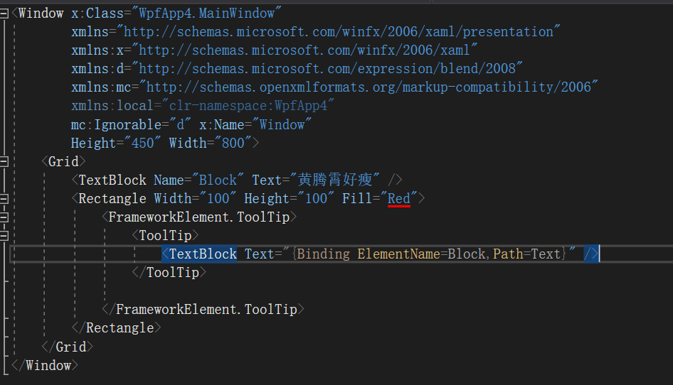
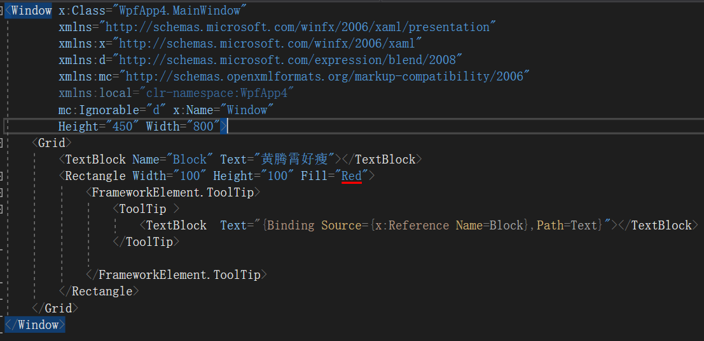
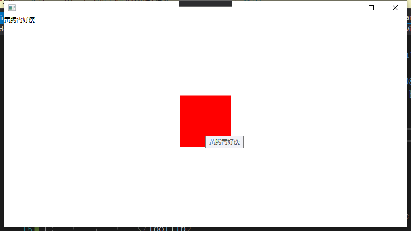
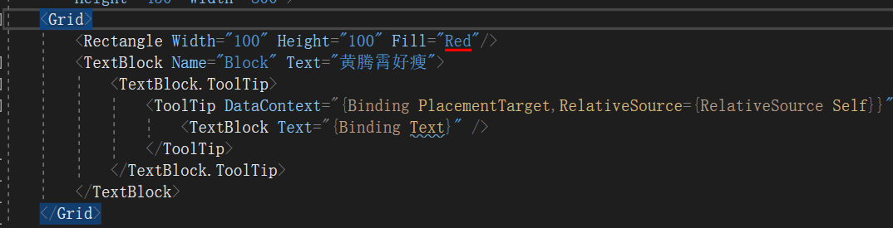
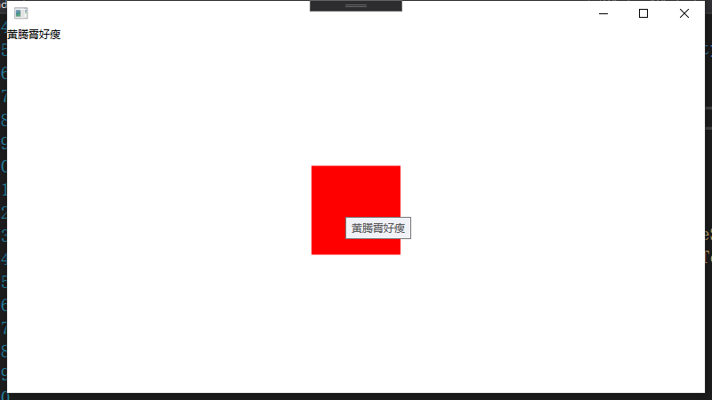

小伙伴们肯定都很熟悉xaml的binding，但是对于tooltip或者popup这些跨窗口的binding总是容易遇到这样，或者那样的问题。这里就给大家提供下关于tooltip的binding方法。

-----

我们都知道常见的绑定数据源来自以下几种：

- DataContext
- ElementName
- ReferenceSource

但是对于ToolTip来说这边就不好直接使用了

例如下面的代码使用了ElementName进行绑定

但是我们看到实际上这里tooltip并没有显示内容

而如果我们使用了{x:Reference}替换ElementName

结果就可以直接显示了

###那么这里有什么差别呢？

首先，Binding的ElementName属性是一个String，他会直接从当前的NameScope中找对应的对象。

如果当前对象没有NameScope，就会沿着逻辑树找到带有NameScope的对象。

那么那些会有NameScope呢？例如windows，style等等。

而我们的tooltip是另一个单独的逻辑树（popup这些也是）。

但是这里的namescope来自window对象，而tooltip不在window的逻辑树上，自然无法沿着逻辑树去寻找。

所以就虽然记录了ElementName，但是无法找到指定对象。

同样的原理，DataContext和ReferenceSouce也是无法跨域逻辑树传递或找寻的。

### 为什么第二个例子可以

而{x:Reference}这里是在xaml语言级别的查找，它的算法不是依赖于逻辑树向上查。

他是在xaml生成元素的同时，查找当前的NameScope。

PS：使用{x:Reference}引用父元素的时候会提示出现循环引用的错误，而ElementName不会

此外这里获得对象之后，使用Souce直接绑定对象，就不需要关系逻辑树的问题了。

### 其他方案

那么如果你的场景需要的是DataContext传递，怎么办呢？

可以这样使用Binding PlacementTarget的方式获取Tooltip附加的对象的DataContext

然后，这个DataContext就可以在ToolTip的逻辑树上传递了

---

参考文档：

-  [x:Reference Markup Extension - WPF - Microsoft Docs](https://docs.microsoft.com/en-us/dotnet/desktop-wpf/xaml-services/xreference-markup-extension)
-  [Binding.ElementName Property (System.Windows.Data) - Microsoft Docs](https://docs.microsoft.com/en-us/dotnet/api/system.windows.data.binding.elementname?view=netframework-4.8)
-  [ElementName Binding In ToolTips (Borrowing a NameScope) - Andrew Smith](https://agsmith.wordpress.com/2008/07/17/elementname-binding-in-tooltips-borrowing-a-namescope/)
-  [NameScope Class (System.Windows) - Microsoft Docs](https://docs.microsoft.com/en-us/dotnet/api/system.windows.namescope?view=netframework-4.8)
-  [wpf - What is the difference between x:Reference and ElementName? - Stack Overflow](https://stackoverflow.com/questions/19244111/what-is-the-difference-between-xreference-and-elementname)
-  [C# WPF: Changing PlacementTarget of a ToolTip - Stack Overflow](https://stackoverflow.com/questions/44581980/c-sharp-wpf-changing-placementtarget-of-a-tooltip)

