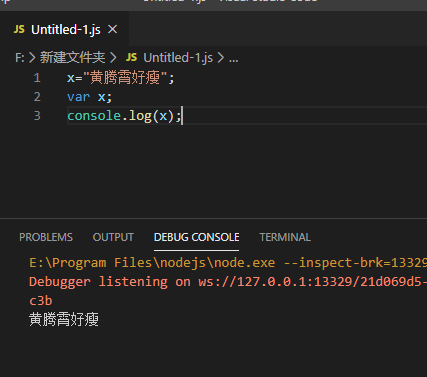
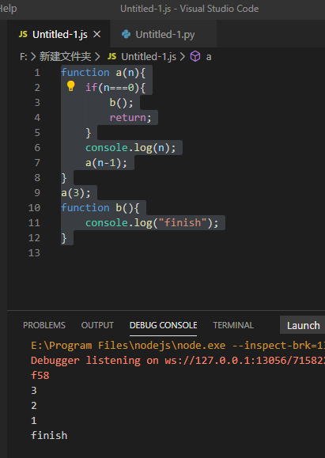
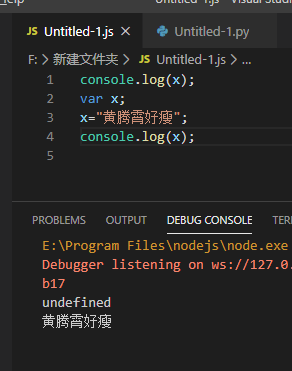
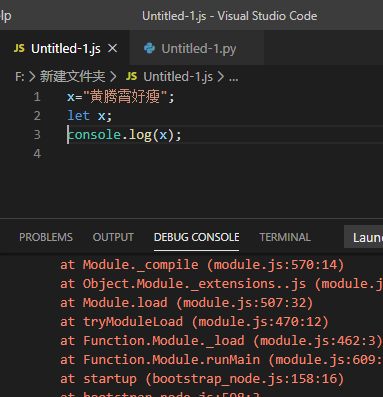

不知道同学们在学习JavaScript时，有没有对JavaScript的“提升”（hoisting）这个概念感到困惑。

-----

## 什么是“提升”（hoisting）

我们提到hoisting的时候专指JavaScript中的一种场景：

对JavaScript的编译期间，文件中的函数，var定义的变量等的声明会被提升至命名空间（scope）的最上层。

这也就意味着，在JavaScript中，即使你的变量先初始化，再声明，也不会出现bug

```javascript
x="黄腾霄好瘦";
var x;
console.log(x);
```



同样的函数也能够提升，例如

```javascript
function a(n){
    if(n===0){
        b();
        return;
    }
    console.log(n);
    a(n-1);
}
a(3);
function b(){
    console.log("finish");
}

```



## 为什么需要提升（Why hoisting）

这个问题应该分成两部分，为什么需要函数提升和为什么需要变量提升

#### 函数提升

首先根据BrendanEich（JavaScript创建者）在[Twitter上的留言](https://twitter.com/BrendanEich/status/33403701100154880)

函数提升是为了解决函数多重递归调用的问题。

例如对于上面的例子如果没有提升，调用方法a的时候就会发现内部的方法b未定义，出现异常。

或者执行过程中就会出现各种类型的跳转问题。

#### 变量提升

var 的变量提升，就不像函数提升那样优雅了。

例如下面的代码，x在声明之前使用，出现了undefined的输出。

而由于var变量提升，这个代码不会报任何异常，直到业务出现问题。

```javascript
console.log(x);
var x;
x="黄腾霄好瘦";
console.log(x);
```



所以现在ES6也不推荐使用var

那么为什么当初要设计这个var 的变量提升呢？

同样是BrendanEich在[Twitter留言](https://twitter.com/brendaneich/status/562313394431078400?lang=en)，这个设计是一个“implementation artifact”，是之前在jsvm上出现的设计问题。但是这个问题流出过久，而且拯救了许多同学的bug，所以也就遗留了下来。

## 如何替代变量提升

很简单，使用新的关键字let去代替变量var

let强制要求在scope内先定义，再使用。

所以执行如下的代码会出现，编译时异常。

这样就能够帮助大家提前发现问题。



---

参考文档：

-  [Note 4. Two words about “hoisting”. – Dmitry Soshnikov](http://dmitrysoshnikov.com/notes/note-4-two-words-about-hoisting/)
-  [JavaScript: 变量提升和函数提升 - liuhe688 - 博客园](https://www.cnblogs.com/liuhe688/p/5891273.html)
-  [JavaScript Variables Hoisting in Details](https://dmitripavlutin.com/javascript-hoisting-in-details/)
-  [hoisting - Why does JavaScript hoist variables? - Stack Overflow](https://stackoverflow.com/questions/15005098/why-does-javascript-hoist-variables)
-  [Advance JavaScript: Why hoisting? - Jaspreet Sidhu - Medium](https://medium.com/@sidhujaspreet963/advance-javascript-why-hoisting-3db74309e674)
-  [Hoisting in JavaScript - Catalin Red](https://catalin.red/hoisting-in-javascript/)
-  [BrendanEich on Twitter: "@jsfaq A bit more history: `var` hoisting was an implementation artifact. `function` hoisting was better motivated: https://t.co/S3QGqy7DTF."](https://twitter.com/brendaneich/status/562313394431078400?lang=en)
-  [BrendanEich on Twitter: "@DmitrySoshnikov @jashkenas yes, function declaration hoisting is for mutual recursion & generally to avoid painful bottom-up ML-like order"](https://twitter.com/BrendanEich/status/33403701100154880)
-  [Hoisting in Modern JavaScript — let, const, and var](https://blog.bitsrc.io/hoisting-in-modern-javascript-let-const-and-var-b290405adfda)
-  [Arduino - VariableDeclaration](https://www.arduino.cc/en/Reference/VariableDeclaration)
-  [ECMAScript 2015 Language Specification – ECMA-262 6th Edition](https://www.ecma-international.org/ecma-262/6.0/#sec-let-and-const-declarations)
-  [Shadow, hoisting, TDZ](https://gist.github.com/DmitrySoshnikov/b53e379f63f4cd841305)


