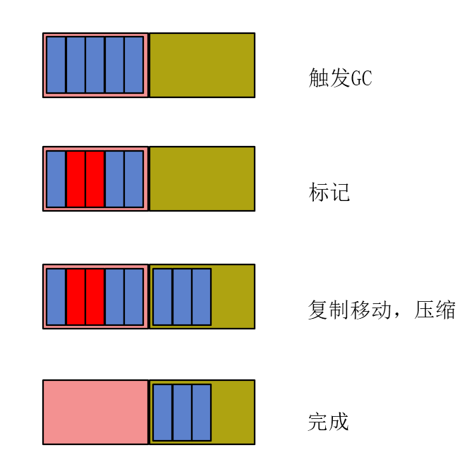
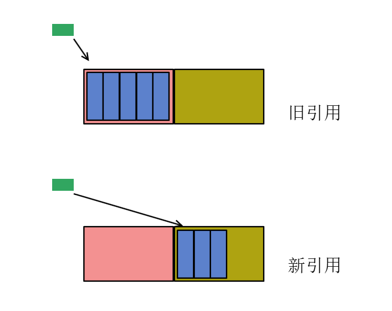
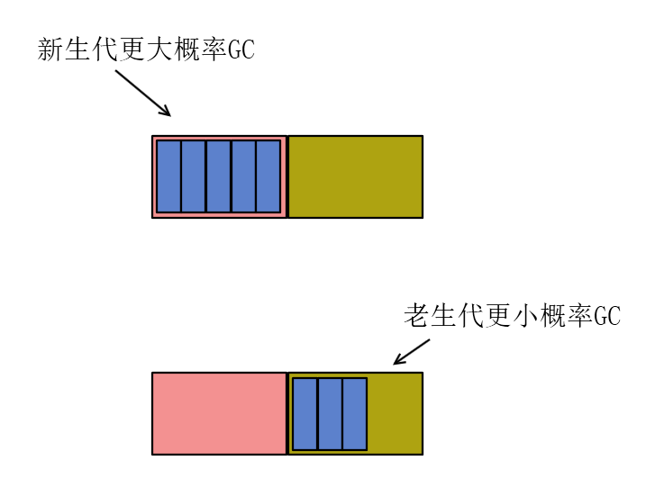
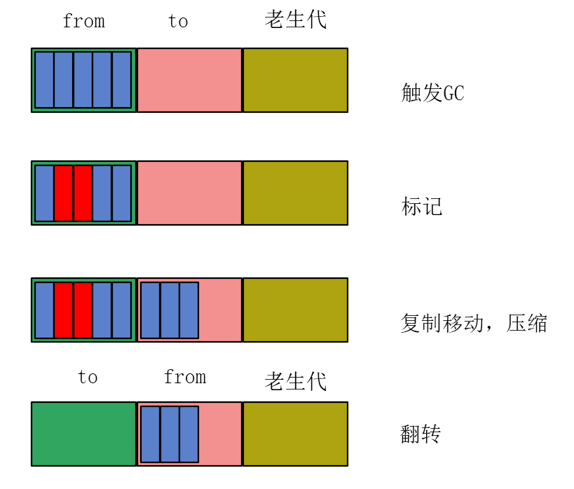

今天和大家一起解析下常见的GC算法设计。

-----

## 什么是GC

GC是一种软件进行自动的内存回收的方式。

如果软件运行过程中，发现某些对象没有了引用（或者称之为不可达）的状态时，就会启动GC过程。将这部分内存进行释放。以避免程序员因为忘记显示释放内存导致程序出现out of memory。

## GC的过程

GC的过程主要分为标记、移动和压缩

### 标记

软件先分析堆中的所有内存对象，判断是否“存活”。

如果一个对象没有保持着被其他存活对象引用，就需要被清理

### 移动

将标记为存活的对象移动到另一个内存空间（老生代）

### 压缩

由于内存清理之后会出现很多碎片（非连续的小段可用内存），因此往往需要对其进行移动，确保大块的内存可用空间。（有时候移动和压缩会放在一起操作）

## GC算法分析

### 为什么GC时要移动对象至另一空间

这里我们先思考一个问题，为什么需要把存活的对象移动到另一个内存空间。

首先，GC是一个非常耗性能的过程。

因为在GC过程中，你的程序中各个对象的引用指向的内存地址可能发生改变。

如果此时你仍然在执行程序，就可能访问到错误的内存地址。

因此GC期间会挂起程序的执行，也就是我们俗称的Stop the world。

在这一个限制下，我们设计GC算法的时候，必须做到**尽可能少的进行GC**。

### 如何才能尽可能少的进行GC呢？

我们每次GC时，尽可能保证扫描的对象最大比例的释放内存。这样可用内存越多，触发GC的次数就会越少。

OK，我们再引进一个社会工程学知识，就是越新创建的对象，被清理的概率越高。

如果一个对象经过了一次GC，仍然存活了下来，那么它很有可能再下一次GC中存活。

那么将其放在一个单独的内存空间（老生代）中，可以有效的减少这些长生命周期对象的GC次数。

而仅对这些新生成的对象（新生代）进行GC，可以使用更少的对象扫描，完成近似相当的内存释放。

只有当老生代的内存空间也满了，才会进行老生代的GC。

### 老生代对象移动到哪里？

我们再思考一下，如果老生代也满了，那么GC时内存对象还能移动到哪里去呢？

在开一个“老老生代”？那“老老生代”也满了呢？

我们当然不能无限的开辟这么多的内存空间，放置GC存活的对象，这样内存的有效使用率太低了。

这里我们会在原始的老生代内存空间直接移动对象，将那些被回收的对象产生的内存碎片压缩即可。

## .NET的GC设计

.NET的GC设计很简单，就同我们刚刚分析的情况基本一致。

它将内存分为三个区域，第0代，第1代，第2代。

所有的新对象的内存会分配至第0代。

当第0代满了，触发GC将第0代清空，将存活对象提升至第1代。

当第1代满了，再存活对象提升至第1代。

当第2代满了，GC后的存活对象直接在第2代的空间进行碎片压缩。

## V8的GC设计

在.NET的GC设计中可能会出现这种情况，在第0代GC过程中，最新生成的内存对象被提升到了第1代中。

但是这些对象很可能是一些短生命周期的对象，仅仅是“偶然”在GC之前生成罢了。

但是这些对象被提升至第1代之后，很可能在之后的多次GC中，都不能被清理。

这些“无用”的内存占用就会消耗我们软件的内存空间。

V8 采用了另一种设计思想。

V8仅有新生代和老生代两个空间，并且它将新生代分成了From和To两个半空间。

每次新对象直接生成在From半空间内。

当触发GC时，From半空间内存活的对象被移动到To半空间内。

然后令To成为新的From半空间，From成为新的To半空间，即“半空间翻转”

在下一次GC时，检查GC存活对象，如果已经经历了一次GC，那么提升至老生代，否则还是移动到To半空间。

在V8的这种设计下，对象必须经历2次GC后才能提升到老生代。

避免了因为生成时机问题，导致内存中的“生命周期”延长。

### JVM的GC设计

V8半空间的设计也会带来的一个问题就是，新生代的内存可用空间只有一半。

那么有没有什么方式可以增加一些空间呢？

JVM设计GC时将新生代分成了三块，eden，s0和s1（From幸存空间，To幸存空间）。

所有的对象创建时，内存分配至eden区域。

而当第一GC时存活对象提升至s0区域（From幸存空间）。

再下一次GC时，会将eden和s0一起进行GC，并且将存活对象移动至s1区域（To幸存空间）。

然后和V8一样s0和s1，发生“幸存空间翻转”

仅当对象在幸存空间存活超过了8次，才提升至老生代。

这种设计基于如下现实：每次GC仅有少部分对象存活。

因此JVM就将需要进行翻转的半空间缩小了，这样就能有更大的空间用于新对象内存分配。

## 后记

这里我们分析了.NET，V8和JVM的GC设计，但是并不是说明那种软件的GC算法更好，所有的算法架构都是进行一种设计取舍。

我们需要知道大部分情况下，GC能够直接帮我们处理内存问题。

而在那些内存敏感的应用场景，期望依赖某一软件的GC设计原生机制来自动处理，也是不会奏效的。

---

参考文档：

-  [Java Garbage Collection Basics](https://www.oracle.com/webfolder/technetwork/tutorials/obe/java/gc01/index.html)
-  [垃圾回收 (计算机科学) - 维基百科，自由的百科全书](https://zh.wikipedia.org/wiki/%E5%9E%83%E5%9C%BE%E5%9B%9E%E6%94%B6_(%E8%A8%88%E7%AE%97%E6%A9%9F%E7%A7%91%E5%AD%B8))
-  [JVM 垃圾收集与 GC 算法 - 简书](https://www.jianshu.com/p/43c1b262d36b)
-  [GC的三大基础算法 - code-craft - SegmentFault 思否](https://segmentfault.com/a/1190000004665100)
-  [Java虚拟机详解04----GC算法和种类【重要】 - 千古壹号 - 博客园](https://www.cnblogs.com/qianguyihao/p/4744233.html)
-  [Understanding the Java Memory Model and Garbage Collection - DZone Java](https://dzone.com/articles/understanding-the-java-memory-model-and-the-garbag)
-  [垃圾回收的基本知识 - Microsoft Docs](https://docs.microsoft.com/zh-cn/dotnet/standard/garbage-collection/fundamentals)

