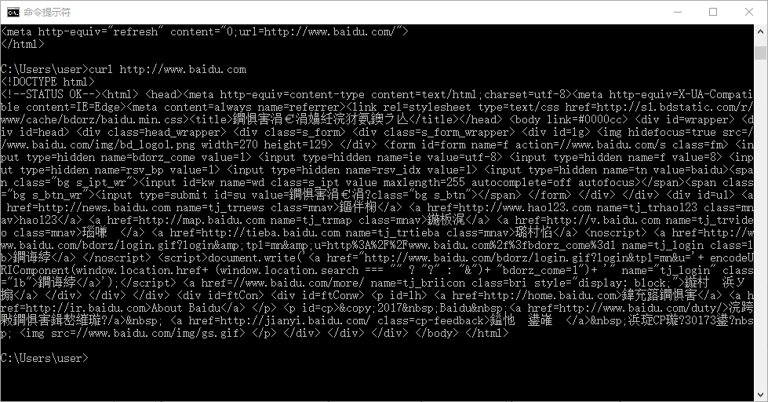
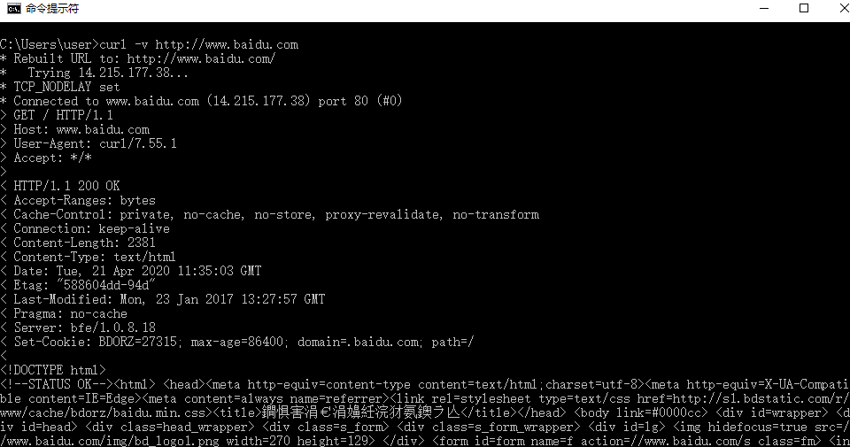
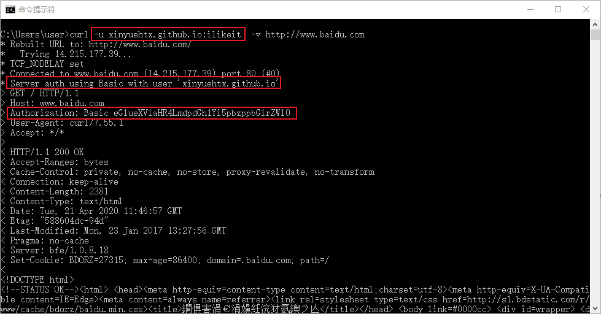
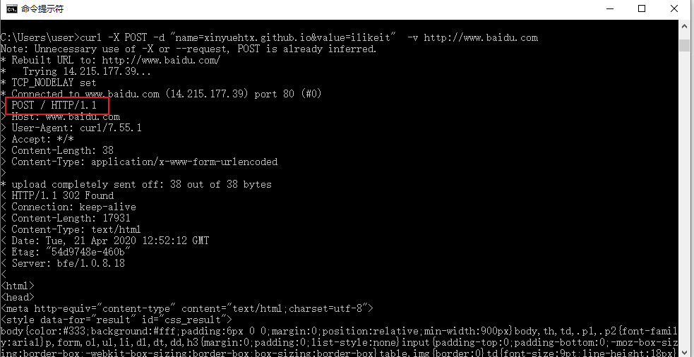

今天给大家介绍下网络分析工具curl。

-----

## 什么是Curl

curl是一款热门的网络传输命令行工具。

除了http协议之外，curl还支持DICT, FILE, FTP, FTPS, GOPHER, HTTP, HTTPS, IMAP, IMAPS, LDAP, LDAPS, POP3, POP3S, RTMP, RTMPS, RTSP, SCP, SFTP, SMB, SBMS, SMTP, SMTPS, TELNET 和TFTP等各类网络协议。

常常应用于linux环境下，进行后台测试，下载文件等。

## Curl的使用

一般来说在各个平台的终端，如windows的cmd，mac的terminal等都会内置了curl工具。

因此可以直接使用。

### 简单访问网址

最简单的使用方式是利用curl访问网址，比如我们访问下百度

```bash
curl http://www.baidu.com
```



我们可以看到直接获得了返回的html

### 展示详情（verbose）

但是有时候我们并不仅仅需要一个返回页面，更期望知道request和response的详情

这个时候就可以使用 -v参数

```bash
curl -v http://www.baidu.com
```



我们看到了本次请求的request和response信息

### 鉴权（Auth）

我们还常常见到一些网站是需要权限才能够访问的

在curl中可以使用 -u参数添加

```bash
curl -u xinyuehtx.github.io:ilikeit -v http://www.baidu.com
```




### post

当然除了get请求，我们还会需要使用其他的http动词，例如post

在curl，我们可以使用-X参数选择http动词和-d参数传入数据

```bash
curl -X POST -d "name=xinyuehtx.github.io&value=ilikeit" -v http://www.baidu.com
```




##其他用法

其他更加详细的用法可以在[curl - Tutorial](https://curl.haxx.se/docs/manual.html) 官网手册

或者直接用`curl -help`获取帮助文档

---

参考文档：

-  https://www.smashingmagazine.com/2018/01/understanding-using-rest-api/
-  [curl - How To Use](https://curl.haxx.se/docs/manpage.html)
-  [curl](https://curl.haxx.se/)
-  [cURL - 维基百科，自由的百科全书](https://zh.wikipedia.org/wiki/CURL)


