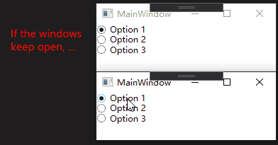
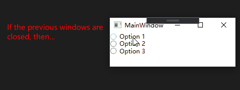
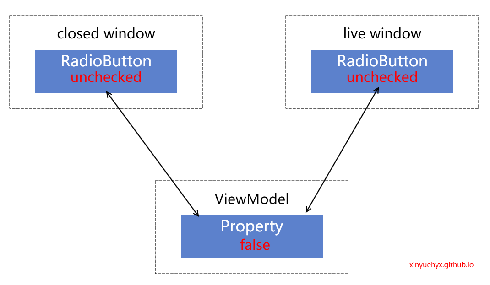
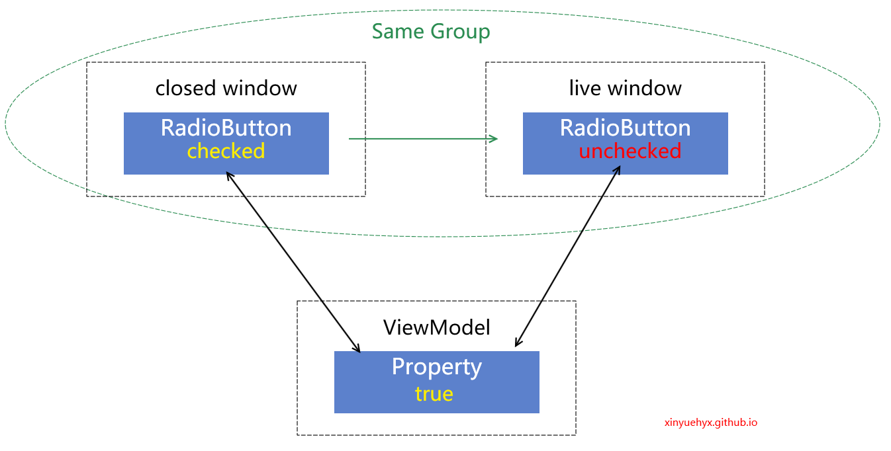
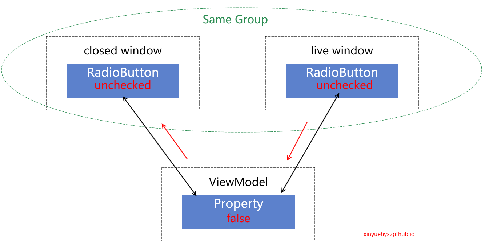
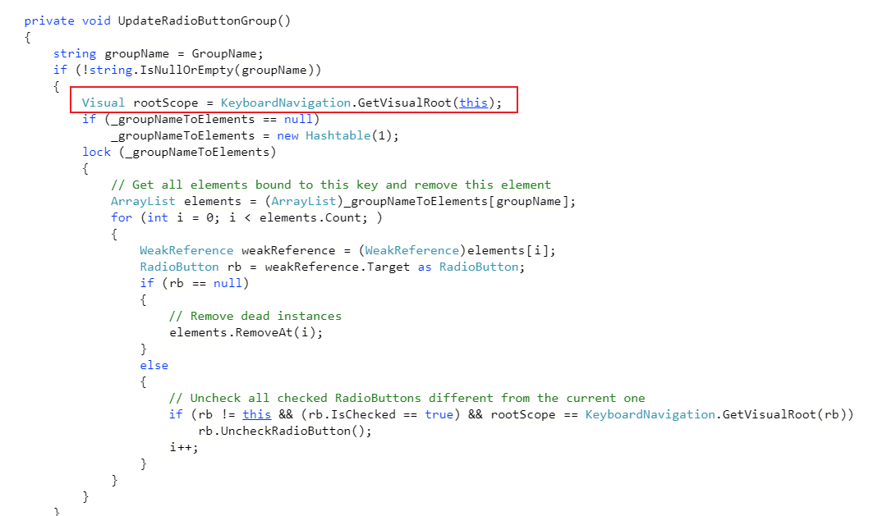
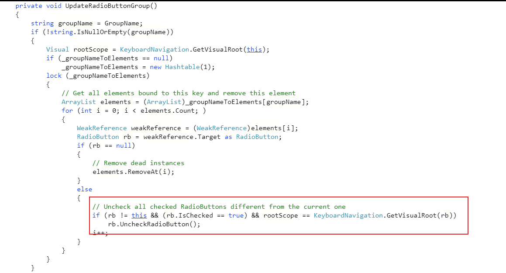

今天遇到一个神奇的WPF的RadioButton的group问题，和大家介绍下。

-----

## 问题描述

英文好的同学可以直接看[吕毅 - walterlv](https://blog.walterlv.com/)同学在github提的[issue](https://github.com/dotnet/wpf/issues/2995)。

最小复现demo，见毅仔的[仓库](https://github.com/walterlv/Walterlv.Issues.RadioButton.GroupName)

我将一组RadioButton关联到了同一个GroupName下，并且绑定了同一个ViewModel。

```xaml
        <Border>
            <RadioButton GroupName="A" IsChecked="{Binding Bar, Source={x:Static local:Foo.Instance}}" Content="Option 1" />
        </Border>
        <Border>
            <RadioButton GroupName="A" Content="Option 2" />
        </Border>
        <Border>
            <RadioButton GroupName="A" Content="Option 3" />
        </Border>
```

```csharp
public class Foo : INotifyPropertyChanged
    {
        public static Foo Instance { get; } = new Foo();

        public bool Bar
        {
            get => _bar;
            set
            {
                if (!Equals(_bar, value))
                {
                    _bar = value;
                    PropertyChanged?.Invoke(this, new PropertyChangedEventArgs(nameof(Bar)));
                }
            }
        }

        private bool _bar;
        public event PropertyChangedEventHandler PropertyChanged;
    }
```

然后开启两个窗口，此时显示正常（图片来自吕毅）



如果我们关闭其中一个窗口，另一个窗口就不能再点击至check状态（图片来自吕毅）



## 原因探究

通过vs断点，我们可以发现ViewModel中被绑定的数值，在点击option1时，先变成true，再变成false。

那么很显然问题是这样的。

- 初始情况下，我们的两个窗口都处于未点击状态



- 接着我们尝试点击未关闭的那个窗口的RadioButton，他的状态变成了checked
  同时，因为binding，ViewModel的属性也变为true，使关闭的那个window（未被GC）也置为checked
  

- 接着就是问题所在了，已经被关闭的window会和还存在的window被识别为同一个GroupName的域。因此
  同一个域中的一个RadioButton被点击，会让其他RadioButton被Unchecked。
  

- 接着就是通过binding，使得ViewModel属性至为false，其他地方被unchecked

  

## 验证

按照猜想，我们已经关闭的窗口的GroupName的scope会和全局的保持为同一个。

因此可以去WPF的源码看看。

我们可以在[RadioButton.cs](https://referencesource.microsoft.com/#PresentationFramework/src/Framework/System/Windows/Controls/RadioButton.cs,539785e3b68f04e6)看到其中的代码是依赖于visual root



不过问题在于如果完全按照referenceSouce的实现，这里不会出现问题



因此，这里还需要进一步调查

## 临时方案

既然知道了是GroupName的scope问题，那么我们可以通过一些方法，针对每一个不同的View实例，提供不同的GroupName字符串。

这类我创建了一个静态类GroupNameProvider，提供了一个附加属性BuildScope

当BuildScope设置为true时，我们可以生成一个guid，并赋值给另一个只读附加属性GroupNameA。

这样我们的RadioButton就可以依赖于这个字符串，实现每个View有不同的GroupName。

代码如下：

```csharp
public static class GroupNameProvider
    {
        public static readonly DependencyProperty BuildScopeProperty = DependencyProperty.RegisterAttached(
            "BuildScope", typeof(bool), typeof(GroupNameProvider), new PropertyMetadata(PropertyChangedCallback));

        private static void PropertyChangedCallback(DependencyObject d, DependencyPropertyChangedEventArgs e)
        {
            if (e.NewValue is bool value && value == true)
            {
                SetGroupNameA(d, Guid.NewGuid().ToString("N"));
            }
        }

        public static void SetBuildScope(DependencyObject element, bool value)
        {
            element.SetValue(BuildScopeProperty, value);
        }

        public static bool GetBuildScope(DependencyObject element)
        {
            return (bool) element.GetValue(BuildScopeProperty);
        }

        public static readonly DependencyProperty GroupNameAProperty = DependencyProperty.RegisterAttached(
            "GroupNameA", typeof(string), typeof(GroupNameProvider), new PropertyMetadata(default(string)));

        private static void SetGroupNameA(DependencyObject element, string value)
        {
            element.SetValue(GroupNameAProperty, value);
        }

        public static string GetGroupNameA(DependencyObject element)
        {
            return (string) element.GetValue(GroupNameAProperty);
        }
    }
```

```xaml
<Grid x:Name="Panel" local:GroupNameProvider.BuildScope="True">
    <RadioButton IsChecked="{Binding Foo}"
      GroupName="{Binding ElementName=Panel,Path=(local:GroupNameProvider.GroupNameA)}"/>
</Grid>
```


---

参考文档：

-  [RadioButtons with the same `GroupName` will affect each other over windows if window is closed · Issue #2995 · dotnet/wpf](https://github.com/dotnet/wpf/issues/2995)
-  [RadioButton.cs](https://referencesource.microsoft.com/#PresentationFramework/src/Framework/System/Windows/Controls/RadioButton.cs,dabba45f135b2941)
