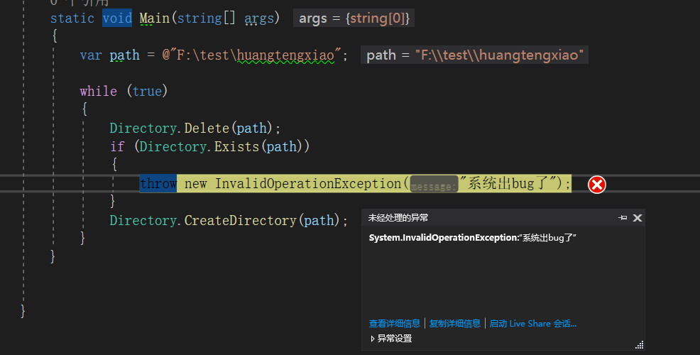
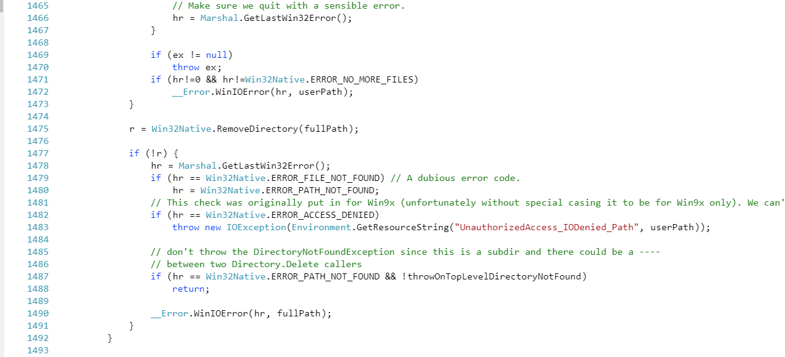

今天遇到一个神奇的Directory问题，和大家介绍下。

**毅仔同学也研究了这个问题** 更加详细，大家可以关注[.NET/Windows：删除文件夹后立即判断，有可能依然存在 - walterlv](https://blog.walterlv.com/post/file-or-directory-delete-is-not-completed-after-calling-delete.html)

-----

## 问题描述

简单描述下问题，

当你调用`System.IO.Directory.Delete`删除一个文件夹，

然后立即用`System.IO.Directory.Exists`进行判断会概率性返回true。

也就是说`System.IO.Directory.Exists`在检测一个刚刚被删除的文件夹时可能得到错误结果

代码如下

```csharp
using System;
using System.IO;

namespace ConsoleApp2
{
    class Program
    {
        static void Main(string[] args)
        {
            var path = @"F:\test\huangtengxiao";

            while (true)
            {
                Directory.Delete(path);
                if (Directory.Exists(path))
                {
                    throw new InvalidOperationException("系统出bug了");
                }
                Directory.CreateDirectory(path);
            }
        }

      
    }
}
```

运行大约3-5s就会触发exception



## 源码分析

去referencesouce里面看看源码。

发现Directory.Exists最终是调用FindFirstFile这个windowsAPI，判断这个文件的标记（注意对于操作系统来说，文件和文件夹都是属于`file`）。

而Directory.Delete，最终是调用RemoveDirectory。




## 猜想

因此对这个问题的猜想是，系统调用RemoveDirectory之后，只是暂时`标记`移除了文件夹。

而在随后的一个时机才会真正执行移除。

所以在很短的时间内，还可以通过FindFirstFile获取文件的Attribute。

因此可以Directory.Exists返回true

---

参考文档：

-  [directory.cs](https://referencesource.microsoft.com/#mscorlib/system/io/directory.cs,da9e994871b99972)
-  [RemoveDirectory](https://referencesource.microsoft.com/#mscorlib/microsoft/win32/win32native.cs,d7268ec44fb9c3ac,references)
-  [file.cs](https://referencesource.microsoft.com/#mscorlib/system/io/file.cs,56cd161c65ab07fe)
-  [FindFirstFile](https://referencesource.microsoft.com/#mscorlib/microsoft/win32/win32native.cs,faee0f9f700fa6f3,references)
-  [.NET/Windows：删除文件夹后立即判断，有可能依然存在 - walterlv](https://blog.walterlv.com/post/file-or-directory-delete-is-not-completed-after-calling-delete.html)
