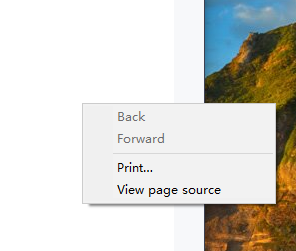
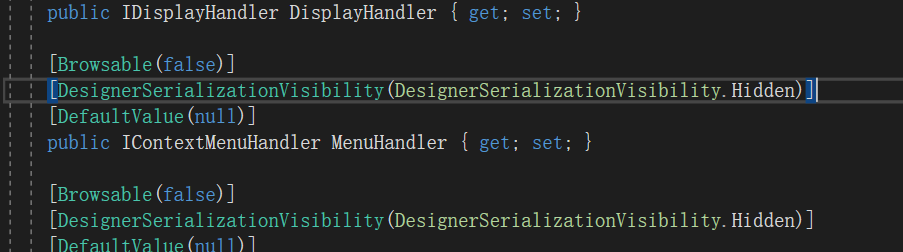

今天遇到了一个在cefsharp中禁用浏览器默认邮件菜单的需求，mark一下。

-----

## 问题描述

当我们使用默认的cefsharp的ChromiumWebBrowser时，会默认添加一个右键菜单项，如下。



实际上，我们业务上往往不需要嵌入浏览器中包含这种右键菜单。

或者我们期望自己实现业务需求的右键菜单。

那应该怎么办呢？

## 解决方法

实际上我们ChromiumWebBrowser暴露了一个MenuHadler属性。

这个是一个IContextMenuHandler接口对象。

我们可以通过自己实现这个接口，进行注入，去调整浏览器默认右键菜单



对于自定义菜单需求可以实现下面这个方法

```csharp
void IContextMenuHandler.OnBeforeContextMenu(IWebBrowser chromiumWebBrowser, IBrowser browser, IFrame frame, IContextMenuParams parameters, IMenuModel model)
        {
            //To disable the menu then call clear
            // model.Clear();

            //Removing existing menu item
            //bool removed = model.Remove(CefMenuCommand.ViewSource); // Remove "View Source" option

            //Add new custom menu items
            model.AddItem((CefMenuCommand)ShowDevTools, "Show DevTools");
            model.AddItem((CefMenuCommand)CloseDevTools, "Close DevTools");
        }
```

model就是菜单模型，可以通过clear方法清除默认菜单项。

通过additem添加新的菜单项。

例如这里我们添加了ShowDevTools和CloseDevTools两个菜单项。

对于点击菜单时执行的命令，我们可以实现下面这个方法

```csharp
 bool IContextMenuHandler.OnContextMenuCommand(IWebBrowser chromiumWebBrowser, IBrowser browser, IFrame frame, IContextMenuParams parameters, CefMenuCommand commandId, CefEventFlags eventFlags)
        {
            if ((int)commandId == ShowDevTools)
            {
                browser.ShowDevTools();
            }
            if ((int)commandId == CloseDevTools)
            {
                browser.CloseDevTools();
            }
            return false;
        }
```

根据接收的commandId，确定执行的菜单命令。


---

参考文档：

-  [CefSharp/MenuHandler.cs at master · cefsharp/CefSharp](https://github.com/cefsharp/CefSharp/blob/master/CefSharp.WinForms.Example/Handlers/MenuHandler.cs)
