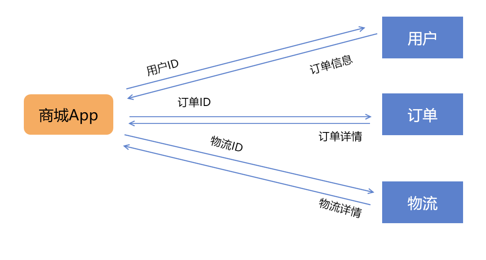
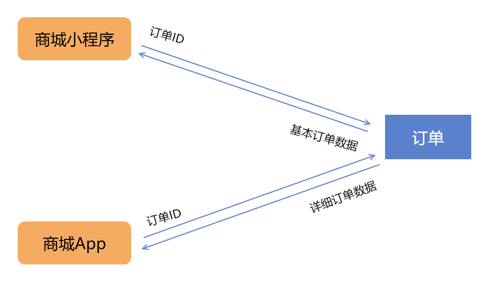
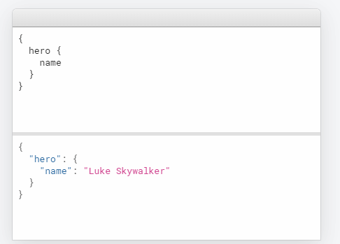
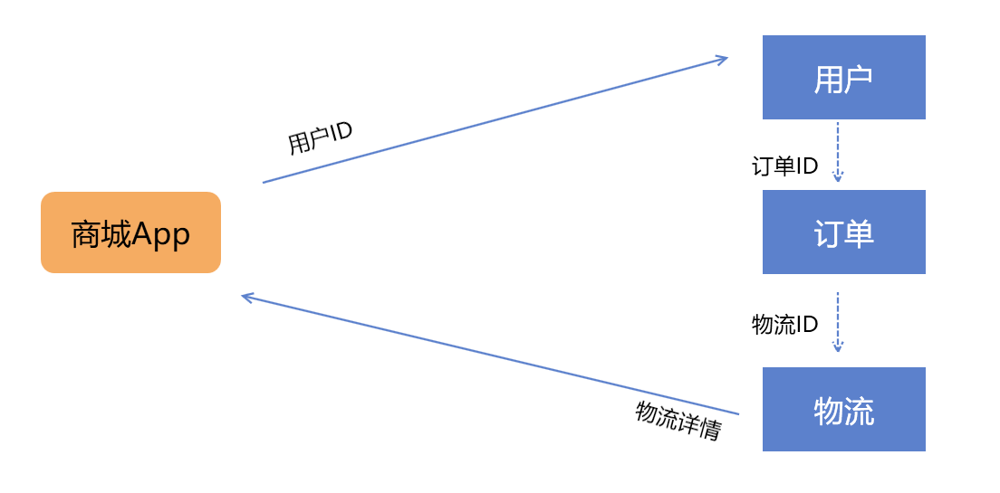
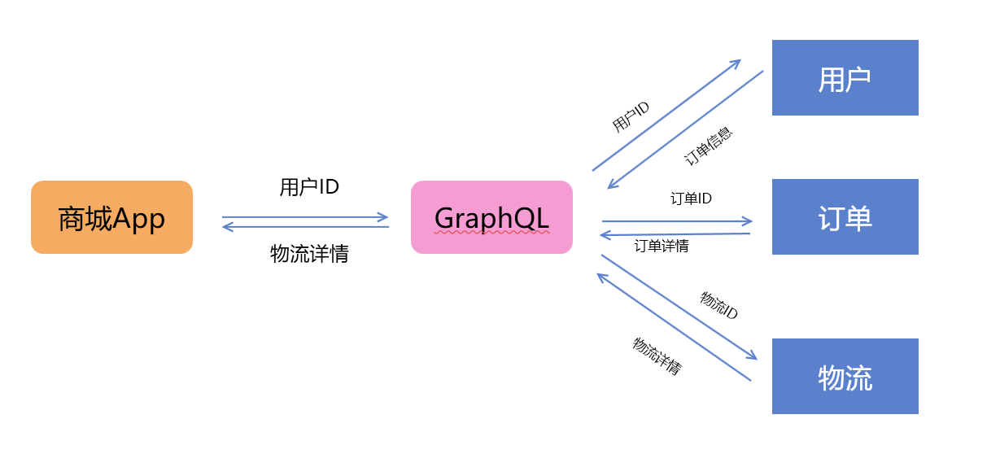
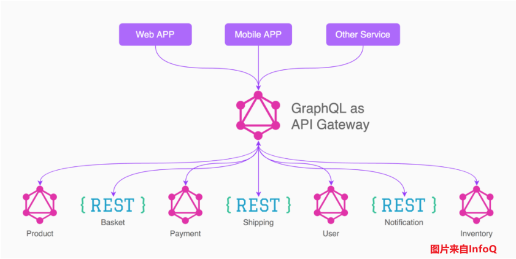

之前[2020-5-6-restful理解 - huangtengxiao](https://xinyuehtx.github.io/post/restful%E7%90%86%E8%A7%A3.html)和大家提及了RESTfulAPI的一个弊端，就是接口膨胀。

也提到了一个解决方案——GraphQL

今天就和大家讲一下什么是GraphQL

-----

## RESTfulAPI的问题

### 请求爆炸

我们先假设有这样一个商城应用，后端对应着用户，订单，物流三个微服务，通过RESTfulAPI暴露服务。

在客户端，我们需要完成查询指定用户的所有商品的物流信息。

那么我们的请求行为应该是这样的。



如上图所示，我们需要先通过用户ID获取从用户服务中获取订单信息，从其中抽取订单ID。

然后再通过订单ID从订单服务中查询订单详情，从中抽取物流ID。

然后再根据物流ID从物流服务中获取物流详细。


我们可以看到，这样的交互模式下，一个小小的功能要发出三个请求，经历6次`糟糕`的网络传输。

这样会大大增加请求响应时间，造成用户体验下降。

### 接口爆炸

还是这个例子，现在我们客户端部分有App和小程序，他们都期望查询订单信息。

但是不同的是，多端模型不一致问题。

对于小程序，可能只需要订单的基本信息，用户简单查询。

而对于App，可能需要的是更加详细的订单数据，以进行更加复杂的操作。



对于这种情况，我们有这么几种方案：

- 要么我们获取所有数据，然后在客户端筛选。
  但是这样会导致小程序端获取过多不必要数据。
- 要么我们通过[HATEOAS](https://xinyuehtx.github.io/post/HATEOAS%E7%AE%80%E4%BB%8B.html)，传入客户端对应的版本类型，进行区分返回数据
  但是HATEOAS实现比较复杂，而且将前端业务逻辑往下沉，之后改动起来容易头大
- 要么我们给两个不同的API，不同的端调用自己的API
  简单有效，但是工作量大

## 什么是GraphQL

GraphQL是一种针对于API的查询语言，能够让你像查询SQL那样调用后端API。

它为上述RESTful的两大问题提供了解决方案：

- 通过请求发送指定的Schema，得到对应的数据
- 一次请求获得多个资源。

在GraphQL的wiki上的例子是这样的

```json
//post
{
    orders {
        id
        productsList {
            product {
                name
                price
            }
            quantity
        }
        totalAmount
    }
}
```

```json
//response
{
    "data": {
        "orders": [
            {
                "id": 1,
                "productsList": [
                    {
                        "product": {
                            "name": "orange",
                            "price": 1.5
                        },
                        "quantity": 100
                    }
                ],
                "totalAmount": 150
            }
        ]
    }
}
```

这里的请求的含义是获取所有的订单信息，订单中要包含对应的id，总价，商品列表，商品列表中要包含商品的信息。

我们可以看到使用GraphQL，发出的请求和收到的响应格式是一一对应的。

而且注意，这里的订单服务和商品目录服务可以是不同的服务，分别获得数据后在GraphQL服务端进行组装、


至于所见即所得，在GraphQL上可以看到这样的一个例子。

这样对于不同的客户端需求，只要写不同的schema即可。

这样业务逻辑也在前端，而且数据量也不会变大。



## GraphQL理解

### 改造商城例子

上述的商城例子用GraphQL改造起来后，`看起来`是这样的。

我们的所有数据能在一个请求中完成。



注意上图中各个微服务之间的调用我们使用的是虚线

因为实际上我们不可能让各个微服务之间进行互相调用，来完成这样的查询

实际的情况如下图所示



GraphQL这边相当于一个API网关，作为用户端和后端实际服务之间的 中间层，

承担了请求schema的解析，对于不同服务的调用，返回数据的拼接。

但是它的好处是这些顺序请求，都是在服务端完成的，减少了网络通信造成的延迟。


而且利用schema解析，可以满足客户端各种类型的数据需求。

## GraphQL接入

如果你理解了GraphQL网关的地位，就能够发现GraphQL可以在现在有RESTfulAPI基础上进行无缝接入。

而且，对于RESTfulAPI和其他的GraphQL服务混合情况下，也是可以顺利使用的。



### GraphQL弊端

GraphQL也存在一些弊端：

- 对于小型项目，GraphQL比较重，多了一层中间层。
  所以简单应用没有必要使用GraphQL
- GraphQL的`子查询`本质上还是链式查询，所以在服务端还是可能因为较多的嵌套导致响应变慢
  因此，对于一些性能敏感应用，或者是可以异步请求的数据，不建议使用GraphQL
- GraphQL的查询对单点故障敏感，部分查询失败会导致整个结果失败。
  所以如果你的某一个服务容易出现单点故障，那就建议将抽离在GraphQL之外，单独提供服务

---

参考文档：

-  [2020-5-6-restful理解 - huangtengxiao](https://xinyuehtx.github.io/post/restful%E7%90%86%E8%A7%A3.html)
-  [为什么说GraphQL可以取代REST API？ - InfoQ](https://www.infoq.cn/article/LVQGuC3vQX-T3PpVCkHt)
-  [2020-5-11-HATEOAS简介 - huangtengxiao](https://xinyuehtx.github.io/post/HATEOAS%E7%AE%80%E4%BB%8B.html)
-  [GraphQL - Wikipedia](https://en.wikipedia.org/wiki/GraphQL)
-  [GraphQL - A query language for your API](https://graphql.org/)
