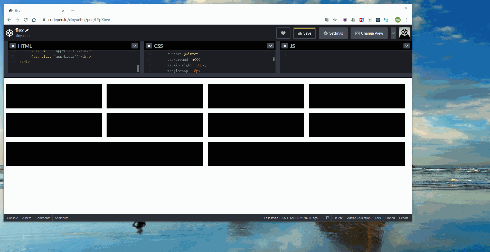
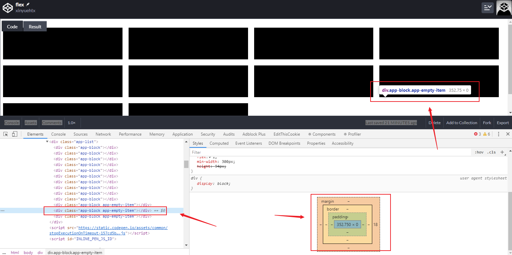

今天来和大家聊一个有意思的flex布局问题。

注：源码可以参考我在codepen做的demo[flex](https://codepen.io/xinyuehtx/pen/LYpXbve)

-----

## 问题来源

问题是这样的，我有一个list，期望做成一个flex的wrap布局。

每个item项有一个最小宽度，随着窗口的拉伸，item宽度会增加，并且占满容器空间。

当窗口宽度增加到一定程度，会触发wrap的布局，每一行会多排列一个item。

代码如下

```html
<div class="app-list">
    <div class="app-block"></div>
    <div class="app-block"></div>
    <div class="app-block"></div>
    <div class="app-block"></div>
    <div class="app-block"></div>
    <div class="app-block"></div>
    <div class="app-block"></div>
    <div class="app-block"></div>
    <div class="app-block"></div>
    <div class="app-block"></div>
</div>
```

```css
.app-list {
    display: flex;
    justify-content: flex-start;
    flex-direction: row;
    flex-wrap: wrap;
}


.app-block {
    cursor: pointer;
    background: #000;
    margin-right: 18px;
    margin-top: 18px;
    flex: 1;
    min-width: 300px;
    height: 94px;
}
```




但是问题来了对于最后一行的item，显示情况就很糟糕了。

由于最后一行的元素更少，所以在就会占用更多的宽度，导致这些元素比其他列表的元素更宽。

## 解决方案

在查询了Stack Overflow的众多问题后，发现这个是一个通用问题，并没有特别完善的css解决方案。

不过在这个问题的答案给了我一些启发[css - Flex: wrapped items with same width as the rest - Stack Overflow](https://stackoverflow.com/questions/42767664/flex-wrapped-items-with-same-width-as-the-rest?rq=1)

利用空列表项进行辅助布局。

```html
<div class="app-list">
    <div class="app-block"></div>
    <div class="app-block"></div>
    <div class="app-block"></div>
    <div class="app-block"></div>
    <div class="app-block"></div>
    <div class="app-block"></div>
    <div class="app-block"></div>
    <div class="app-block"></div>
    <div class="app-block"></div>
    <div class="app-block"></div>
    <div class="app-block app-empty-item"></div>
    <div class="app-block app-empty-item"></div>
    <div class="app-block app-empty-item"></div>
</div>
```

```css
.app-list {
    display: flex;
    justify-content: flex-start;
    flex-direction: row;
    flex-wrap: wrap;
}


.app-block {
    cursor: pointer;
    background: #000;
    margin-right: 18px;
    margin-top: 18px;
    flex: 1;
    min-width: 300px;
    height: 94px;

    
}

/*注释下面代码可以出现问题*/
.app-block.app-empty-item{
        cursor: default;
        height: 0;
        margin-top: 0;
        margin-right: 18px;
}
```

这里我们额外添加了三个列表项，并且将其高度设置为0。

结果如下，我们看到即使最后一行没有填满也能成功布局，使每一项等宽。


我们看到这些额外的列表项实际也参与了flex布局，只是没有高度，所以在感官上不会影响。



## 处理生成列表

当然我们现在开发面对的大部分是生成列表，不会这样手写html

例如我们拿React来说，该怎么处理呢？

```typescript
render() {
        return (
            <div className="app-list">
                {this.props.dataSource.map((item, index) => (
                    <div key={item.id} className="app-block"/>
                )).concat(new Array(3).fill(0).map((_, index) => (<div key={index} className="app-block app-empty-item"/> )))}
            </div>
        );
    }
```

如上所示，这里只要在数据源之后通过concat拼接上一个空的数据项即可。

## 如何决定空列表项个数

由于最后一行列表的最少个数1个，所以同其他行差距为，单行铺满的个数-1 。

因此我们只要让空列表项个数为，窗口最大宽度能铺满的个数再-1就可以了。

---

参考文档：

-  [flex](https://codepen.io/xinyuehtx/pen/LYpXbve)
-  [CSS flex-wrap property](https://www.w3schools.com/cssref/css3_pr_flex-wrap.asp)
-  [A Complete Guide to Flexbox | CSS-Tricks](https://css-tricks.com/snippets/css/a-guide-to-flexbox/)
-  [css - How to keep wrapped flex-items the same width as the elements on the previous row? - Stack Overflow](https://stackoverflow.com/questions/23274338/how-to-keep-wrapped-flex-items-the-same-width-as-the-elements-on-the-previous-ro)
-  [css - Flex-box: Align last row to grid - Stack Overflow](https://stackoverflow.com/questions/18744164/flex-box-align-last-row-to-grid)
-  [css - Flex: wrapped items with same width as the rest - Stack Overflow](https://stackoverflow.com/questions/42767664/flex-wrapped-items-with-same-width-as-the-rest?rq=1)
-  [html - Targeting flex items on the last or specific row - Stack Overflow](https://stackoverflow.com/questions/42176419/targeting-flex-items-on-the-last-or-specific-row)
-  [html - Equal width flex items even after they wrap - Stack Overflow](https://stackoverflow.com/questions/44154580/equal-width-flex-items-even-after-they-wrap)
-  [html - Targeting flex items on the last or specific row - Stack Overflow](https://stackoverflow.com/questions/42176419/targeting-flex-items-on-the-last-or-specific-row)

