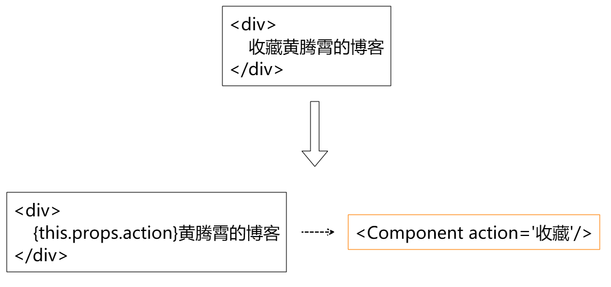

今天来和大家聊React的渲染更新过程。

-----

## React是JavaScript代码

在聊渲染更新之前，我们不能忽视的一个概念是——React是JavaScript代码。

我们都知道React传给浏览器的并不是一个HTML代码，而是一段js脚本。

而在浏览器接收到js脚本之后，再执行并生成对应的html元素，插入到DOM中。

这种做法提供了前端组件化的能力，能够让前端的同学不再“面向UI”进行操作。

例如上面的例子，我们把一段原生的HTML元素封装成了一个Component组件。

组件成了一个独立的模型概念，而组件内部的div等HTML元素，就成了封装的UI细节。

这样一来，我们就可以在开发时把更多精力放在模型实现上（功能），而暂时不需要视觉显示（UI）。

React框架会帮我们将模型装换成相应的HTML元素，挂载至DOM树上。

这就实现了Model和View的关注点分离。

这样我们如果需要进行业务模型的变化，组件就能够高效复用。

比如我们这里把收藏改为点赞。就可以这样写。

## 从虚拟DOM到DOM

### 渲染是一个“重”操作

React将我们从复杂的HTML的DOM节点操作中解放出来。

但是浏览器终究只能解析渲染真实的HTML元素，而不是jsx定义的语法糖。

任何在对React组件进行的变更操作，最终还是要转换成HTML才能在浏览器渲染。

然而，重绘整个HTML的DOM是一件非常耗性能的工作。

原本只需要操作一个div元素进行修改，如果现在用React需要对整个DOM进行刷新，肯定是不能接受的。

那能不能每次React组件更新，只修改组件对应的DOM节点内容呢？

### 构建虚拟DOM

在React中，组件是一个封装后的概念。组件的渲染还是会依赖于HTML的元素。

那么如果我们把React从root挂载的组件开始“解封装”，会得到一个只有HTML元素组成的树。

这颗“React 树”的结构在`大部分`情况下和实际渲染后的DOM树结构是一模一样的。

（注：“小部分”使两颗树不一样的点在于React的[Portals – React](https://reactjs.org/docs/portals.html)概念，这里暂时不讲，不会影响后续内容）

这样一来，我们只要观察这颗虚拟的“DOM”树上的结点变化，再刷新真实DOM树上对应的结点，就能实现对特定的HTML元素的更改，进而达到高性能更新UI。

## 虚拟DOM之间的比较

有了上述的知识，我们现在开始看看React的更新过程。

React出现了"更新"，意味着树的结构出现了变化。

为了性能考虑，我们比较变更时，只会选择新旧两颗虚拟DOM树之间的变化比较。

以上面图中的变更为例。

对于我们肯定很容易想到，只要对节点B和节点C交换，再向节点E添加一个子节点F就可以了。

但是对于React来说，不是这样。

对两颗树做“完全”的比较是一个复杂度为O($n^3$)的算法。

这么高的时间复杂度是不能接受的。

### 启发式Diffing算法

React在做比较算法时做了一个假设——在HTML的DOM节点中，叶节点（包括子树）的添加和删除是常态，而插入和移动是罕见的。

这个假设带来的就是，在React的比较算法中，只要发现对应节点位置的元素不一致，就会将整个节点对应的子树全部更新。

以上图为例，在比较到B节点位置发现节点类型变化了，所以整个子树发生了替换。从而对应的HTML的DOM子树也发生了更新。

这种启发式算法只需要对整个虚拟DOM树做一次遍历，所以复杂度降低到了O(n)。

## 没有第二颗树

聊到这里，我们再思考一下。我们真的有必要把新的虚拟DOM树完全构建出来么？

既然我们的diff算法只是遍历一次虚拟DOM树，那么我们就可以把生成节点和比较放在一起。

还是以上一个小节的例子，模拟一遍React的diff过程。

首先是节点A的state发生了变更，所以触发了自身的render方法，得到子节点C和E。

注意，此时节点C和E还没有完全“创建”，即没有走构造函数，只是一个用于比较的中间对象。

接着就可以对节点B和C进行diff。

diff结果，发现是不一样类型的对象。

因此，需要对虚拟DOM中B的子树进行销毁，然后替换为节点C。

此时B子树的组件都会执行*componentWillUnmount*。

然后创建组件C的实例，挂载到虚拟DOM，并且执行*componentDidMount*

C节点作为一个新挂载的节点，不需要进行diff，直接将子节点生成并挂载即可。

接着对比节点E，此时发现节点E的类型相同。

此时React不会创建新的实例，而是复用E原有实例，并且传入props，进行render。

由于节点E原来没有子节点，因此直接挂载节点F即可。

我们可以看到React的整个渲染更新过程，只有在一个虚拟DOM树上进行更新。

这样可以尽量减少时间和内存消耗

## render和虚拟DOM树更新是两个过程

最后有一个小问题，下图中由于A节点的state发生改变，导致虚拟DOM更新，会导致哪些组件触发render

（注：图中每个节点都是`React.Component`，线段上表示传入的props）

当当当当，答案是全都会触发render。

有同学问了，为什么会这样，明明B节点子树都没有变化，为什么要触发这些“多余”的render。

这里，其实很容易混淆的一点是，render和虚拟DOM树更新，是两个过程。

当我们在对节点B进行diff算法的时候，我们并不知道，节点B的子节点渲染出的结果一定是一致的。

所以React必须对每一个组件调用render方法，再进行对比。

### props和state决定render结果

有同学会不服气，明明是传入的相同的props，渲染结果为什么会不一致？

能这么问，说明你平时开发保持很好的习惯。

对于React组件来说，推荐的情况是props和state决定render结果。

如果这么做了，的确能够在比较节点B后，就确定B子树的render结果一定相同。

但是现实是，React没有办法约束大家这么做。

开发权在我们手里，我们完全可以让一个组件每次都随机生成render的结果。

所以React没有办法，只能依次比较。

### React.PureComponent

那有没有解决方案呢？

有，你可以把一个组件继承自`React.PureComponent`。

这样会对React表明，这个组件一定是由props和state决定render结果。

这样React在节点B对比后，就不会继续比较它的子树了。

（注意：`React.PureComponent`还是有一些使用前提的，这里暂时不展开，大家可以去看官网文档）

## 小结

这次我们探索了React的渲染和更新机制，发现了以下几点：

- React通过js控制渲染
- 通过启发式diff算法，减少时间复杂度
- 通过单独的虚拟DOM减少空间复杂度
- 发现render和DOM更新属于不同的过程

正是这些算法的一步步优化，实现了React的高性能渲染和更新方案。

让React的使用者提升了开发效率，也增强了产品的用户体验

---

参考文档：

-  [Reconciliation – React](https://reactjs.org/docs/reconciliation.html)
-  [Portals – React](https://reactjs.org/docs/portals.html)
-  [editsurvey.dvi](https://grfia.dlsi.ua.es/ml/algorithms/references/editsurvey_bille.pdf)

