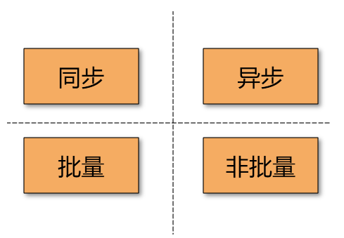
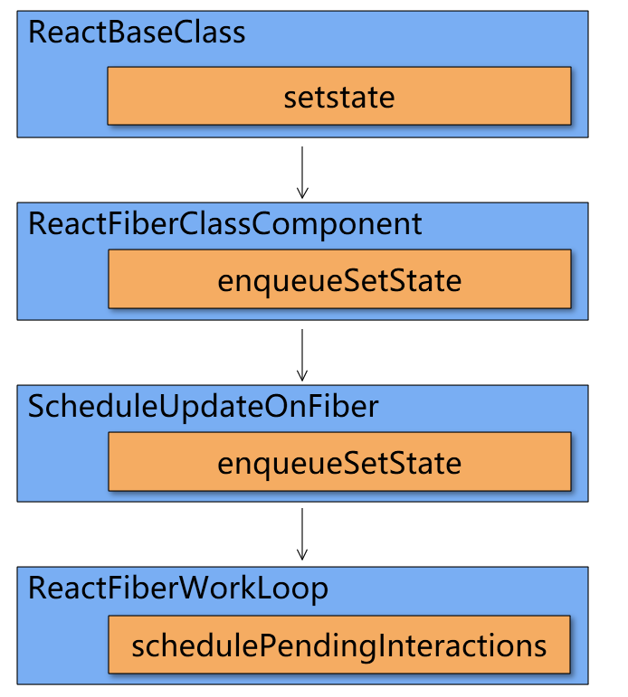

今天和大家聊一聊React的render时机问题。

-----

---

参考文档：

-  [javascript - How to synchronously render components with React (or render to string) - Stack Overflow](https://stackoverflow.com/questions/37979778/how-to-synchronously-render-components-with-react-or-render-to-string)
-  [Simplifying state management in React apps with batched updates - LogRocket Blog](https://blog.logrocket.com/simplifying-state-management-in-react-apps-with-batched-updates/)

