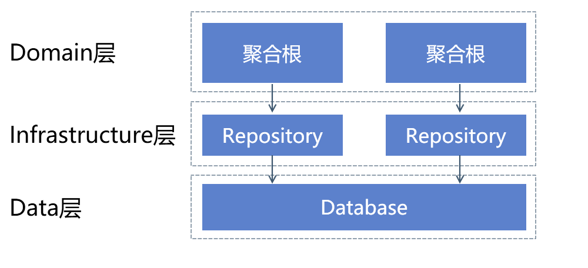
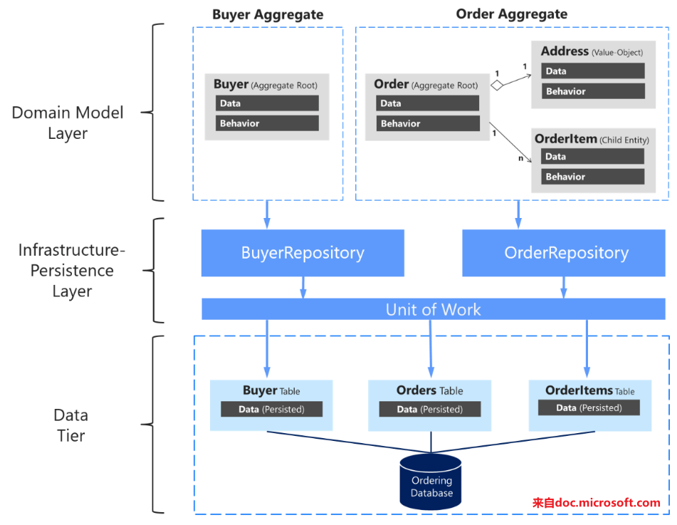

今天和大家介绍一下一种特殊的设计模式——仓库模式（repository pattern）

-----

## 什么是仓库模式（repository pattern）

Martin Flower对此的定义是领域模型层和数据映射层中间的间接层。它封装了一系列数据库对象以及对应的操作。实现了领域模型和数据访问层的解耦。

## Repository 模式作用

试想一下，在你的程序中，有多处地方需要查询，修改数据。

你肯定不希望在各个地方重复书写数据访问代码，所以你会将其放置在同一处地方（数据访问层）。

这在大部分场景下都能够满足要求。

但是如果你是使用模型驱动开发的方式进行软件开发，那么就很容易发现这样一个问题——领域模型的格式和数据库的格式不一致。

例如上面的这张图，Buyer和Order是领域模型的两个聚合根，其中Order中包含了OrderItem这一实体对象。

然而在数据层中，Order和OrderItem分别存储在不同的表中。

这就意味着在对Order进行更改时，需要同时更新两张表中的数据。而这个逻辑不应该是领域层应该关心的事情。

Repository 就充当了这一个中间层，封装了从Order这个聚合根到Orders和OrderItems这两张表之间的数据访问业务逻辑。让领域层可以更加关注领域业务逻辑。

### 其他好处

当然对于Repository 来说，作为一个中间层，也自然会有其他中间层的通用优势。

比如说单元测试时，可以mock数据仓库。面向接口编程，便于替换ORM等数据映射层实现。

## Repository 同DAL比较

Repository 模式是模型驱动的，微软在《.NET Microservices: Architecture for Containerized .NET Applications》一书中推荐每一个聚合根都要对应一个Repository 。

Repository 更方便领域模型层对模型数据进行操作。

而DAL是数据驱动的，所有的操作都是面向数据库中的存储方式，进行对应的增删改查。

Repository 也可以在DAL之上进行搭建。

可以说Repository模式的存在就是为了抹平模型表示和数据库存储表示之间的差异。

让数据更容易被领域模型使用。

---

参考文档：

-  [Designing the infrastructure persistence layer | Microsoft Docs](https://docs.microsoft.com/en-us/dotnet/architecture/microservices/microservice-ddd-cqrs-patterns/infrastructure-persistence-layer-design)
-  [P of EAA: Repository](https://martinfowler.com/eaaCatalog/repository.html)
-  [Repository Pattern | DevIQ](https://deviq.com/repository-pattern/)
-  [关于Repository模式 - 云+社区 - 腾讯云](https://cloud.tencent.com/developer/article/1343277)
-  [The Repository Pattern - 简书](https://www.jianshu.com/p/f97466245ed8)

