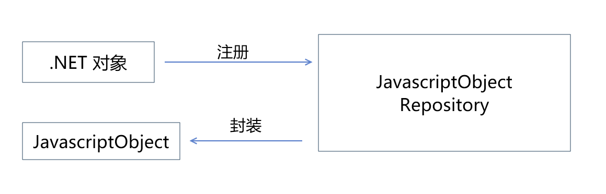
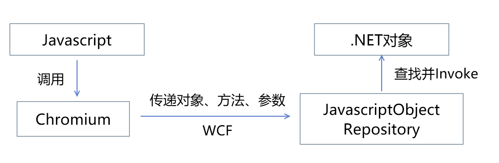
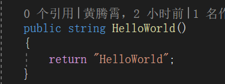
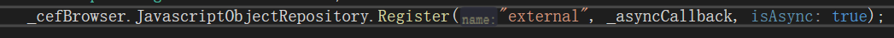
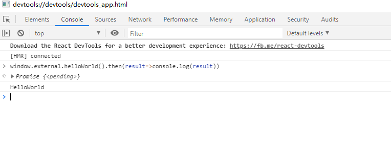
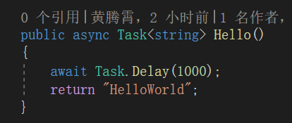
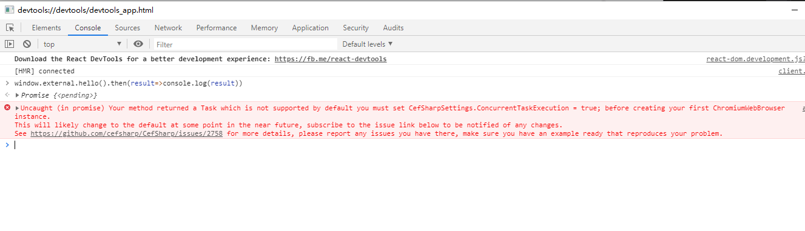
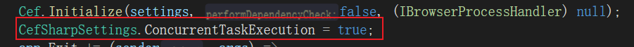
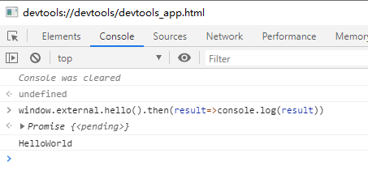

今天和大家介绍一下使用cefsharp，在浏览器中调用.Net 方法

-----

## 什么是cef和cefsharp

Cef全称Chromium Embedded Framework 是谷歌的chromium浏览器的嵌入式框架，可以给予其他应用嵌入谷歌chromium浏览器的能力。

CefSharp是Cef的.NET 封装版本，可以在.NET环境下运行Cef。

有了CefSharp我们就能够在.NET应用中嵌入前端界面，大大扩展了前端页面在多端复用的能力。

CefSharpn的的使用例子可以参考github给出的官方用例：

- [CefSharp/CefSharp.Wpf.Example at master · cefsharp/CefSharp](https://github.com/cefsharp/CefSharp/tree/master/CefSharp.Wpf.Example)
- [CefSharp/CefSharp.WinForms.Example at master · cefsharp/CefSharp](https://github.com/cefsharp/CefSharp/tree/master/CefSharp.WinForms.Example)

今天我们着重讲一下如何利用CefSharp实现浏览器中调用.NET方法。

## Cef调用.NET方法原理



```csharp
public class BoundObject
{
    public int Add(int a, int b)
    {
        return a + b;
    }
}

browser.JavascriptObjectRepository.Register("boundAsync", new BoundObject(), true, options);
```


第一步是在cef控件的JavascriptObjectRepository中注册一个.NET对象。

此时cef会将这个.NET 对象存储在一个字典中，并且分析对象的MethodInfo将对象中所有public的实例方法信息提取出来。



接下来在运行时，执行对应的js方法时，Chromium会将对应的对象的方法，参数等，序列化后通过WCF（CefSharp是如此）传递至JavascriptObjectRepository。

JavascriptObjectRepository更据对象名称找到字典中的.NET对象，并Invoke对应的Method获得结果。

```javascript
(async function()
{
	await CefSharp.BindObjectAsync("boundAsync");
	
	//The default is to camel case method names (the first letter of the method name is changed to lowercase)
	boundAsync.add(16, 2).then(function (actualResult)
	{
		const expectedResult = 18;
		assert.equal(expectedResult, actualResult, "Add 16 + 2 resulted in " + expectedResult);
	});
})();
```

## Cef调用.NET方法实践

### 调用.NET的同步方法



实践一下，这里我们定义了一个HelloWorld方法，返回一个字符串"HelloWorld"。



接着我们将方法进行注册，并且指定isAsync为true

注意：请不要使用同步执行长时间任务，可能会导致浏览器的渲染线程卡死。



然后我们在浏览器进行调用，成功返回了。

### 调用.NET的异步方法

我们当然不止是有同步的方法，更常见的情况会在.NET中使用异步方法。

这就容易导致异步方法传递，所以暴露给浏览器的js方法就可能是返回一个task。



例如我们这里定义的Hello方法，返回的是一个`Task<String>`。

然而我们直接调用的话会返回如下错误。



这里提示是Task对象不是浏览器原生支持的对象，没有办法在js中调用，也不能跨WCF传递。

因此我们必须先使用Task.Result同步执行完成，再将结果传递给前端。

好在CefShape不会让我们在业务端做这些重复工作。

只要在第一个Cef控件初始化之前，设置`CefSharpSettings.ConcurrentTaskExecution = true;`



现在我们再试试前端调用，正常等待1s之后获得返回值。




## 风险点

我们刚刚看到目前的CefSharp利用WCF进行通信。

但是WCF在最新的.NET Core还没有得到支持，短期也看不到微软要支持它的样子。

因此目前只能在.NET Framework项目中使用。

## 总结

- 使用CefSharp可以打通Chromium浏览器和.NET
- 使用js调用.NET同步方法
- 使用js调用.NET异步方法

---

参考文档：

-  [General Usage · cefsharp/CefSharp Wiki](https://github.com/cefsharp/CefSharp/wiki/General-Usage#3-how-do-you-expose-a-net-class-to-javascript)
-  [CefSharp中文帮助文档 · cefsharp/CefSharp Wiki](https://github.com/cefsharp/CefSharp/wiki/CefSharp%E4%B8%AD%E6%96%87%E5%B8%AE%E5%8A%A9%E6%96%87%E6%A1%A3#a9_3)
-  [CefSharp/JavascriptObjectRepository.cs at e81a3ed316ee86401981c0d9954db1247ee97295 · cefsharp/CefSharp](https://github.com/cefsharp/CefSharp/blob/e81a3ed316ee86401981c0d9954db1247ee97295/CefSharp/Internals/JavascriptObjectRepository.cs)
-  [Chromium Embedded Framework - Wikipedia](https://en.wikipedia.org/wiki/Chromium_Embedded_Framework)
-  [CefSharp/CefSharp.WinForms.Example at master · cefsharp/CefSharp](https://github.com/cefsharp/CefSharp/tree/master/CefSharp.WinForms.Example)
-  [CefSharp/CefSharp.Wpf.Example at master · cefsharp/CefSharp](https://github.com/cefsharp/CefSharp/tree/master/CefSharp.Wpf.Example)


