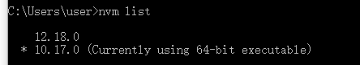
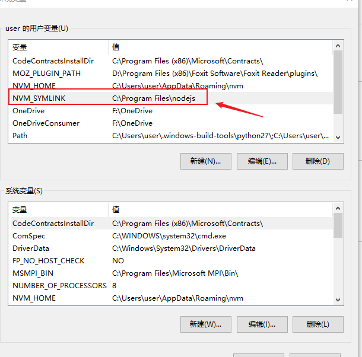
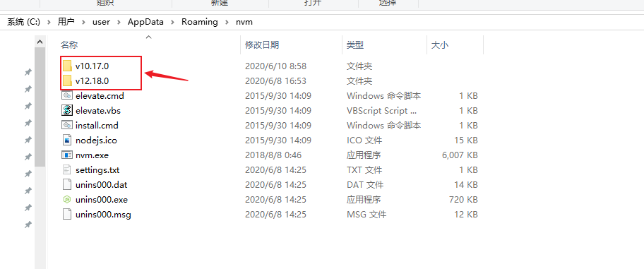
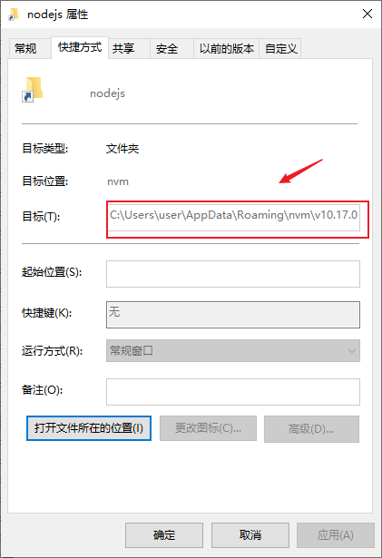
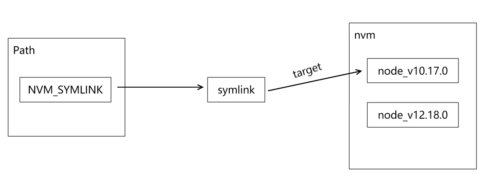

今天和大家聊一聊node在windows下的版本管理工具NVM-windows

-----

## 为什么需要node版本管理

主要原因有两个：

- 开发时保证项目以及依赖库（尤其是原生的addon）API兼容。
- 调试特定node版本下的软件问题。

## 推荐的node版本管理工具

- 如果是在mac/linux下，可以使用[nvm-sh/nvm](https://github.com/nvm-sh/nvm)
- 如果是在windows下，可以使用我们今天要讲的[coreybutler/nvm-windows](https://github.com/coreybutler/nvm-windows)

## 使用方法

1. 卸载你电脑上的node以及npm

2. 在[Releases · coreybutler/nvm-windows](https://github.com/coreybutler/nvm-windows/releases)中下载最新的安装包

3. 使用下面的命令就可以安装和切换指定版本的node了

   ```bat
   nvm install 10.17.0
   nvm use 10.17.0
   ```

4. 使用下面的命令，检查是否成功切换到对应的版本

   ```bat
   nvm list
   ```

   

## 原理解析

nvm-windows是如何做到多个版本的node进行切换的呢？

- 首先，nvm-windows添加了一个系统环境变量NVM_SYMLINK，指向了一个symlink（你可以简单理解为快捷方式）
- 接着nvm将不同的node版本文件下载到自己的指定目录下
- 最后将symlink的target指向特定版本的文件夹，就实现了node版本的切换。








最终整体的原理如下图所示。




这样就最终在windows实现了多个版本的node管理。

当然我们也可以参照这个思路去实现其他的软件在windows下的版本管理。


---

参考文档：

-  [coreybutler/nvm-windows: A node.js version management utility for Windows. Ironically written in Go.](https://github.com/coreybutler/nvm-windows)
-  [nvm-sh/nvm: Node Version Manager - POSIX-compliant bash script to manage multiple active node.js versions](https://github.com/nvm-sh/nvm)

