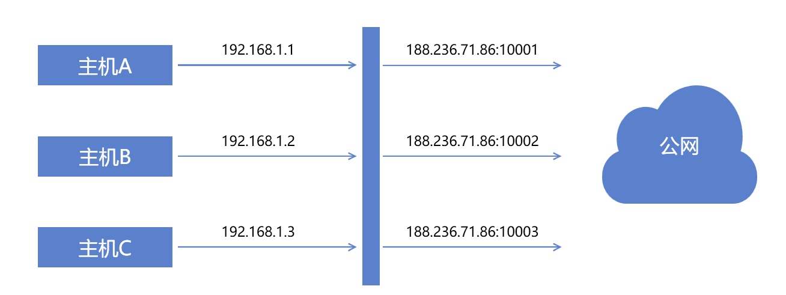
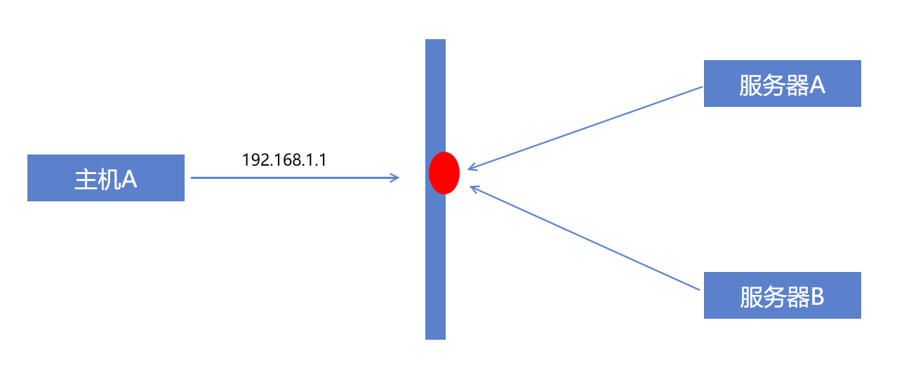
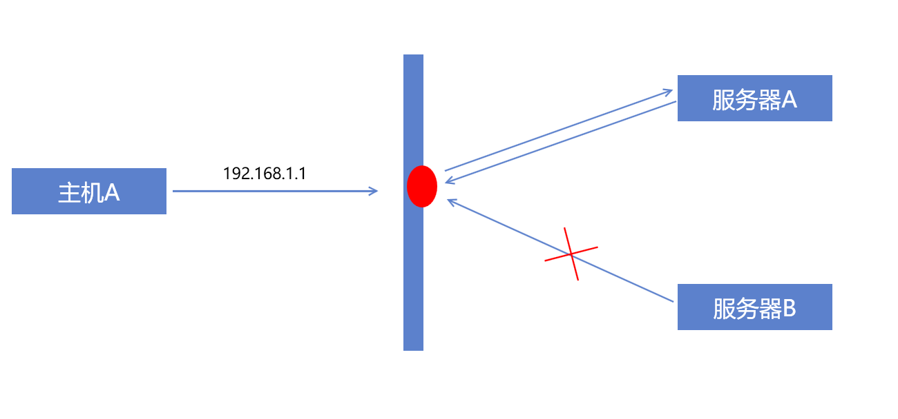
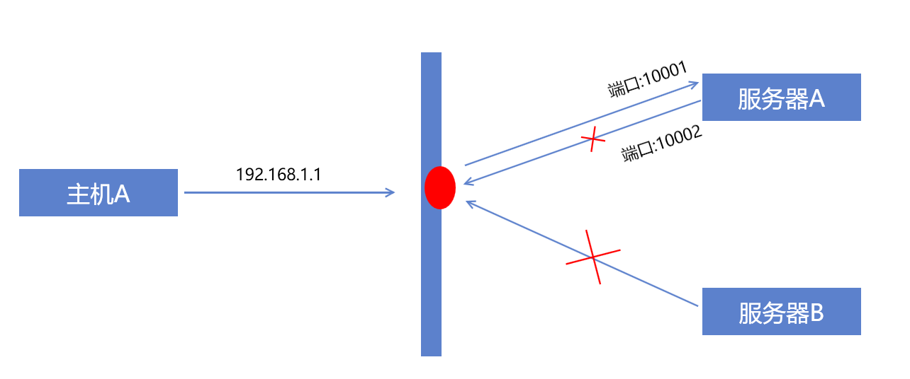
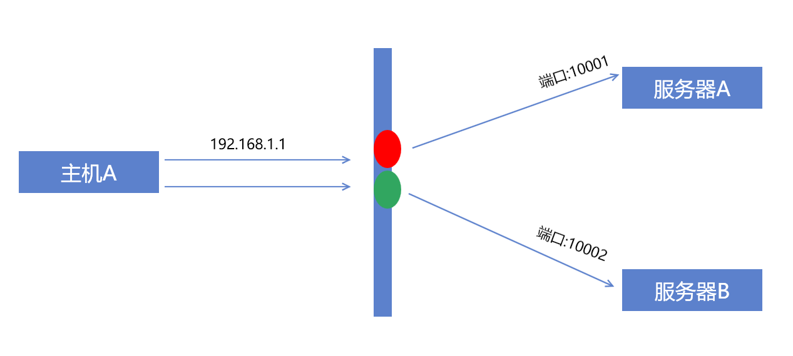
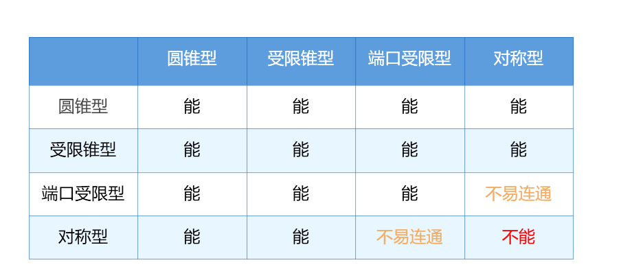

今天和大家聊一聊NAT穿越

-----

## 什么是NAT

NAT(**N**etwork **A**ddress **T**ranslation)，即网络地址转换，是一种ip数据包的重写技术。

为什么要要有NAT呢？

这是因为现实中公网的ip地址过少，很多单位，学校都不能满足每个主机分配一个公网地址。

因此会通过NAT技术将内网的主机地址映射为同一个公网地址的不同端口，进行外网访问。

## NAT的缺点

NAT解决了内网环境下多主机上网的问题，但是也造成了难以从外网访问内网主机的问题。

尤其是在一些p2p应用的场景下(比如现在越来越火的webrtc)，NAT穿越成为了需要着重研究的点。

## NAT的分类

NAT一共可以分为四种：

- 圆锥形NAT：相当于在NAT服务器上打了个洞，所有外部主机都可以按照这个公网的IP:port发送数据，并且能够顺利找到内网主机

- 受限锥型NAT：NAT会记录内网主机访问的外网IP，只有来自同一个IP的请求才能转发到内网主机。

- 端口受限型NAT：NAT会记录内网主机访问的外网IP和端口，只有来自同一个IP且同一个端口的请求才能转发到内网主机。

- 对称型NAT：每次请求的连接都会使用不同的公网端口

注意，对称型NAT和其他三个最大的不同点在于每次请求的端口都会变化，这就导致了NAT穿越的难度增加。

## NAT穿越

我们如何实现NAT穿越呢？

方式就是在NAT后面的主机向公网指定端口发送一个包，这样就会在NAT服务器上留下一个端口。

其他主机只要知道了这个端口，就可以向内网主机发送数据了。

这个行为形象的称之为“打洞”。

### 一方是圆锥型NAT

当一方是圆锥型NAT，只要它向某个公网服务器（例如STUN服务器）发送一个包。

这样它在公网的ip和端口就确定了。

无论对端是哪种类型的NAT，只要向这个ip和端口发送数据即可连通。

### 双方是受限锥型NAT或者端口受限型NAT

那么双方都向公网服务器发送一个包，确定自己的ip和端口，并通过公网服务器发送给对方。

接着双方再向对方地址发送一个包，之后就可以实现通信了。

### 一方是对称型NAT

- 当对方是圆锥型NAT：只要让对方先发送请求即可

- 当对方是受限锥型NAT：需要在双方交换完地址后，对方先发送一个包，确保指定IP的数据可接收；本机再向对方IP和端口发送数据，完成连接。

- 当对方是端口受限型NAT：需要在双方交换完地址后，本机先发送一个包，在NAT服务器上打洞。

  但是此时对端并不知道本机这次打洞的端口，所以需要向各个端口都进行发包探测。此时本机需要不停的向对端发包，直至某一个包被接收。此时双方都确定了对方的ip和端口，完成通信。

- 当对方是对称型NAT：没有办法连通。因为其中一个主机在每次探测时，自身的端口都会变化。这样对方无法确定本机端口。因此只能通过公网服务器进行中转（例如TURN服务器）

### 穿透总结

各个类型的NAT穿透可以总结如下表

当然有同学会觉得这个东西太复杂。

不过没关系，已经有一些现成的方案帮我们做了这些事情。比如webrtc的ice，可以使用简单API的完成NAT的穿越。当遇到无法穿越的对称型NAT时，也会降级为服务器中转。

这样我们开发时，就不需要关注这类问题了。

---

参考文档：

-  [网络地址转换 - 维基百科，自由的百科全书](https://zh.wikipedia.org/wiki/%E7%BD%91%E7%BB%9C%E5%9C%B0%E5%9D%80%E8%BD%AC%E6%8D%A2)
-  [STUN - 维基百科，自由的百科全书](https://zh.wikipedia.org/wiki/STUN)
-  [NAT穿透 - 维基百科，自由的百科全书](https://zh.wikipedia.org/wiki/NAT%E7%A9%BF%E9%80%8F)
-  [NAT 穿透原理浅浅说（一） - 云+社区 - 腾讯云](https://cloud.tencent.com/developer/article/1005974)
-  [udp协议怎么穿透Symmetric NAT？ - 知乎](https://www.zhihu.com/question/20436734)
-  [NAT穿透 - 知乎](https://zhuanlan.zhihu.com/p/86759357)

