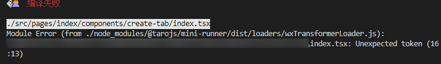
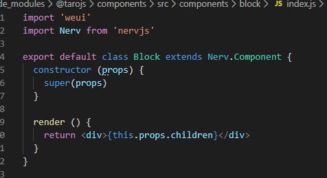

今天和大家聊一聊taro使用React.Fragment出现的问题。

-----

## 什么是React.Fragment

在react组件中，只能返回单一的元素，不能返回一个元素列表。

```jsx
//报错
render() {
  return (
      <ChildA />
      <ChildB />
      <ChildC />
  );
}
//正常
render() {
  return (
    <div>
      <ChildA />
      <ChildB />
      <ChildC />
    </div>
  );
}
```

这个是由React的API决定的，因为这段jsx代码最终会转换成为如下的调用。

```javascript
React.createElement(
  type,
  [props],
  [...children]
)
```

因此必须由一个父元素进行包裹

但是这种方式是有代价的，多了一个“无用”div元素。

如果这些无用的元素多了，页面的层级以及复杂度增加，就会影响页面性能

因此React推出了Fragment元素。

```jsx

render() {
  return (
     <React.Fragment>
      <ChildA />
      <ChildB />
      <ChildC />
    </React.Fragment>
  );
}
//简写
render() {
  return (
    <>
      <ChildA />
      <ChildB />
      <ChildC />
    </>
  );
}
```

Fragment元素在进行dom转换时会被忽略，因此能够在兼容react语法的同时，不引入额外的元素。

## taro不支持React.Fragment

taro作为一个react语法作为dsl的框架，并没有类似的React.Fragment语法实现

如果你使用了`<>`的语法，就会发现在编译时报如下错误



**不要相信提示的报错位置!!**

taro编译时不会表明是`<>`的语法的错误，报错的位置会千奇百怪。这也是难以调查的根源

## 解决方案

官方推荐的方法是使用`<Block>`元素进行处理。



我们可以看下对应源码，发现他实际上还是使用了一个`<div>`进行包裹，因此还是会出现一些性能问题。

因此还是期待taro官方能在之后的版本中添加支持吧

---

参考文档：

-  [Children 与组合 - Taro 文档](https://nervjs.github.io/taro/docs/children/)
-  [Debug 指南 - Taro 文档](https://taro-docs.jd.com/taro/docs/next/debug/#%E8%BF%90%E8%A1%8C%E6%97%B6%E6%8A%A5-dom-%E7%9B%B8%E5%85%B3%E9%94%99%E8%AF%AF)
-  [Fragments – React](https://reactjs.org/docs/fragments.html)

