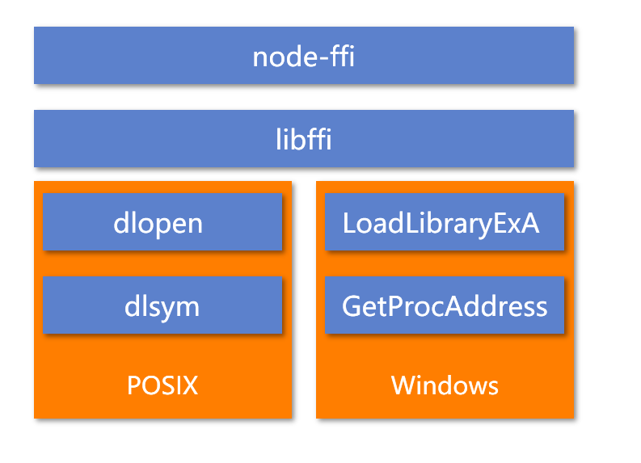
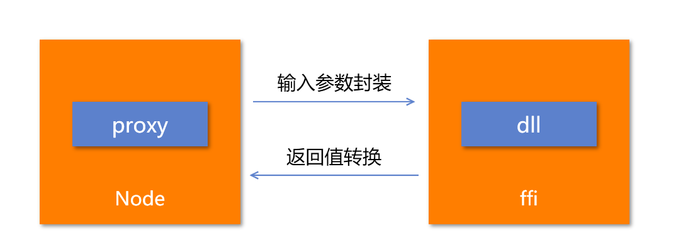

今天和大家聊一聊如何在JavaScript中调用C++动态链接库

-----

## 什么是ffi

ffi 是Foreign Function Interface的简称，是一款nodejs的addon。

可以让大家在nodejs中调用c风格的c++动态链接库

ffi调用起来非常简单，可以看下官网的这个例子

```javascript
var ffi = require('ffi-napi');

var libm = ffi.Library('libm', {
  'ceil': [ 'double', [ 'double' ] ]
});
libm.ceil(1.5); // 2

// You can also access just functions in the current process by passing a null
var current = ffi.Library(null, {
  'atoi': [ 'int', [ 'string' ] ]
});
current.atoi('1234'); // 1234
```

只要传入dll的路径，方法名称，返回值和参数类型，就可以得到一个关于dll中对应方法的代理对象。

接着在这个代理对象上执行对应的方法即可。

## ffi原理

node-ffi的原理可以参见下图




实际上node-ffi是在libffi之上套了一层壳，将libffi的方法封装成了nodejs的addon

而libffi又调用了系统的API，打开特定的dll（POSIX下dlopen方法/Winodws下LoadLibraryEx方法），并获取对应的方法的地址（POSIX下dlsym方法/Winodws下GetProcAddress方法）。

获得方法对象之后，就可以封装对应的参数，在dll中执行，并获得对应的返回值



## ffi问题

ffi相较于单独编写nodeaddon的方式简便了不少。

但是也会存在一定的问题。

- ffi只支持c风格的dll
- ffi通过对应的字符串进行动态加载，没有编译优化，相较于addon会有一定性能损失

因此ffi也不是银弹，需要大家在项目中根据实际情况进行考虑


---

参考文档：

-  [node-ffi使用指南 - 掘金](https://juejin.im/post/5b58038d5188251b186bc902)
-  [ffi - npm](https://www.npmjs.com/package/ffi)
-  [LuaJIT FFI 介绍，及其在 OpenResty 中的应用（上） - spacewander - SegmentFault 思否](https://segmentfault.com/a/1190000015802547)
-  [Node-FFI 不得不说的原理 - Dosk技术站](https://old.dosk.win/2018/05/15/node-ffi/)
-  [libffi](https://sourceware.org/libffi/)
-  [LoadLibraryExA function (libloaderapi.h) - Win32 apps -Microsoft Docs](https://docs.microsoft.com/en-us/windows/win32/api/libloaderapi/nf-libloaderapi-loadlibraryexa)
-  [GetProcAddress function (libloaderapi.h) - Win32 apps - Microsoft Docs](https://docs.microsoft.com/en-us/windows/win32/api/libloaderapi/nf-libloaderapi-getprocaddress)

