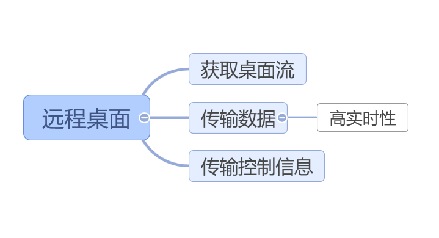
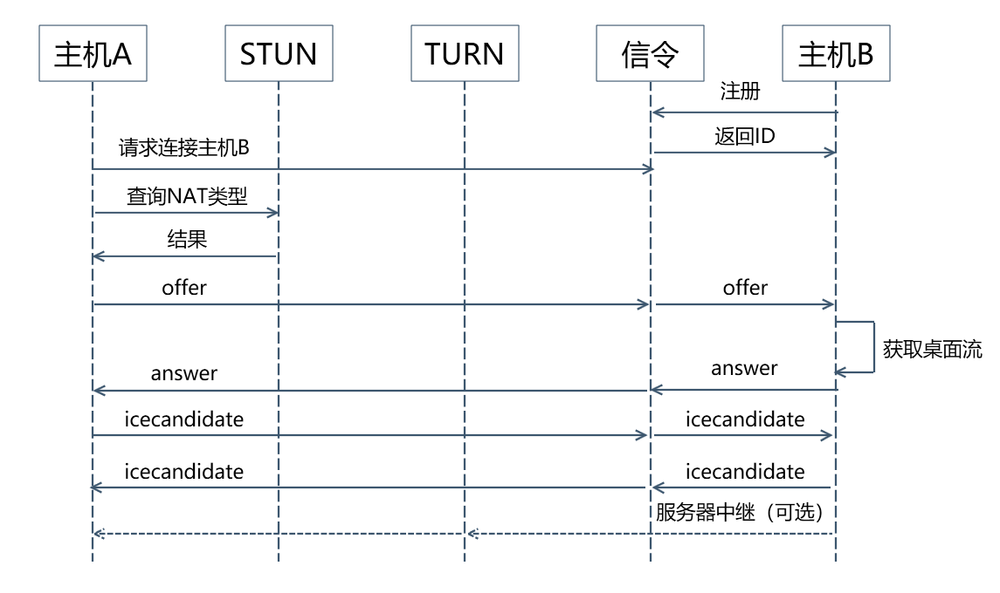

今天和大家聊一聊如何实现一个远程桌面程序。

-----

## 关于远程桌面

对于远程桌面程序，相信大家一定有所了解。

常见的产品有TeamViewer，向日葵，微软远程桌面，QQ远程桌面等等。

远程桌面能够在定位用户问题，协助操作，远程办公上有非常便捷作用。

这里我们就来自己实现一个远程桌面程序。

## 需求分析

对于一个远程桌面程序，我们要解决的问题主要有三点：

- 获取桌面流——没有桌面流，怎么做远程桌面
- 传输数据——包括桌面流以及键盘鼠标等信息
- 传输控制信息——建立连接，断开连接等

这里需要注意的点是第二点传输数据。

远程桌面一个重要的质量指标是实时性。需要控制端对被控制端的操作能够及时得到响应。

试想一下，假如你在帮用户远程时，打开一个文件夹要3s之后才能在控制端看到结果，你的工作效率可想而知。

## 技术选型

### webrtc

对于实时性的数据流传输，我们首先想到的就应该是udp+p2p的方式。

udp没有tcp的握手连接和拥塞处理导致的延时问题。

p2p使用了最短链路进行数据通信。

这里推荐的解决方案是webrtc。

webrtc提供了高效的，流媒体数据的p2p通信方法。几乎是开箱即用。

### electron

确定webrtc之后，桌面客户端就可以选择electron。

electron基于chrome和node，能够同时拥有webapi和调用系统原生的能力。

此外，electron自带的[desktopCapturer](https://www.electronjs.org/docs/api/desktop-capturer)API可以直接满足我们获取桌面流的需求。

### websocket

我们还剩下一个传递控制信息的需求，即搭建一个信令服务器。

webrtc没有指定信令服务器的搭建方式，所以你愿意可以选择任何方式传输控制信号，包括飞鸽传书。

这里我们选择websocket。

主要考虑两点：

- websocket作为长连接可以保持高效稳定传输。
- 信令服务器需要使用消息透传功能，因此，websocket的服务端推送能力会比较适合

## 远程桌面程序运行流程

远程桌面程序的运行流程如上图所示。

- 首先主机B（受控端），向信令服务器注册，获取注册ID
- 主机A（控制端），获取到这个ID后，向信令服务器发起连接，实现两个设备的透传线路搭建
- 接着主机A，创建RCTPeerConnection，创建offer，并设置为LocalDescription。
- 然后将offer通过信令服务器透传给主机B。
- 主机B将offer设置为remoteDescription，并获取桌面流，创建answer，回传给主机A
- 主机A将answer设置为remoteDescription，至此，双方的sdp交换完成
- 接着主机A和主机B收集各自的iceCandidate，通过信令服务器透传给对端。
- webrtc自动会从这些iceCandidate中选择合适的信号通路，进行连接通信。优先级为本地>p2p>服务器中继
- 至此RCT连接完成，主机A等待视频流到达之后，添加到自己的页面中即可。

## 代码示例

代码示例可以参考我的github项目[xinyuehtx/RemoteView](https://github.com/xinyuehtx/RemoteView/)

---

参考文档：

-  [xinyuehtx/RemoteView](https://github.com/xinyuehtx/RemoteView/)
-  [WebRTC API - Web APIs - MDN](https://developer.mozilla.org/en-US/docs/Web/API/WebRTC_API)
-  [01 - 课程介绍](https://time.geekbang.org/course/detail/100044201-187014)
-  [desktopCapturer - Electron](https://www.electronjs.org/docs/api/desktop-capturer)

