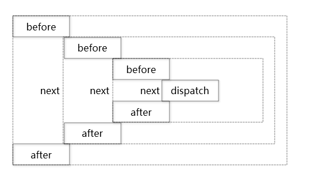

今天和大家聊一聊redux的中间件原理。

注：本文内容大部分参考redux的官网文档[Middleware - Redux](https://redux.js.org/advanced/middleware)。如果英文好的同学可以直接阅读官网文档，写的非常好。

-----

## 关于redux-middleware

redux中间件提供了一个切面的关注点。

我们可以很方便的利用中间件进行AOP编程，比如日志功能，埋点上报等。

这里主要是利用装饰器模式，在实际任务执行之前，动态添加before和after的逻辑。

这样就能形成一个洋葱模型



接下来我们就看下如何手动开写一个日志中间件

## 手动处理日志

首先我们手动处理日志，就是在执行dispatch方法前后，添加console.log

```javascript
console.log('dispatching', action)
store.dispatch(action)
console.log('next state', store.getState())
```

##  抽取方法

手动处理日志有一点问题，假如我们有多处执行action的地方需要用到日志，我们不可能每一处都进行复制粘贴。

那么这时候就需要额外抽取一个方法。

```javascript
function dispatchAndLog(store, action) {
  console.log('dispatching', action)
  store.dispatch(action)
  console.log('next state', store.getState())
}
```

这样我们只要对原来执行dispatch的地方替换为这个方法，就可以实现日志功能了

```javascript
dispatchAndLog(store, addTodo('Use Redux'))
```

## Monkeypatching

上一层的方法虽然解决了重复代码的问题，但是还是需要我们修改所有的dispatch处。

这就会导致入侵业务代码。

那有没有非入侵的方式呢？有，就是Monkeypatching。

Monkeypatching，简单的来说就是用自己定义的新方法，替换对象的原始方法。

这样虽然业务代码（使用方）没有进行改动，但是实际的执行代码已经在运行时被更改了。

```javascript
const next = store.dispatch
store.dispatch = function dispatchAndLog(action) {
  console.log('dispatching', action)
  let result = next(action)
  console.log('next state', store.getState())
  return result
}
```

## 处理多中间件问题

上一步我们解决了一个中间件的问题，假如我们现在需要添加一个新的中间件，那么应该怎么处理呢？

最简单的方法是复制一遍逻辑。

```javascript
let next = store.dispatch
store.dispatch = function dispatchAndLog1(action) {
  console.log('dispatching1', action)
  let result = next(action)
  console.log('next state1', store.getState())
  return result
}

next = store.dispatch
store.dispatch = function dispatchAndLog2(action) {
  console.log('dispatching2', action)
  let result = next(action)
  console.log('next state2', store.getState())
  return result
}
```

显然，获取next和赋值store.dispatch都是重复逻辑，应该抽取出来成为公共代码.

假如我们做如下改动，直接返回包装后的函数会如何？

```javascript
function logger(store) {
  const next = store.dispatch

  return function dispatchAndLog(action) {
    console.log('dispatching', action)
    let result = next(action)
    console.log('next state', store.getState())
    return result
  }
}
```

这样我们就可以使用一个foreach对一个中间件数组进行添加。

```javascript
function applyMiddlewareByMonkeypatching(store, middlewares) {
  middlewares = middlewares.slice()
  middlewares.reverse()

  // Transform dispatch function with each middleware.
  middlewares.forEach(middleware => (store.dispatch = middleware(store)))
}
```

OK，这个解决方案已经很棒了，但是我们还可以更进一步。

试想一下，我们在中间件代码中，其实并不关心next方法是不是store.dispatch，只需要知道它能够链式处理action即可。

那么我们可以进一步隐藏这个概念。

```javascript
const logger = store => next => action => {
  console.log('dispatching', action)
  let result = next(action)
  console.log('next state', store.getState())
  return result
}
```

```javascript
function applyMiddleware(store, middlewares) {
  middlewares = middlewares.slice()
  middlewares.reverse()
  let dispatch = store.dispatch
  middlewares.forEach(middleware => (dispatch = middleware(store)(dispatch)))
  return Object.assign({}, store, { dispatch })
}
```

这样一来，我们在执行时，只要对一个dispatch中间变量进行处理，最后再赋值在store即可。

## 小结

在这里我们看到了如何一步步实现一个redux的中间件机制。

实际上，类似express，koa等后端框架的中间件机制也是用类似的方法进行处理的。

有了中间件，我们可以更方便的在非入侵业务代码的情况下实现更多复杂的功能。

---

参考文档：

-  [Middleware - Redux](https://redux.js.org/advanced/middleware)

