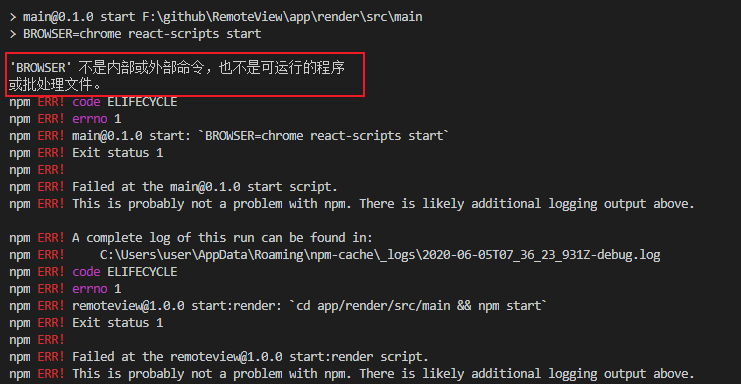
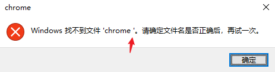
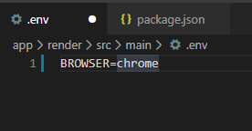

今天和大家聊一聊create-react-app设置默认启动浏览器的方式。

-----

## 问题来源

对于create-react-app默认会在npm start执行之后在默认浏览器打开页面。

但是，有的时候，我们期望能够设置特定的浏览器启动。

或者是在开发诸如electron之类的应用时，不期望启动浏览器。

## 解决方案

在npm脚本中，我们可以使用create-react-app提供的配置参数BROWSER指定启动的浏览器。

比如如果你期望指定浏览器为chrome，就可以写

```js
"start": "BROWSER=chrome react-scripts start",
```

### windows环境下处理

如果你在windows下进行开发，使用上面的脚本时会出现问题。



这是因为windows不支持按这种方式设置环境变量。

所以在windows电脑上可以使用下面的脚本执行

```js
"start": "set BROWSER=chrome&& react-scripts start",
```

**注意**：这里的&&之前不能有空格，否则会出现异常弹窗



这里是环境变量中将空格也设置在了BROWSER字段中，但是create-react-app没有做trim处理导致的。

### env方式配置

此外如果你不想用脚本的配置方式，还可以再项目所在目录下创建一个`.env`文件，进行环境变量设置。

也能实现指定浏览器的效果



---

参考文档：

-  [Advanced Configuration](https://create-react-app.dev/docs/advanced-configuration)
-  [start without opening url in browser · Issue #3070 · facebook/create-react-app](https://github.com/facebook/create-react-app/issues/3070)

