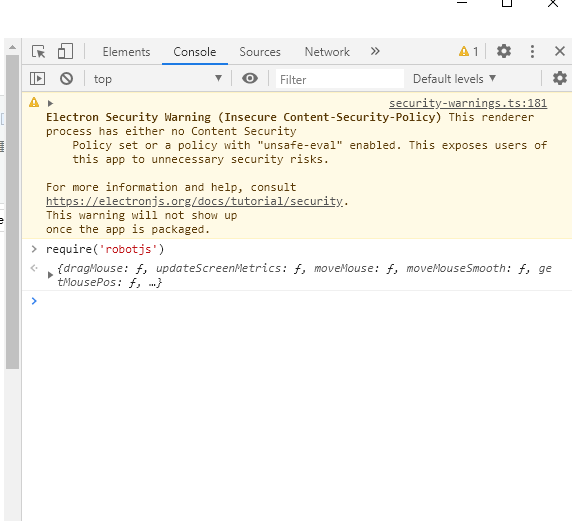

今天在写electron的项目时，需要使用到robotjs。

而robotjs是c++编写的库，所以需要在不同的平台进行重新编译。

期间遇到了许多问题，mark一下。

-----

## 问题来源

所有代码最终是要转换为操作系统相关代码，才能在指定的OS上运行。

像java，python这类代码是需要对应平台的vm环境，转成平台相关代码才能够执行。

而c++并没有这样的vm环境，因此对于node的c++模块，需要先编译成平台相关的代码，才能执行。

## 方案

这里我采用的方式是node-gyp进行编译

整体方案如下所示，利用node-gyp，调用系统编译工具将源码编译成二进制文件。

之后node就可以调用对应的二进制文件，调用模块方法。


## 准备依赖

对于node的c++module，编译需要有设备安装有指定的编译工具集

例如robotjs在官网的推荐编译工具集如下：


此外还需要使用下面命令安装node-gyp ，

```javascript
npm install -g node-gyp
```

### windows平台简化工具

当然手动安装这么多依赖相当繁琐，因此可以选择一些一键安装依赖的npm包

比如在windows平台，可以使用[Windows-Build-Tools](https://github.com/felixrieseberg/windows-build-tools)，它可以直接帮你安装完，python和vs依赖。

只要执行下面的命令

```javascript
npm install --global windows-build-tools
```

## 编译

这里我们可以使用下面的命令

```javascript
npm rebuild
```


他会自动完成清理，重新编译的过程。（如果有安装的预编译文件，则会直接使用）

不过值得注意的是，这里默认会使用node作为runtime。

此时如果你在做electron开发，你很可能遇到目标NODE_MODULE_VERSION版本不一致的问题。

如果我们想针对electron进行编译的话，可以使用下面的命令

```JavaScript
npm rebuild --runtime=electron --disturl=https://atom.io/download/atom-shell --target=<你的electron版本> --abi=<对应abi版本>
```

其中electron版本可以通过process.versions.electron获取；

而从process.versions.node获取node版本，并且从[abi_crosswalk](https://github.com/mapbox/node-pre-gyp/blob/master/lib/util/abi_crosswalk.json)文件中找到对应的node_abi版本

### electron-rebuild

显然，这么多的配置对electron开发并不友好。

这里可以使用[electron-rebuild - npm](https://www.npmjs.com/package/electron-rebuild)进行一键配置。

首先安装electron-rebuild

然后运行下面的命令，这里直接会使用对应的electron版本和abi版本进行编译

```javascript
npx electron-rebuild
```

当然为了方便，你也可以在package.json里面配置Rebuild脚本

```json
"scripts": {
  "rebuild": "electron-rebuild"
}
```

## 效果

最终你可以在浏览器通过require指定的模块，查看编译是否成功。



---

参考文档：

-  [node-pre-gyp/abi_crosswalk.json at master · mapbox/node-pre-gyp](https://github.com/mapbox/node-pre-gyp/blob/master/lib/util/abi_crosswalk.json)
-  [使用原生 Node 模块 - Electron](https://www.electronjs.org/docs/tutorial/using-native-node-modules)
-  [electron-rebuild - npm](https://www.npmjs.com/package/electron-rebuild)
-  [node-gyp - npm](https://www.npmjs.com/package/node-gyp)
-  [Building - RobotJS](http://robotjs.io/docs/building)
-  [felixrieseberg/windows-build-tools: Install C++ Build Tools for Windows using npm](https://github.com/felixrieseberg/windows-build-tools)
-  [node-pre-gyp/abi_crosswalk.json at master · mapbox/node-pre-gyp](https://github.com/mapbox/node-pre-gyp/blob/master/lib/util/abi_crosswalk.json)

