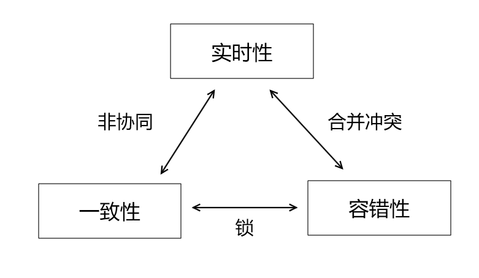
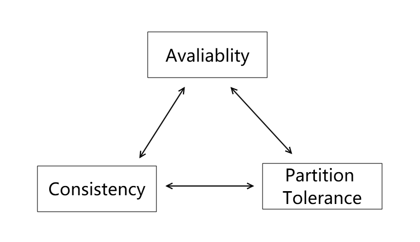
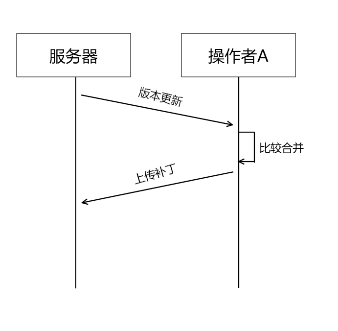
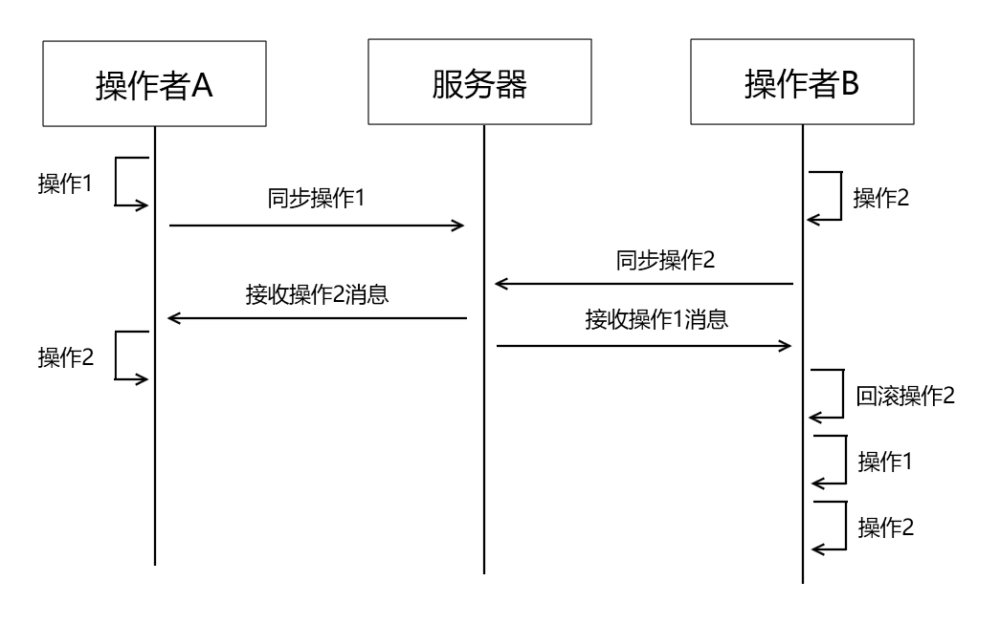
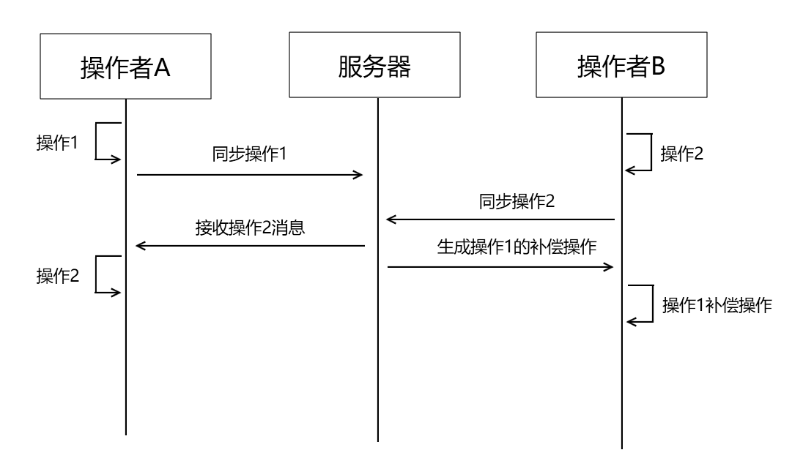

今天和大家聊一聊协同编辑的架构设计。

-----

## 什么是协同编辑

协同编辑是指多人同时对同一份文档进行编辑。

例如我们熟悉的wiki，百度百科，以及办公产品腾讯文档，乃至我们的代码管理工具git，都可以算作是协同编辑产品。

### 实时协同编辑

随着大家在家办公，异地办公的情况普及，实时协同编辑工具也变得更加引人注目。

实施协同编辑会面临几个问题：

- 实时性——输入的数据可以及时被相关协作者看到
- 一致性——各端看到和编辑的文档需要保持一致
- 容错性——允许存在一定的网络波动，和数据丢失

但是这三个问题会形成一个不可能三角

即任意方案只能满足其中2个点，牺牲第3个点。

有的同学可能对这个三角形不是很理解。

我们可以这样类别，将协同编辑的文档类比为分布式数据库，编辑者类别为数据库的读写服务，那么我们的这个三角形就可以转换为CAP不可能三角

关于CAP定理，可以参见我的博客[2020-3-15-一文看懂CAP定理 - huangtengxiao](https://xinyuehtx.github.io/post/%E4%B8%80%E6%96%87%E7%9C%8B%E6%87%82CAP%E5%AE%9A%E7%90%86.html)

## 实施协同编辑架构抉择

架构抉择第一件要做的事情是挑出哪些点是必须要满足的，哪些点是可以妥协的。

这里我们会选择实时性和容错性：

- 实时性：保证了用户体验，让整个产品可用，毕竟用户不会期望编辑时一直卡顿
- 容错性：实现分布式协同和远程办公的基础，也是协同的必要条件

那为什么一致性可以妥协呢？

首先我们要基于这一个`假设`:

在实时协同编辑的场景下，冲突是小概率事件。

就是说大部分情况下，协同编辑的参与者都会在文档的不同部分进行操作，而很少会同时对同一区域进行操作。

因此我们需要处理一致性问题的情况较少。

另外，我们只是放弃`强一致性`，在各端同步之后，能够较快的恢复到完全一致的状态，实现最终一致性。

## 最终一致性的处理方法

### diff-patch

如果熟悉Git的同学，就会发现diff-patch和git的版本管理基本一致。

当出现版本冲突时，会通过diff算法计算出，两个版本之间的差异值，然后生成一个patch，将两个版本的内容合并。

这样就能让服务器端和本地端的文档内容重新保持一致。

但是diff-patch这种方式是基于文档内容比较的，那就意味着一旦出现对同一行的操作冲突，就需要人工介入，选择其中一个版本的内容。

例如git，出现合并冲突时，需要开发者对所有冲突部分进行人工处理。否则很容易出现无法运行的代码。

这种方式适用于“编辑——保存——解决冲突”的交互方式，比如kb文档。

但是要处理googledoc或者腾讯文档这样的交互就不合适了。

### Operational Transformation

Operational Transformation方法是将所有的编辑行为封装成一个个的操作。

各个编辑者执行单个操作后，会将操作信息同步到各个协作端。

协作端根据操作的执行时间戳，调整文档状态，保持各端操作顺序的一致性。

注意的一点，Operational Transformation只是一种操作思想，具体的操作实现可以按照业务情况处理。

下面是我思考的两种操作方式：

- #### 操作回滚法

  在每个操作执行的同时，生成对应的undo，redo方法。
  
  如果发现需要执行更早的操作，那么就先回滚已有晚于新操作时间戳的操作。
  
  然后再按顺序执行新操作，和刚刚回滚的操作。
  
  这种方式对于有全局状态管理的应用来说实现会比较方便，而且服务器的工作量也比较小，只需要进行时间戳的添加，以及消息的转发。

- #### 操作补偿法

  操作补偿法直接在服务器端维护最终的文档状态。

  每次同步时，根据各端不同的状态重新生成一个补偿操作，发给对应的协作者客户端。

  客户端执行补偿操作，重新和服务端状态保持一致。

  这种方式不需要客户端维持一个撤销重做栈，任务被集中到了服务端。

  但是在协作者增多时服务端压力会变大。

  此外获取到补偿操作之前客户端会有短暂的不可用状态（避免冲突）

## 交互设计

在实际的应用中，我们可以采用两者结合的方式。

- 在线实时协作阶段，可以采用webrtc+Operational Transformation 保持一个良好的实时体验。

  此时操作变更较少，冲突和补偿处理也会比较轻量，对用户感知少。

- 在出现较长时间断线，或者离线编辑的情况下，可以在连线后进行一次diff-patch，确保较大部分的改动可以同步。

---

参考文档：

-  [多人协同编辑的实现 · Issue #10 · Aaaaash/blog](https://github.com/Aaaaash/blog/issues/10)
-  [实时协同编辑的实现 - FEX](https://fex.baidu.com/blog/2014/04/realtime-collaboration/)
-  [协同编辑 - 维基百科，自由的百科全书](https://zh.wikipedia.org/wiki/%E5%8D%8F%E5%90%8C%E7%BC%96%E8%BE%91)
-  [2020-3-15-一文看懂CAP定理 - huangtengxiao](https://xinyuehtx.github.io/post/%E4%B8%80%E6%96%87%E7%9C%8B%E6%87%82CAP%E5%AE%9A%E7%90%86.html)

