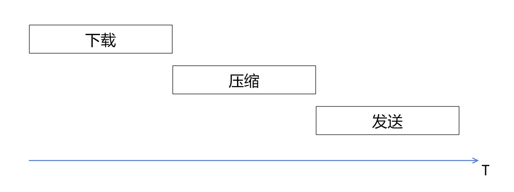
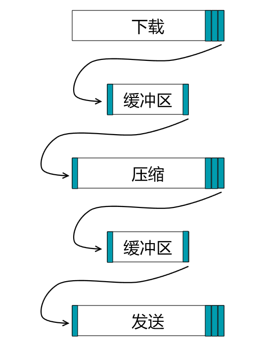
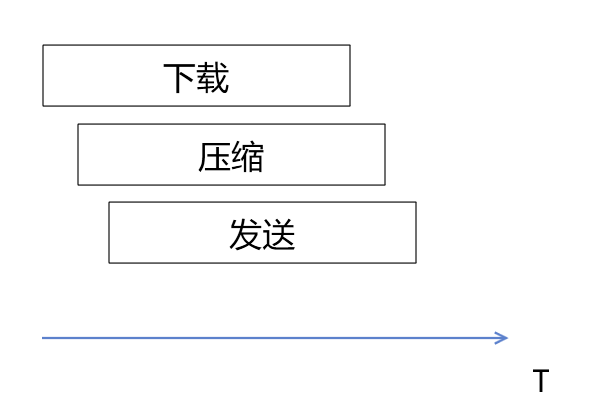
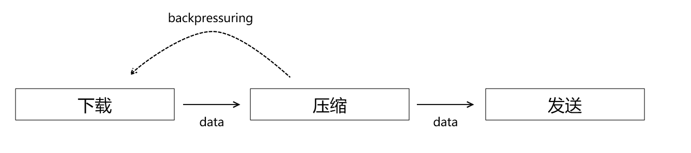

今天和大家聊一聊node中的stream的背压机制。

-----

## 为什么要有流

在编写服务时，经常会需要涉及到文件或者数据压缩的问题。

使用合适的压缩算法能够有效减少请求文件的大小，从而减少网络中的数据传输量，提升响应速度。

假设我们采用最普通的方式处理一个文件的获取，压缩，发送这个过程，就会是如下所示的图形表示：



我们看到整个执行流程是串行的，所有耗时都会累加，导致整个过程耗时很长。

流的出现就是为了解决这个串行处理的问题。

如下图所示，我们将整个文件分成一个个小块，利用生产者消费者模式，上一个阶段的操作有一小部分完成后，

下一个阶段的操作就可以开始执行



这样从宏观上看，整个处理流程就可以并行执行，从而大大减少处理耗时。



## 背压问题

背压问题来源于生产者消费者模式中，消费者处理速度过慢。

比如说，我们下载过程，处理速度为3Mb/s，而压缩过程，处理速度为1Mb/s，这样的话，很快缓冲区队列就会形成堆积。

要么导致整个过程内存消耗增加，要么导致整个缓冲区慢，部分数据丢失。

### 什么是背压处理

背压处理可以理解为一个向上"喊话"的过程。

当压缩处理发现自己的缓冲区数据挤压超过阈值的时候，就对下载处理“喊话”，我忙不过来了，不要再发了。

下载处理收到消息就暂停向下发送数据。



而当缓存区处理至空时，又会重新通知下载处理，继续发送数据。

这样就能够实现，整个流的处理始终以保持以消费者速度进行消耗，不会引起重大积压。

## pipe的生命周期

```javascript
                                                     +===================+
                         x-->  Piping functions   +-->   src.pipe(dest)  |
                         x     are set up during     |===================|
                         x     the .pipe method.     |  Event callbacks  |
  +===============+      x                           |-------------------|
  |   Your Data   |      x     They exist outside    | .on('close', cb)  |
  +=======+=======+      x     the data flow, but    | .on('data', cb)   |
          |              x     importantly attach    | .on('drain', cb)  |
          |              x     events, and their     | .on('unpipe', cb) |
+---------v---------+    x     respective callbacks. | .on('error', cb)  |
|  Readable Stream  +----+                           | .on('finish', cb) |
+-^-------^-------^-+    |                           | .on('end', cb)    |
  ^       |       ^      |                           +-------------------+
  |       |       |      |
  |       ^       |      |
  ^       ^       ^      |    +-------------------+         +=================+
  ^       |       ^      +---->  Writable Stream  +--------->  .write(chunk)  |
  |       |       |           +-------------------+         +=======+=========+
  |       |       |                                                 |
  |       ^       |                              +------------------v---------+
  ^       |       +-> if (!chunk)                |    Is this chunk too big?  |
  ^       |       |     emit .end();             |    Is the queue busy?      |
  |       |       +-> else                       +-------+----------------+---+
  |       ^       |     emit .write();                   |                |
  |       ^       ^                                   +--v---+        +---v---+
  |       |       ^-----------------------------------<  No  |        |  Yes  |
  ^       |                                           +------+        +---v---+
  ^       |                                                               |
  |       ^               emit .pause();          +=================+     |
  |       ^---------------^-----------------------+  return false;  <-----+---+
  |                                               +=================+         |
  |                                                                           |
  ^            when queue is empty     +============+                         |
  ^------------^-----------------------<  Buffering |                         |
               |                       |============|                         |
               +> emit .drain();       |  ^Buffer^  |                         |
               +> emit .resume();      +------------+                         |
                                       |  ^Buffer^  |                         |
                                       +------------+   add chunk to queue    |
                                       |            <---^---------------------<
                                       +============+
```

从图中我们可以看到pipe对流的背压处理：

- 将数据按照chunk进行划分，写入
- 当chunk过大，或者队列忙碌时，暂停读取
- 当队列为空时，继续读取数据。

---

参考文档：

-  [数据流中的积压问题 - Node.js](https://nodejs.org/zh-cn/docs/guides/backpressuring-in-streams/)

