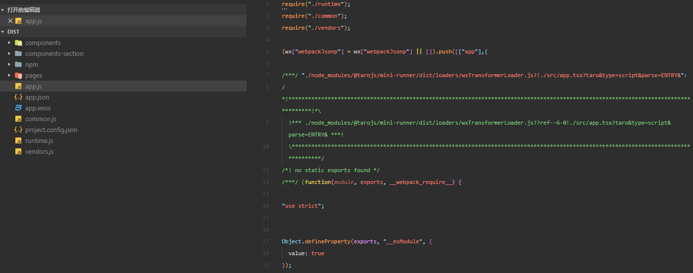
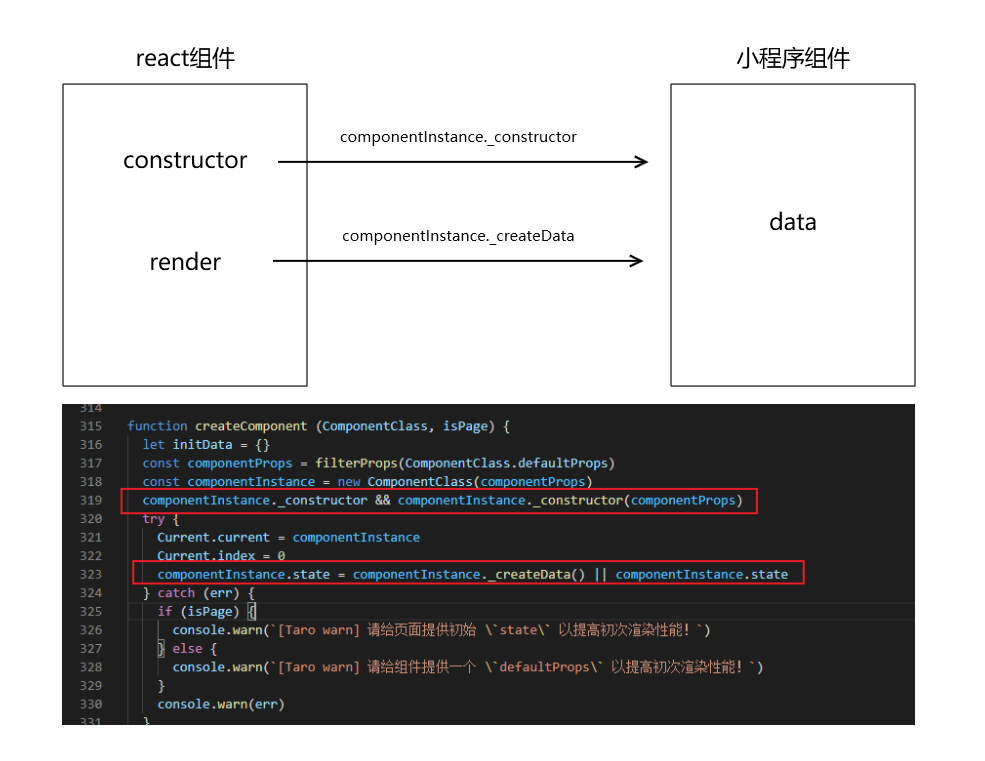
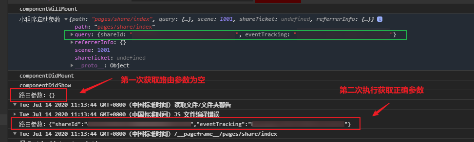
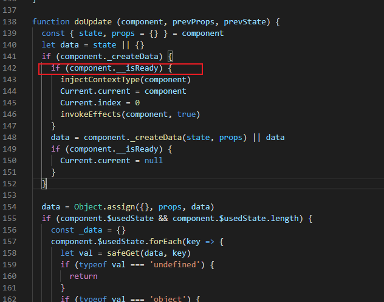

今天和大家聊一聊taro在微信小程序下函数组件多次执行问题

-----

## 关于taro和小程序

首先taro是一个针对多端小程序的编译框架。

对于微信小程序来说，taro的源码最终会编译成微信小程序可执行的代码。

因此对于使用taro进行开发来说，既会受到小程序的约束，又能利用小程序的优势

## 小程序初始数据

对于小程序来说，可以通过`data`进行数据绑定，为页面模板提供初始数据。

这种方式能够更有效的提升初始渲染的效率。

但是对于react来说，组件的初始状态来自于组件的构造函数中的初始state或者函数组件的usestate。

这就意味使用react语法的taro，在将react组件转换为小程序自定义组件时，需要多运行一次构造函数及render（对于类组件）或者函数组件，以产生小程序组件的data

对应的taro中的源码如下

## 导致的问题

针对taro的提前调用，经常出现的一个问题就是部分数据为空。

例如我这次遇到的，函数组件通过useRouter获取页面的路由参数可能为空的问题。

此时如果你在期间做了一些依赖于路由参数的行为，就会导致异常，（比如跳转页面）

## 处理方式

对于这个问题的处理方式其实也很简单。

首先，对于这些参数相关的计算和函数调用，需要进行判空

第二，对于side effects，需要遵守react的规范。

类组件不要将side effects放置到构造函数和render中，函数组件一定要放到useEffect中。

有同学会问，useEffect难道不会执行么？

不会。

参见下面的taro源码，taro进行提前调用时，`__isReady`参数是false，因此不会执行Effects。

所以side effects放置到useEffect中是安全的

---

参考文档：

-  [最佳实践 - Taro 文档](https://nervjs.github.io/taro/docs/best-practice#%E7%BB%84%E4%BB%B6%E7%9A%84-constructor-%E4%B8%8E-render-%E6%8F%90%E5%89%8D%E8%B0%83%E7%94%A8)
-  [数据绑定 - 微信开放文档](https://developers.weixin.qq.com/miniprogram/dev/reference/wxml/data.html)

