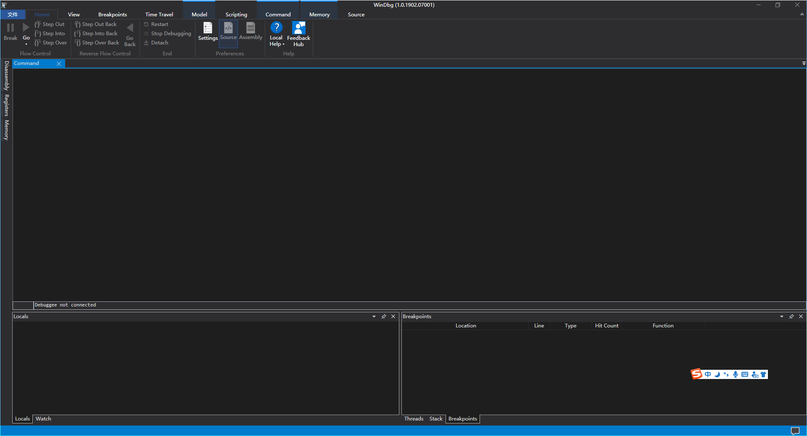

一款软件运行时最严重的问题就是奔溃了。大部分情况下我们能从日志中分析出奔溃原因，并进行修复。但是在一些极端情况下，只能依靠dump文件来找寻一些信息。

-----

在windows端，微软提供了一款专门分析dump内容的工具——[WinDbg Preview](https://www.microsoft.com/en-us/p/windbg-preview/9pgjgd53tn86?activetab=pivot:overviewtab)。这个目前只能在微软的应用商店下载。

我们打开界面，可以看到界面还是很优美的

参考链接：

- [WinDbg](http://www.windbg.org/)
- [Get WinDbg Preview - Microsoft Store](https://www.microsoft.com/en-us/p/windbg-preview/9pgjgd53tn86?activetab=pivot:overviewtab)

