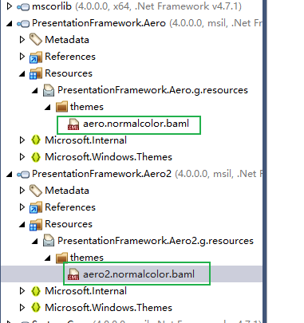

在反编译WPF程序集的时候经常会发现一个命名为theme的文件夹

-----

这个文件夹中存放着一个预编译的资源字典，如图



这个实际上是wpf的一个冷门功能：windows主题支持。

你可能没有听说过这个功能，但是如果你像我一样是接触过xp的上个世纪过来的人，就会记得windows的不同主题能够影响元素外观。

其实这个功能在WPF 也有保留，只是大家定制的样式多了，没有注意到罢了

参见[为什么同样的WPF控件在不同的电脑上呈现外观不一致](为什么同样的WPF控件在不同的电脑上呈现外观不一致.html)

不过如果你做过一些自定义控件的话，你可能会熟悉`无外观控件`——将功能与外观分离，通过重写`Metadata`

```csharp
DefaultStyleKeyProperty.OverrideMetadata(typeof(MyControl),newFrameworkPropertyMetadata(typeof(MyControl)))
```

控件就会通过程序集`theme`文件夹下的`generic.xaml`中寻找默认样式

那么有人会问了，这个和我们自己使用`有外观控件`，然后替换样式有什么不同么

###  下面是`DefaultStyle`和`Style`的主要区别

- 部分替换样式

实际上WPF里面有2套样式`Style`和`DefaultStyle`, 如果某些属性没有被`Style`显示赋值

就会采用`DefaultStyle`中的默认值。

那如果只用`Style`不行吗？

试想一下以下情况：

```xaml
<Grid>
  <Grid.Resources>
    <Style TargetType="{x:Type Button}">
      <Setter Property="HorizontalAlignment" Value="Center" />
      <Setter Property="VerticalAlignment" Value="Center" />
    </Style>
  </Grid.Resources>
  <Button Content="Click me" />
</Grid>
```

如果我们的`Button`的默认控件样式写在了`Style`里面，新的`Style`替换之后，例如`Background`,`Foreground`这些属性就全部都丢掉了，成为依赖属性的默认值

所以在WPF中就采用了``DefaultStyle`保证默认样式的完整性

参考链接：https://www.interact-sw.co.uk/iangblog/2007/02/14/wpfdefaulttemplate

