当你完成了一个awesome的程序之后，如何分享给你的小伙伴？压缩包？太low。安装包？太难。

折中一下，搞一个自解压安装包如何？

-----

工具很简单，Rar就可以了

- 首先将想要的文件创建rar压缩包，在选项中勾选，`创建自解压格式压缩文件`

  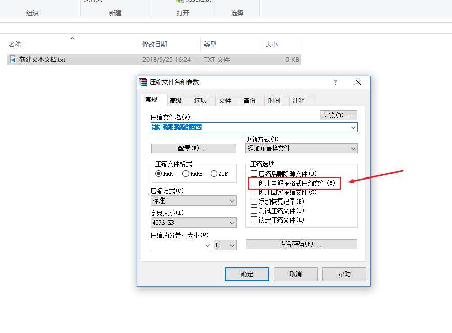

  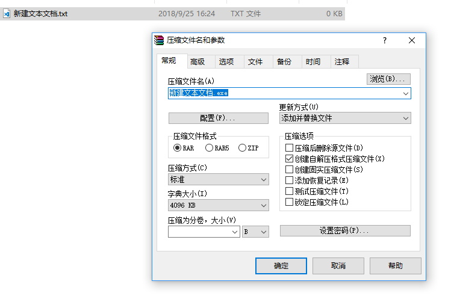

  我们看到勾选后文件后缀名就变成了exe

- 接下来进入，高级-自压缩选项，里面可以进行一些高级的配置

  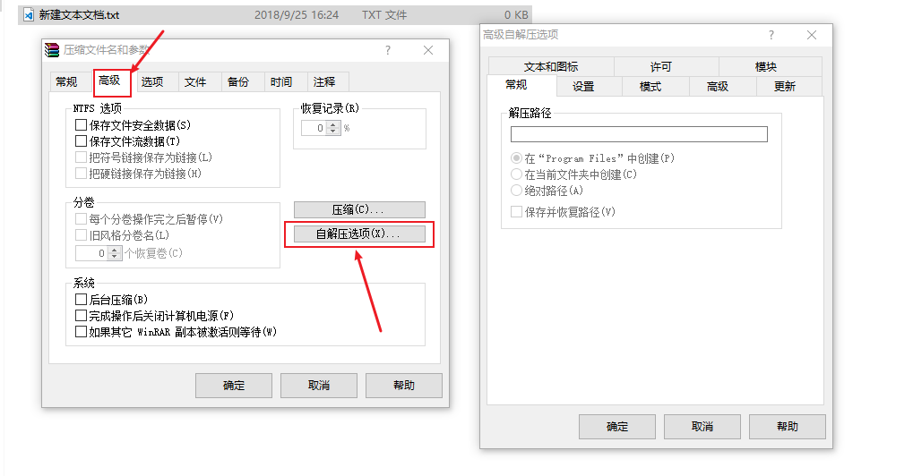

  - 常规

    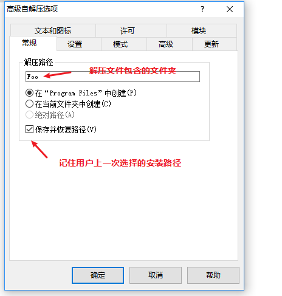

  - 设置：可以在“安装”（解压）前后运行一些脚本

    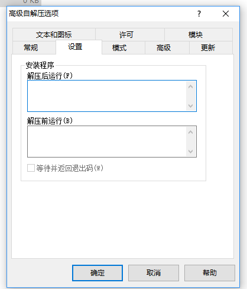

  - 模式

    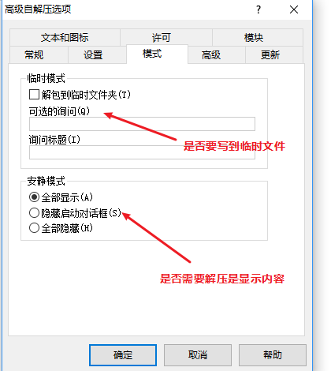

  - 高级

    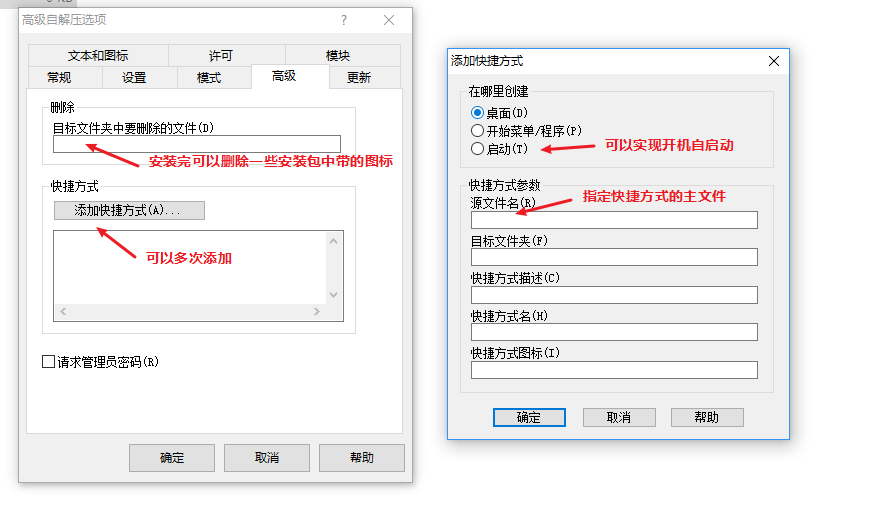

  - 更新

    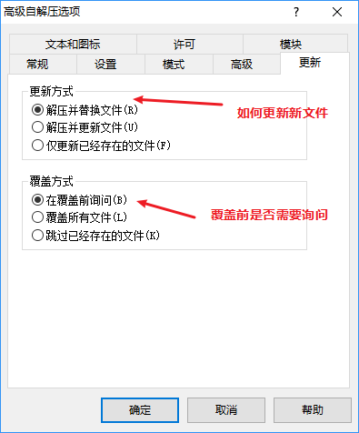

  - 文本和图标

    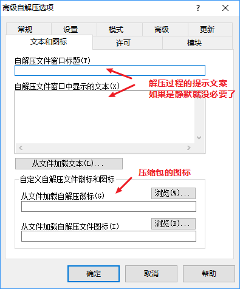

  - 许可：用于软件许可说明，当然也可以写一点奇奇怪怪的东西

    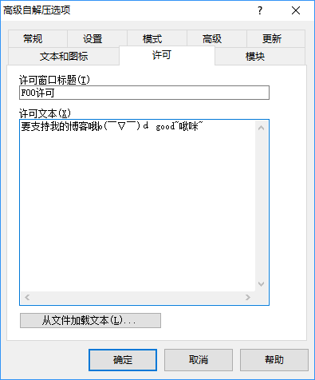

  - 模块：可以选择是使用GUI还是控制台进行安装交互

    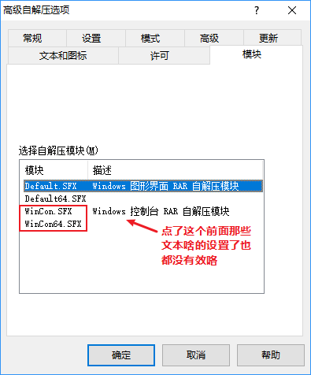

这样就有一个简单实用的安装包啦

参考链接：[WinRAR使用技巧-发掘 WinRAR 的“自解压安装”功能 WinRAR 5.0官方简体中文版下载 支持64位 非破解版WinRAR压缩软件中文网站-独家总代理商-软众信息](http://www.winrar.com.cn/jjjq2.htm)

