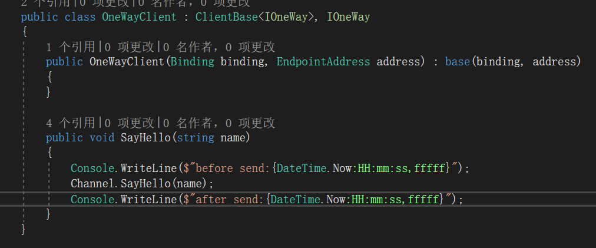

**本文demo已上传至github：[xinyuehtx/WCFdemo](https://github.com/xinyuehtx/WCFdemo)**

这个博客会介绍如何设置服务操作调用模式的第二种单向模式（One-Way）

-----

## 单向模式

单向模式服务的调用如图所示，可以看到仅用于一端向另一端发送消息，而没有回复。

由此可见，单向模式的服务方法一定是`void`方法

创建单向模式的操作很简单，只要在`OperationContract`中将`IsOneWay`设置成`True`即可

再次强调单向模式的方法必须是`void`，如果用在有返回值的方法上vs会给出相应的警告

接下来就是实现

上一篇我们说过请求答复模式是一个同步方法，比较严重的问题就是容易超时

而这次的单向模式是在发送完成之后立刻返回，而不会等待服务端的方法执行。

为此我们模拟服务端耗时，并且添加一些时间日志

我们可以看到客户端在发送消息完成后就直接返回了，而且此时服务端还未开始处理消息

服务端的耗时操作也不会对客户端造成影响

### 小结

我们研究了WCF服务的单向模式，其特点有

- 简单——只需要添加一个属性
- 发送完成立刻返回
- 只能用于`void`方法

参考链接：

- [单向服务 - Microsoft Docs](https://docs.microsoft.com/zh-cn/dotnet/framework/wcf/feature-details/one-way-services)

