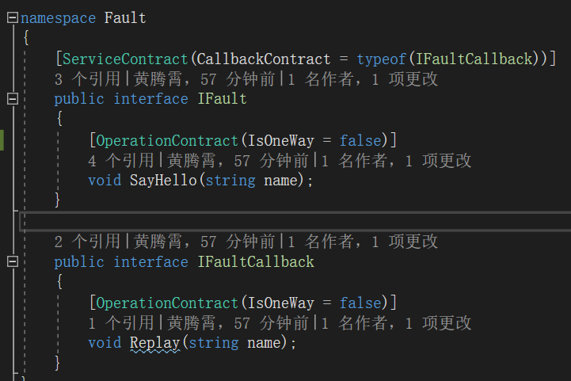
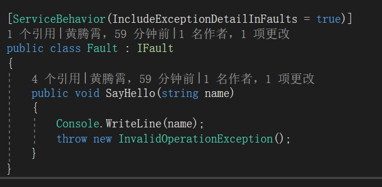
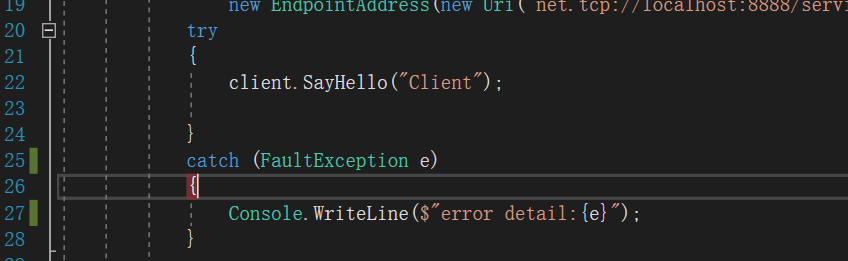
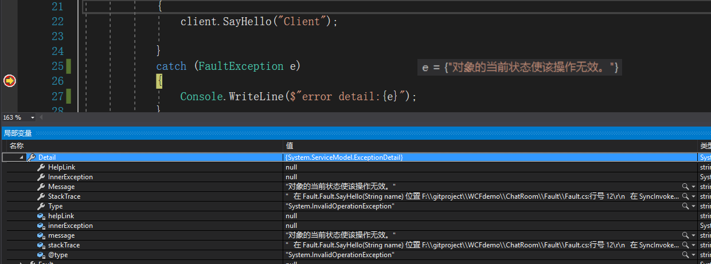

**本文demo已上传至github：[xinyuehtx/WCFdemo](https://github.com/xinyuehtx/WCFdemo)**

这个博客会介绍如何设置服务的异常回馈

-----

在上一篇博客中介绍了[2019-1-29-wcf入门（9） - huangtengxiao](https://xinyuehtx.github.io/post/wcf%E5%85%A5%E9%97%A8-9.html)如何使用错误协定回馈指定异常，但是往往会存在部分异常是非预期的。这一篇会介绍如何使用服务行为回馈未指定异常

## 回馈未指定异常

这里我们对上一个例子进行一些修改

首先服务接口删除错误协定

在服务实现上，设置`IncludeExceptionDetailInFaults`为`True`。(如果只期望在调试阶段回馈异常，可以使用`ServiceDebugBehavior.IncludeExceptionDetailInFaults`代替)

并且在操作协定实现上直接抛出异常

在客户端我们这次改为捕捉`FaultException`

我们在客户端抓到了异常，并且在`Detail`属性中找到的服务操作实际发生的异常

### 注意

这个例子中处理未指定异常和上一篇博客[2019-1-29-wcf入门（9） - huangtengxiao](https://xinyuehtx.github.io/post/wcf%E5%85%A5%E9%97%A8-9.html)中处理指定异常，原理是一致的。

所以问题也是一致的，**不能处理OneWay**

### 小结

我们研究了WCF服务的`IncludeExceptionDetailInFaults`，其特点有

- 可以将服务端的指定错误回馈客户端，不需要显示指定类型
- 可以配置debug模式
- 不能处理单向操作

参考链接：

- [如何：在服务协定中声明错误 - Microsoft Docs](https://docs.microsoft.com/zh-cn/dotnet/framework/wcf/how-to-declare-faults-in-service-contracts)
- [定义和指定错误 - Microsoft Docs](https://docs.microsoft.com/zh-cn/dotnet/framework/wcf/defining-and-specifying-faults)
- [在协定和服务中指定和处理错误 - Microsoft Docs](https://docs.microsoft.com/zh-cn/dotnet/framework/wcf/specifying-and-handling-faults-in-contracts-and-services)
- [2019-1-29-wcf入门（9） - huangtengxiao](https://xinyuehtx.github.io/post/wcf%E5%85%A5%E9%97%A8-9.html)

