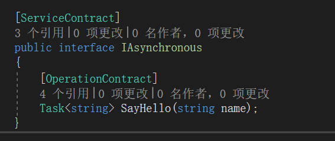
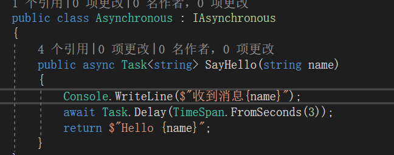
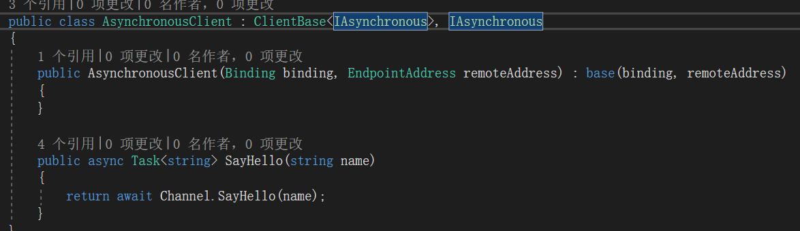
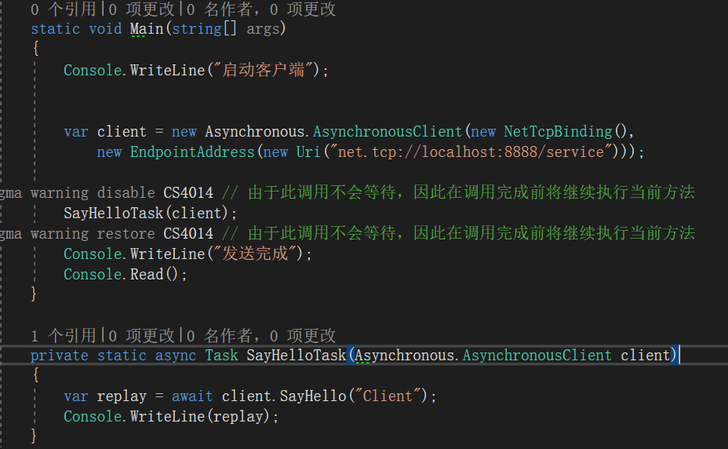
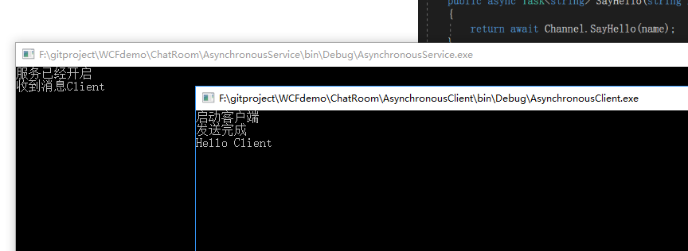
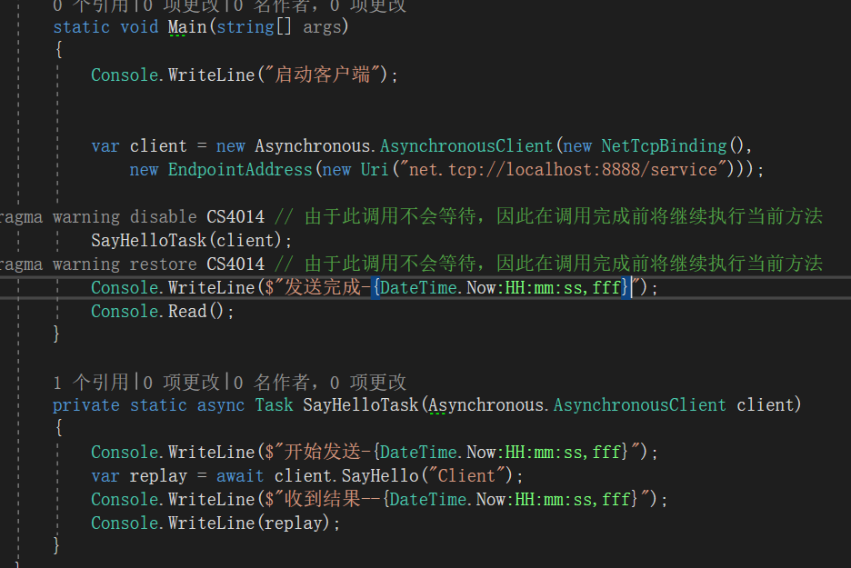
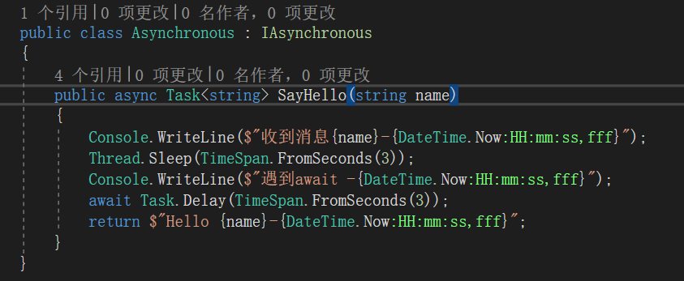
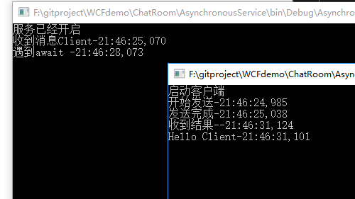

**本文demo已上传至github：[xinyuehtx/WCFdemo](https://github.com/xinyuehtx/WCFdemo)**

这个博客会介绍如何设置服务的异步调用

-----

之前在介绍[2019-1-24-wcf入门（3） - haungtengxiao](https://xinyuehtx.github.io/post/wcf%E5%85%A5%E9%97%A8-3.html)请求答复模式时，提到了异步服务操作。

实际上在C#5引入基于任务的异步模型（TAP，async/await）之后，异步的wcf服务变得非常简单。

### 异步实现

首先在定义接口时，将返回值改为`Task<T>`，表明这个方法可以异步

服务实现上我们通过`Task.Delay`模拟异步操作

客户端实现上注意需要添加`await`

在使用时输出返回值

结果如图所示，我们看到主线程先输出了发送完成，异步线程在完成异步操作后返回输出

### 深入研究

我们都知道自己写WPF之类的客户端程序，处理async/await都是在遇到真正实现了`IAwaitable`的代码时才会切换到异步，而之前的代码都会同步执行。

那么这个时候就有疑问了，如果服务端在进入异步之前执行了许多同步代码，或者信道延迟，那么还是没有解决请求答复模式的超时问题呀。

那么我们就做个实验，看看客户端是什么时候返回的。

实验很简单，我们对之前的日志添加上时间戳。额外的，服务端实现，增加了3秒同步等待。

结果发现在服务端输出收到消息之前，客户端代码就已经返回了。

而不需要等到服务端执行到await

### 小结

我们研究了WCF服务的异步代码，其特点有

- 可以直接使用现有的TAP模式
- 发送完直接返回，不用担心信道，或者服务端实现
- 可以有返回值

参考链接：

- [2019-1-24-wcf入门（3） - huangtengxiao](https://huangtengxiao.gitee.io/post/wcf%E5%85%A5%E9%97%A8-3.html)
- [如何：实现异步服务操作 - Microsoft Docs](https://docs.microsoft.com/zh-cn/dotnet/framework/wcf/how-to-implement-an-asynchronous-service-operation)
- [同步和异步操作 - Microsoft Docs](https://docs.microsoft.com/zh-cn/dotnet/framework/wcf/synchronous-and-asynchronous-operations)

