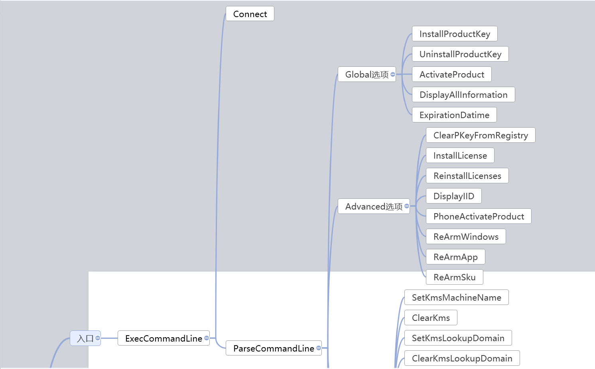
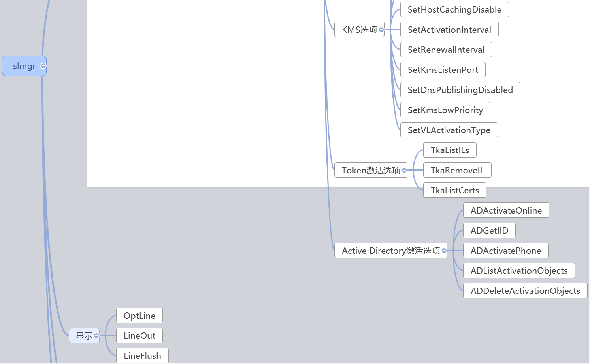
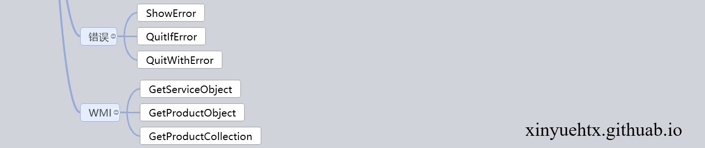

之前大佬要我做一款windows一键激活工具。基本原理是利用我们的license，从后台请求一个微软的正版license，然后调用slmgr进行windows激活。这样就可以把license的控制权留在自己这里，而不用传递给工厂，避免license流失。（所以期望从本文找破解方案的同学可以散了233）所以记录下对slmgr的研究。

-----

slmgr是一个vba脚本，整体的结构如下图所示。可以看到整个结构基本都是面向功能的，十分容易理解。

其主要功能就是通过指定的命令进入分支语句，然后调各个功能模块方法







我们先来看看主要的入口函数ExecCommandLine。归结起来就2句话，1是执行Connect，获取WMI服务和注册表；2是根据命令参数执行不同子模块功能

```vb
Private Sub ExecCommandLine
    Dim intOption, indexOption
    Dim strOption, chOpt
    Dim remoteInfo(3)

    
    '省略中间的参数检测代码
    
    '连接至本地计算机或者远端计算机，以获取WMI服务和注册表
    Call Connect()

    If intUnknownOption = intOption Then
        LineOut GetResource("L_MsgInvalidOptions")
        LineOut ""
        Call DisplayUsage()
    End If
	'针对不同的命令参数执行子函数
    intOption = ParseCommandLine(indexOption)

    If intUnknownOption = intOption Then
        LineOut GetResource("L_MsgUnrecognizedOption") & WScript.Arguments.Item(indexOption)
        LineOut ""
        Call DisplayUsage()
    End If
End Sub
```


Connect的源码如下，其主要功能是从参数中判断是否是对本地计算机处理，针对远端计算机和本地计算机，采用不同方式获取WMI服务和注册表

```vb
Private Sub Connect
    Dim objLocator, strOutput
    Dim objServer, objService
    Dim strErr, strVersion

    On Error Resume Next

    '如果是本地计算机，则直接获取WMI服务和注册表
    If g_strComputer = "." Then
        Set g_objWMIService = GetObject("winmgmts:\\" & g_strComputer & "\root\cimv2")
        QuitIfError2("L_MsgErrorLocalWMI")

        Set g_objRegistry = GetObject("winmgmts:\\" & g_strComputer & "\root\default:StdRegProv")
        QuitIfError2("L_MsgErrorLocalRegistry")

        Exit Sub
    End If

            '否则建立远端连接

    ' Create Locator object to connect to remote CIM object manager
    Set objLocator = CreateObject("WbemScripting.SWbemLocator")
    QuitIfError2("L_MsgErrorWMI")

                ' 获取远端WMI服务
    Set g_objWMIService = objLocator.ConnectServer (g_strComputer, "\root\cimv2", g_strUserName, g_strPassword)
    QuitIfError2("L_MsgErrorConnection")

    g_IsRemoteComputer = True

    g_objWMIService.Security_.impersonationlevel = wbemImpersonationLevelImpersonate
    QuitIfError2("L_MsgErrorImpersonation")

    g_objWMIService.Security_.AuthenticationLevel = wbemAuthenticationLevelPktPrivacy
    QuitIfError2("L_MsgErrorAuthenticationLevel")

    ' Get the SPP service version on the remote machine
    set objService = GetServiceObject("Version")
    strVersion = objService.Version

    ' The Windows 8 version of SLMgr.vbs does not support remote connections to Vista/WS08 and Windows 7/WS08R2 machines
    if (Not IsNull(strVersion)) Then
        strVersion = Left(strVersion, 3)
        If (strVersion = "6.0") Or (strVersion = "6.1") Then
            LineOut GetResource("L_MsgRemoteWmiVersionMismatch")
            ExitScript 1
        End If
    End If

    Set objServer = objLocator.ConnectServer(g_strComputer, "\root\default:StdRegProv", g_strUserName, g_strPassword)
    QuitIfError2("L_MsgErrorConnectionRegistry")

    objServer.Security_.ImpersonationLevel = 3
    Set g_objRegistry = objServer.Get("StdRegProv")
    '获取注册表对象
    QuitIfError2("L_MsgErrorConnectionRegistry")
End Sub
```

接下来是ParseCommandLine函数，其就是简单的一个switchcase，根据输入的命令参数不同，执行不同的激活命令。

```vb
Private Function ParseCommandLine(index)
    Dim strOption, chOpt

    ParseCommandLine = intKnownOption

    strOption = LCase(WScript.Arguments.Item(index))

    chOpt = Left(strOption, 1)

    If (chOpt <> "-") And (chOpt <> "/") Then
        ParseCommandLine = intUnknownOption
        Exit Function
    End If

    strOption = Right(strOption, Len(strOption) - 1)

    If strOption = GetResource("L_optInstallLicense") Then

        If HandleOptionParam(index+1, True, GetResource("L_optInstallLicense"), GetResource("L_ParamsLicenseFile")) Then
            InstallLicense WScript.Arguments.Item(index+1)
        End If

    ElseIf strOption = GetResource("L_optInstallProductKey") Then

        If HandleOptionParam(index+1, True, GetResource("L_optInstallProductKey"), GetResource("L_ParamsProductKey")) Then
            InstallProductKey WScript.Arguments.Item(index+1)
        End If

    ElseIf strOption = GetResource("L_optUninstallProductKey") Then

        If HandleOptionParam(index+1, False, GetResource("L_optUninstallProductKey"), GetResource("L_ParamsActivationIDOptional")) Then
            UninstallProductKey WScript.Arguments.Item(index+1)
        Else
            UninstallProductKey ""
        End If

       '中间还有一堆else if省略
    Else

        ParseCommandLine = intUnknownOption

    End If

End Function
```

我们选取其中最重要的一个函数ActivateProduct来分析下。源码有部分删减，其中过程是获得一个叫“Version”的服务对象，从所有产品列表中检查是否是指定的产品，进行激活并更新状态。

```vbscript
Private Sub ActivateProduct(strActivationID)
    Dim objService, objProduct
    Dim iIsPrimaryWindowsSku, bFoundAtLeastOneKey
    Dim strOutput
    Dim bCheckProductForCommand

    strActivationID = LCase(strActivationID)

    bFoundAtLeastOneKey = False
    '获取“Version”服务
    set objService = GetServiceObject("Version")
'获取激活产品对象
    For Each objProduct in GetProductCollection("ID, ApplicationId, PartialProductKey, LicenseIsAddon, Description, Name, LicenseStatus, VLActivationTypeEnabled ", "PartialProductKey <> null")

        bCheckProductForCommand = CheckProductForCommand(objProduct, strActivationID)

        If (bCheckProductForCommand) Then
            '省略部分输出
            If (Not(IsMAK(objProduct.Description)) Or (objProduct.LicenseStatus <> 1)) Then
                '激活产品
                objProduct.Activate()
                QuitIfError()
                '更新状态
                objService.RefreshLicenseStatus()
                objProduct.refresh_
            End If
            DisplayActivatedStatus objProduct

            bFoundAtLeastOneKey = True
            If (strActivationID <> "") Or (iIsPrimaryWindowsSku = 1) Then
                Exit Sub
            End If
        End If
    Next
    '省略部分输出
End Sub
```

那我们再来看看GetServiceObject方法，实际就是执行了一个WMI的SQL查询，从SoftwareLicensingService获取Version

```vb
Function GetServiceObject(strQuery)
    Dim objService
    Dim colServices

    On Error Resume Next

    Set colServices = g_objWMIService.ExecQuery("SELECT " & strQuery & " FROM SoftwareLicensingService" )
    For each objService in colServices
        QuitIfError()
        Exit For
    Next
    set GetServiceObject = objService
End Function
```

而GetProductCollection则是从SoftwareLicensingProduct获取指定的产品状态

```vb
Function GetProductCollection(strSelect, strWhere)
    Dim colProducts
    Dim objProduct

    On Error Resume Next

    If strWhere = EmptyWhereClause Then
        Set colProducts = g_objWMIService.ExecQuery("SELECT " & strSelect & " FROM SoftwareLicensingProduct")
        QuitIfError()
    Else
        Set colProducts = g_objWMIService.ExecQuery("SELECT " & strSelect & " FROM SoftwareLicensingProduct WHERE " & strWhere)
        QuitIfError()
    End If

    For each objProduct in colProducts
    Next

    QuitIfError()

    set GetProductCollection = colProducts
End Function
```

OK，这里已经大致清除激活的代码原理了，其他的功能基本也是依赖于WMI查询的对象。

而这些WMI对象则是通过对应的COMAPI进行方法调用，以执行进一步的命令。

---

参考文献：[Calling a WMI Method - Windows applications - Microsoft Docs](https://docs.microsoft.com/zh-cn/windows/win32/wmisdk/calling-a-method)


