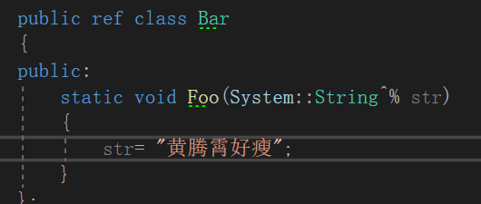
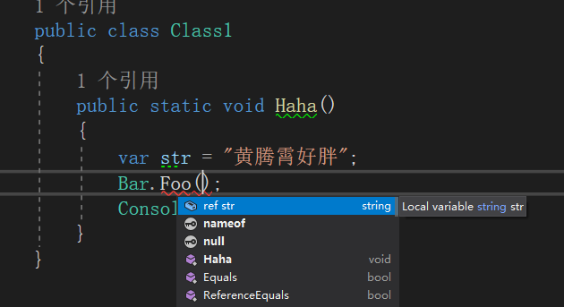
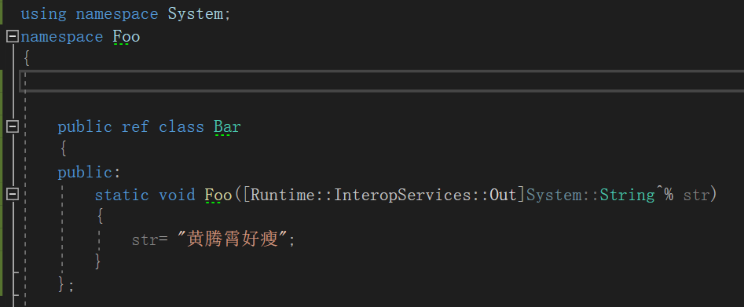
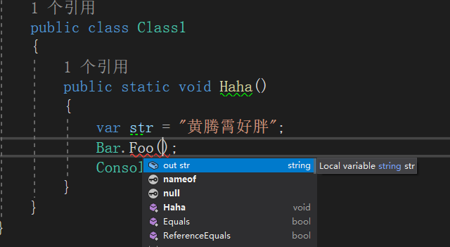

最近在搞C++/CLI，发现经常需要涉及Ref和Out的使用，因此记录下。

-----

C++/CLI 是一种.NET语言，因此其可以像C#一样使用Ref和Out为函数参数进行标识。

首先我们看看Ref，这个是表示对对象的地址进行传递，所以很简单传递一个地址符号即可

我们将这个方法引用到一个C#项目中，可以看到vs帮我们加上了ref关键字

首先我们需要知道的是，CLR层面是没有out这个用法的，他的本质还是ref，只是对于C#等编译器来说，将其设置为out。

所以回到C++/CLI只需要在原来的方法中添加一个[ Runtime::InteropServices::Out ]Attribute即可（注意大小写，这里编译器不会提醒，别问我怎么知道的，都是泪）

看变成out了

此外需要注意的一点，如果你的ref或者out参数是由外部方法的参数传入的，需要确保整条链路上的ref或者out一致，否则会出现编译错误

---

参考文献：

[.net - ref and out in C++/CLI - Stack Overflow](https://stackoverflow.com/questions/3514237/ref-and-out-in-c-cli)

[How to: Specify an out Parameter - Microsoft Docs](https://docs.microsoft.com/en-us/cpp/dotnet/how-to-specify-an-out-parameter?view=vs-2019)