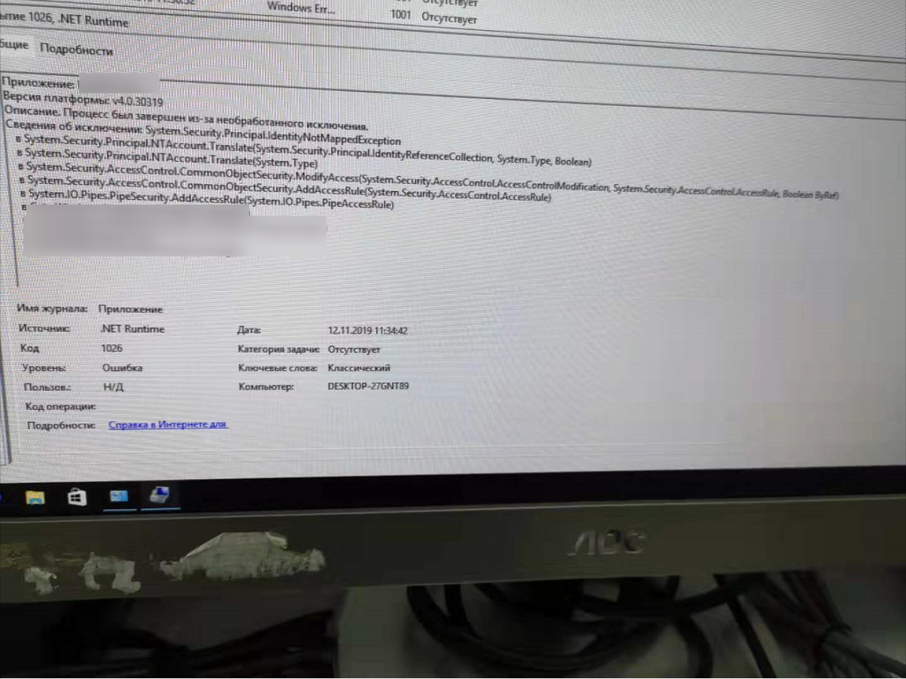

一段运行了很久的命名管道程序，在俄语系统出现了奔溃，揭开了一个尘封已久的bug。

-----

公司的软件最近迁移到俄语系统上，然后出现了一个奔溃异常，如下图（已经隐去了关键信息）



异常显示了在PipeSecurity添加PopeAccessRule时出现了IdentityNotMappedException

## IdentityNotMappedException是什么

首先我们需要了解什么是SID。

windows会给系统中的每个用户和用户组分配一个唯一标识` Security Identifier `,也就是sid。

windows在实际工作中会使用这个sid，而不是用户名和组名，进行诸如权限管理等操作。

我们可以使用下面两个api进行sid和账户名称之间的转换

[LookupAccountName](https://docs.microsoft.com/zh-cn/windows/win32/api/winbase/nf-winbase-lookupaccountnamea?redirectedfrom=MSDN)

[LsaLookupSids](https://docs.microsoft.com/zh-cn/windows/win32/api/ntsecapi/nf-ntsecapi-lsalookupsids?redirectedfrom=MSDN)

但是存在的问题是在进行这个转换时，window会查找所有的本地账户，可信任的域账户，以及`SidHistory`的账户，然后根据他们的之间存在的映射关系，去进行转换。

换句话说，windows账户名称和sid的转换依赖于存储在`SidHistory`和本地域中的映射关系。

那么如果这个映射关系出现了问题，就可能导致出现我们所示的`IdentityNotMappedException`

## 如何解决

那么如何进行解决呢？

实际上在大部分使用情况下，我们需要的都是一些通用的sid信息，比如users

而这些通用sid的信息是固定的，可以在[Well-known SIDs - Win32 apps -Microsoft Docs](https://docs.microsoft.com/zh-cn/windows/win32/secauthz/well-known-sids)找到。

而大部分windowsapi也支持直接使用sid进行操作。

回到具体的例子

我们遇到问题的代码是这样的

```C#
PipeSecurity ps = new PipeSecurity();
ps.AddAccessRule(new PipeAccessRule("Users",PipeAccessRights.ReadWrite,AccessControlTyep.Allow));    
```

这里我们使用了字符串"Users"来查找user的sid，此时如果本地域存在问题，那么就可能出现IdentityNotMappedException

而我们可以使用下面的代码

```C#
var user=WindowsIdentity.GetCurrent().User;
PipeSecurity ps = new PipeSecurity();
ps.AddAccessRule(new PipeAccessRule(user,PipeAccessRights.ReadWrite,AccessControlTyep.Allow)); 
```

这里通过`WindowsIdentity`直接获取User对象（Sid），避免了名称和sid的转换，

所以即使本地域出现问题，代码也能够正常执行。

---

参考文档：

- [PipeAccessRule 类 (System.IO.Pipes) - Microsoft Docs](https://docs.microsoft.com/zh-cn/dotnet/api/system.io.pipes.pipeaccessrule?view=netframework-4.8)
- [c# - IdentityNotMappedException - Stack Overflow](https://stackoverflow.com/questions/3324831/identitynotmappedexception)
- [IdentityNotMappedException Class (System.Security.Principal) - Microsoft Docs](https://docs.microsoft.com/en-us/dotnet/api/system.security.principal.identitynotmappedexception?view=netframework-4.8)
- [How to resolve a System.Security.Principal.IdentityNotMappedException? – Windows SDK Support Team Blog](https://blogs.msdn.microsoft.com/winsdk/2013/12/18/how-to-resolve-a-system-security-principal-identitynotmappedexception/)
- [Well-known SIDs - Win32 apps - Microsoft Docs](https://docs.microsoft.com/zh-cn/windows/win32/secauthz/well-known-sids)


