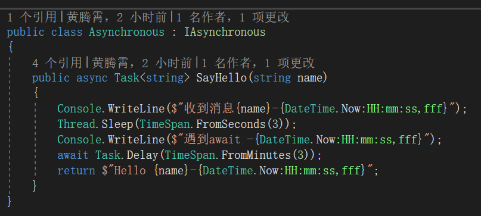
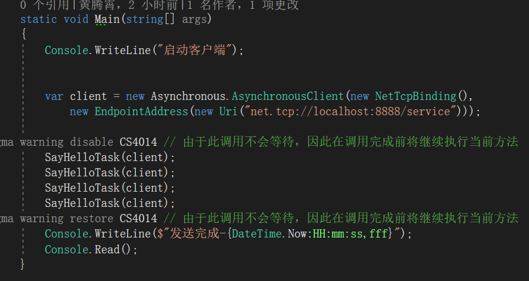
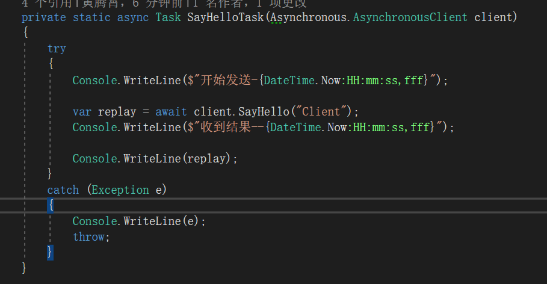
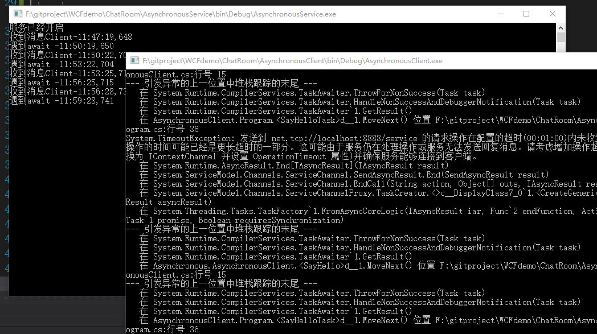

**本文demo已上传至github：[xinyuehtx/WCFdemo](https://github.com/xinyuehtx/WCFdemo)**

在之前的[2019-1-31-wcf入门（12） - huangtengxiao](https://xinyuehtx.github.io/post/wcf%E5%85%A5%E9%97%A8-12.html)博客介绍了wcf的异步，但是发现一些小伙伴没有注意到的问题。因此做一些补充实验

-----

### 异步代码会导致超时么

上一次我们发现当返回值至task时，消息一旦发出，线程就会继续执行。

那么继续利用上一个博客的例子，我们尝试将delay增加到3min，然后检查输出

结果输出我们可以看到所有调用都出现了超时。因此使用await等待仍然是会超时的，我们不能在服务端通过异步执行耗时过长的代码

### 小结

我们研究了WCF服务的异步代码的超时问题，其特点有

- 即使使用async/await，仍然会超时

参考链接：

- [2019-1-31-wcf入门（12） - huangtengxiao](https://xinyuehtx.github.io/post/wcf%E5%85%A5%E9%97%A8-12.html)

