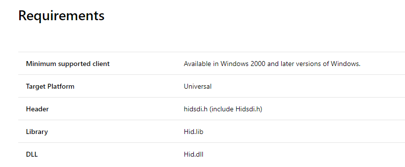

当你写久了应用层代码，是不是需要来玩一下硬件呀？

-----

这个时候你就会接触到一些美妙的dll，比如`user32.dll`,`kernal32.dll`

当然这些是非托管的代码，我们在.net中无法直接使用，所以我们会需要使用PInvoke进行调用

于是你会使用`DllImport`特性标记一个方法，引入非托管函数

比如 我们希望弹出一个消息框，就会使用下面这个函数，添加`DllImport`特性，表明从哪个dll引入方法

```C#
public class Win32
{
    [DllImport("user32.dll")]
    public static extern IntPtr MessageBox(int hWnd, String text, String caption, uint type);
}
class Program
{
    static void Main(string[] args)
    {
        Win32.MessageBox(0, "这是我的博客：https://xinyuehtx.github.io/", "Hello 黄腾霄", 0);

        Console.ReadLine();
    }
}
```


不要被这些表象给骗了，哪有说的这么简单。

我们看一下MessageBox 的原始签名


如果你像我这样没怎么写过c++，第一感觉一定是一脸懵逼，除了int和uint其他啥也没看懂。

所以我们一步步来看如何将c++的MessageBox转化为我们C#中的签名

## 手把手PInvoke

1. 首先打开[Programming reference for Windows API -Microsoft Docs](https://docs.microsoft.com/en-us/windows/desktop/api/)，找到目标函数`MessageBox `的介绍
2. 我们可以在`Requirements`的DLL栏中看到`User32.dll`，这个就是我们在`DllImport`中所需要的dll的名称


这样为我们就可以写出（其中？代表还未填写的内容）

```C#
public class Win32
{
    [DllImport("user32.dll")]
    public static extern ? MessageBox(?);
}
```

3. 接着我们从`Syntax`中找到函数签名


4. 这里比较麻烦的是4个参数的需要转换为对应的托管类型，有时候还会涉及一些结构体和指针。

这里我们先看一下`Parameters`


第一个是一个`HWND`类型，表示一个窗口句柄，

可以通过`HWND`=Handle to A Window来记忆

那么在c#中我们可以使用`Intptr`类型，表示一个指针或者句柄


第2,3个参数都是`LPCTSTR`

`LPCTSTR` = L‌ong P‌ointer to a C‌onst T‌CHAR String 所以这是一个字符串，我们此处使用`string`


最后一个是`UINT`，我们直接在c#中有对应的`uint`

这么一看是不是就更加能够理解了呢。

## 实操

再来一个简单的例子，我们期望获取HID设备的接口GUID

方法给到你们，是[HidD_GetHidGuid](https://docs.microsoft.com/en-us/windows-hardware/drivers/ddi/content/hidsdi/nf-hidsdi-hidd_gethidguid) 

先看requirements.txt，发现DLL 是`Hid.dll`



接着是签名和参数，`LPGUID`我们没有提过，看解释这边是指向GUID的一个指针，所以我们使用`Guid`这个类型


所以我们现在得到的结果如下

```C#
[DllImport("hid.dll")]
public static extern void HidD_GetHidGuid(Guid hidGuid);
```

不过注意，我们WindowsApi中签名的参数类型是一个指针，现在我们传递的`Guid`只是一个结构体

所以我们还需要将其以`引用`方式传递，通过添加`ref`

所以最终形式就是

```C#
[DllImport("hid.dll")]
public static extern void HidD_GetHidGuid(ref Guid hidGuid);
```

```C#
var guid = Guid.Empty;

Win32.HidD_GetHidGuid(ref guid);

Console.WriteLine(guid);
```


运行可以看到结果如下


## Tip

有同学说，这么说完了，我还是担心会写错怎么办

没关系，这里给大家推荐一个网站[pinvoke.net: the interop wiki!](https://www.pinvoke.net/)，里面聚集了各种pinvoke的写法，如果不清楚怎么使用，可以去其中查看

另外vs也带有pinvoke的插件，使用方法可以参见吕毅同学的博客[使用 PInvoke.net Visual Studio Extension 辅助编写 Win32 函数签名 - walterlv](https://walterlv.com/post/pinvoke-net-visual-studio-extension.html?tdsourcetag=s_pcqq_aiomsg)


参考链接：

- [pinvoke.net: the interop wiki!](https://www.pinvoke.net/)
- [Platform Invoke Examples - Microsoft Docs](https://docs.microsoft.com/en-us/dotnet/framework/interop/platform-invoke-examples)
- [Passing Structures -Microsoft Docs](https://docs.microsoft.com/en-us/dotnet/framework/interop/passing-structures)
- [使用 PInvoke.net Visual Studio Extension 辅助编写 Win32 函数签名 - walterlv](https://walterlv.com/post/pinvoke-net-visual-studio-extension.html?tdsourcetag=s_pcqq_aiomsg)
- [MessageBox function - Microsoft Docs](https://docs.microsoft.com/en-us/windows/desktop/api/winuser/nf-winuser-messagebox)
- [Programming reference for Windows API - Microsoft Docs](https://docs.microsoft.com/en-us/windows/desktop/api/)
- [HidD_GetHidGuid function (hidsdi.h) - Windows drivers 0 - Microsoft Docs](https://docs.microsoft.com/en-us/windows-hardware/drivers/ddi/content/hidsdi/nf-hidsdi-hidd_gethidguid)

