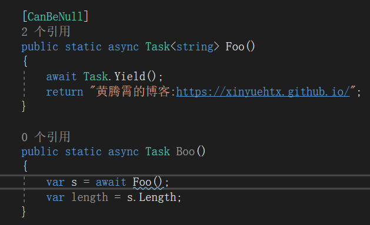

NullReferenceException一定是大多数程序员最讨厌的异常之一

-----

我们在书写代码时看到`NullReferenceException`一定很崩溃，但是更崩溃的事情是在团队协作时，小伙伴写的方法给你返回了一个`Null`

本着己所不欲勿施于人的观点，我们应该选择一种方式或者契约让可能会出现`Null`的地方，告知到其他的小伙伴

这里推荐的是Resharper的`CanBeNull`标记。

`CanBeNull`可以标记在方法的参数或者返回值，使用后可以看到在可能出现空引用的地方vs给出了波浪线提示

还有一种相对来说少见一些的情况是对于`Task<T>`中对`T`可能为空的标记

如果我们采用之前的`CanBeNull`标记，会发现vs提示在await Foo 处出现提示，即Task 可能会null

而不是我们期望的`string` 为null

此时只要将原有的`CanBeNull`改为`ItemCanBeNull`即可

`ItemCanBeNull`可以表示`IEnumerable `，`Task`或者`Lazy`所包含的对象类型可能为空，例如`List<T>`,`Task<T>`和`Lazy<T>`中的T

那么既然可以表示可空，是否有标记表示非空呢？

只要使用`NotNull`和`ItemNotNull`即可表示对应的非空情况

参考链接：

- [Code Annotation Attributes - Help | ReSharper](https://www.jetbrains.com/help/resharper/Reference__Code_Annotation_Attributes.html)

