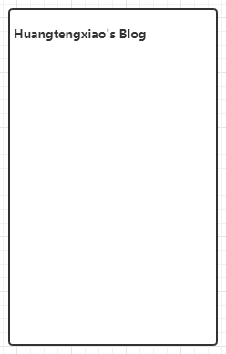
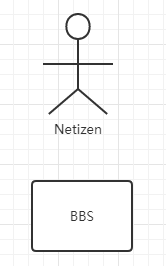
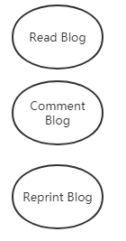
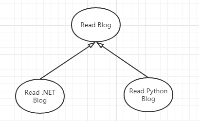
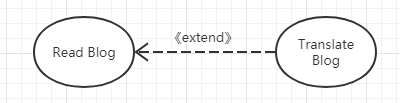
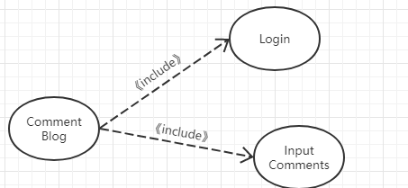
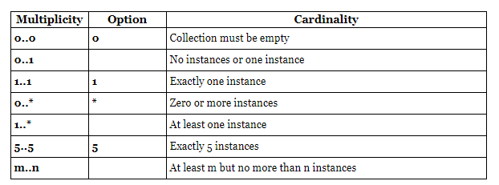
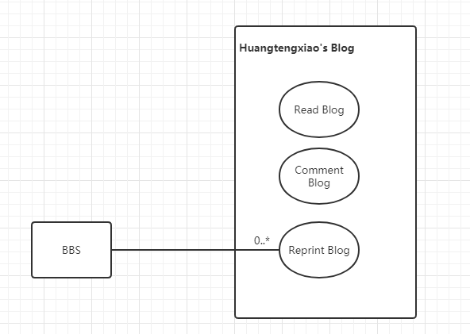
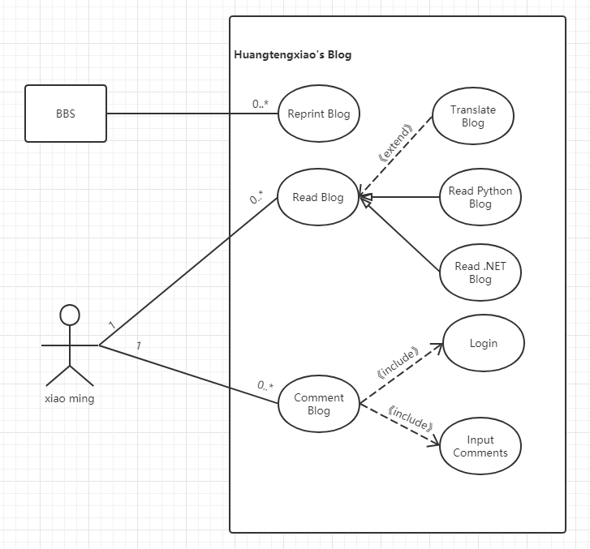

在面向对象的软件分析及设计中，UML用例图是分析业务，明确需求的一种常见工具。

-----

# 定义

UML用例图（Use Case Diagrams）是一种描述用户和系统之间交互的简单表达方式。它描述了特定系统（主体）同外部用户（角色）之间的一系列交互行为（用例）。

## 概念

在用例图中，需要明确以下几个概念：

- 主体
- 角色
- 用例

### 主体

主体(Subject)是指被研究的系统。它限定了用例图研究对象的范围和边界。

主体使用**矩形**表示，左上角标明主体的名称

例如在研究一个blog时，被研究的blog就是一个主体

### 角色

角色（Actor）是指同主体有关联或者交互的外部概念，可以是人员，也可以是其他系统。

例如对于blog案例，与其相关的外部角色，就可能是网友或者技术论坛

在表示方法上没有统一规定，可以是一个小人，或者是表示简单类型的类图。

需要注意的是这里的角色是独立于主题之外存在的。

### 用例

用例（use case）是指主题能够提供的功能性单元。一般使用**椭圆**表示。

对于博客来说，常见的用例有提供内容阅读，文章评论，文章转载等。

#### 用例的泛化（Generalization）、扩展（Extend）、包含（Include）

泛化是指从父用例派生子用例，例如博客可以有.NET博客、Python博客之分，使用**带空心三角形的实线**表示，空心三角形端点为父用例。例如

扩展是指在原有的用例之上，提供扩展的用例。注意，这两个用例都是完备的功能点。例如blog提供了谷歌在线翻译的插件，这个就是一个扩展用例。扩展用例使用**虚线箭头+关键字《extend》**表示，箭头从扩展用例指向原用例。可以理解为翻译博客的用例**扩展了**阅读博客的用例。

包含是指原有用例内部，存在更细致的子模块。例如，博客的评论功能需要有登入、输入等包含用例。包含用例使用**虚线箭头+关键字《include》**表示，箭头从原用例指向子用例。可以理解为评论博客用例**包含了**登入和输入评论用例

### 用例与角色的关联

用例与角色之间通过UML关联（association）进行交互，此处的关联特指二元关联。关联使用**实线**进行表示，实线的端点可以指定**量词**，以表示关联双方的数量关系。量词的格式如表所示

如果BBS可以转载我任意数量的blog，那么就可以使用如下关联将BBS和blog转载关联。注意下图未标明BBS的数量，说明在这个研究场景中，BBS的数量是不重要的，因此未标明细节。这也符合我们在[2019-5-30-UML基础 - huangtengxiao](https://xinyuehtx.github.io/post/UML基础.html)中所说的less is more的原则

# 绘制方法

我们在绘制用例图时，可以遵循下面的步骤：确定主体，寻找角色，定义用例，建立关联的方式一步步的确定用例图。如下是用UML描述的我的blog的用例图

参考链接：

- [Unified Modeling Language (UML) description](https://www.uml-diagrams.org/)
- [统一建模语言 - 维基百科，自由的百科全书](https://zh.wikipedia.org/wiki/统一建模语言)
- [用例图 - 维基百科，自由的百科全书](https://zh.wikipedia.org/wiki/用例图)
- [An association between UML actor and a use case indicates that the actor and the use case communicate with each other.](https://www.uml-diagrams.org/use-case-actor-association.html)
- [UML Multiplicity and Collections - defining and using multiplicity and collections in UML - lower and upper bounds, cardinality, order, unique.](https://www.uml-diagrams.org/multiplicity.html)
- [2019-5-30-UML基础 - huangtengxiao](https://xinyuehtx.github.io/post/UML基础.html)

