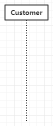
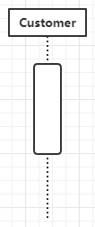
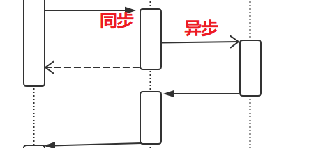
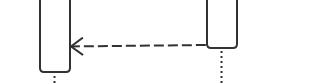
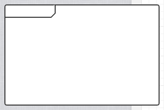

在面向对象的软件分析及设计中，UML时序图描述了系统中各个组成部分的信息交互关系。

-----

# 定义

UML时序图（Sequence Diagrams）是一种面向对象分析和设计中，描述被分析系统中各个组成部分之间消息相互传递的图形。它表现了系统中各个对象在某一个用例场景的行为执行顺序。

## 概念

在时序图中，有如下几种概念需要了解：

- 生命线
- 执行
- 同步/异步调用
- 回复
- 片段

### 生命线

生命线（lifeline）在序列图中，参与对象的生命周期。使用一个简单对象+竖直虚线表示

例如在一个餐馆中，顾客可以使用如下图形表示

### 执行

执行是指在指定对象上进行的操作，使用生命线上的矩形表示

例如顾客的点单过程就是一个执行单元

例如我们可以提取一个Person的接口，它有名字，能吃。

### 同步/异步调用

调用是信息在不同生命线的传递。调用分为同步调用和异步调用。同步调用使用实心三角直线表示，异步使用箭头实线表示。

同步调用后，需要等待被调用对象执行完成；异步调用，可以直接返回

例如一个名叫黄腾霄的顾客。

### 回复

回复指在同步调用完成后的返回，使用虚线箭头表示

### 片段

片段是指诸如，选择、循环、并行等带有逻辑状态的片段

使用如下图形圈出，并在左上角标明片段类型

## 实践

这里给出了一个餐厅的时序图。

顾客向服务员点单，如果菜品还有，则服务员将订单传递给厨师。厨师做完之后，让服务员上菜，顾客进行食用。

如果菜品已经卖完，服务员则直接告知顾客，顾客结束点单

其中菜单中的项目是菜单的组成，因此食用组合。而顾客需要依赖于菜单，才能完成点菜。

参考链接：

- [Unified Modeling Language (UML) description](https://www.uml-diagrams.org/)
- [统一建模语言 - 维基百科，自由的百科全书](https://zh.wikipedia.org/wiki/统一建模语言)
- [类图 - 维基百科，自由的百科全书](https://zh.wikipedia.org/wiki/類別圖)
- [An association between UML actor and a use case indicates that the actor and the use case communicate with each other.](https://www.uml-diagrams.org/use-case-actor-association.html)
- [UML Multiplicity and Collections - defining and using multiplicity and collections in UML - lower and upper bounds, cardinality, order, unique.](https://www.uml-diagrams.org/multiplicity.html)
- [2019-5-30-UML基础 - huangtengxiao](https://xinyuehtx.github.io/post/UML基础.html)
- [2019-5-30-UML用例图 - huangtengxiao](https://xinyuehtx.github.io/post/UML用例图.html)
- [2019-5-31-UML活动图 - huangtengxiao](https://xinyuehtx.github.io/post/UML活动图.html)
- [2019-6-1-UML类图 - huangtengxiao](https://xinyuehtx.github.io/post/UML类图.html)

