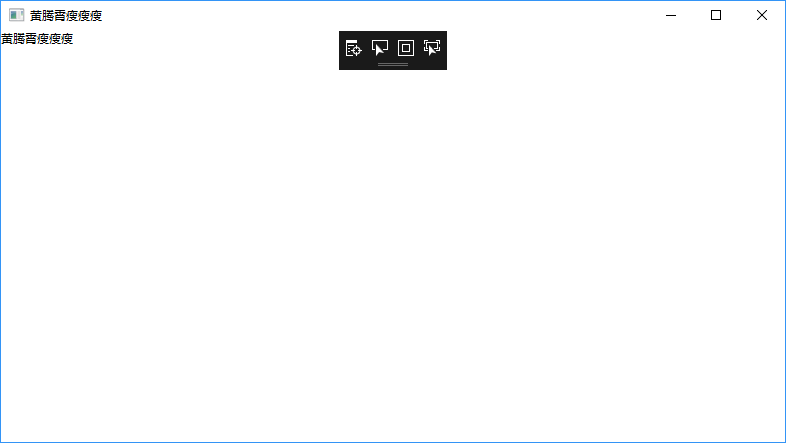
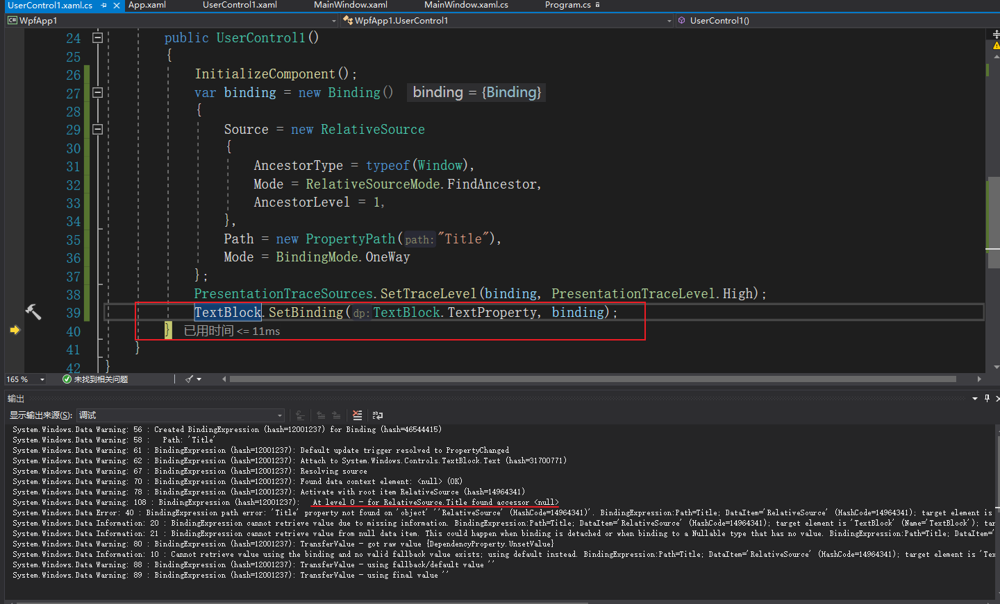
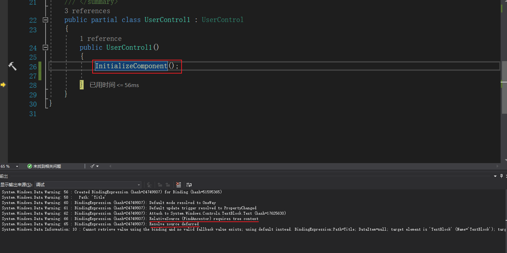
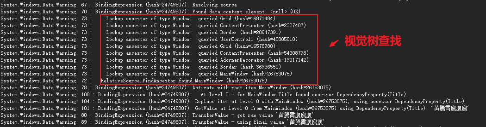

不知道是不是有小伙伴遇到过这样的情况。当我们尝试将一个`RelativeSource`从xaml转到code behind时，原本好好的binding表达式居然出现binding错误。

-----

我们来做个实验，我们创建了一个`UserControl`里面有一个`TextBlock`，其`Text`属性绑定了类型为Window的父元素的Title。而我们的window里面的title写了"黄腾霄瘦瘦瘦"这个美好的祝愿。（下面的代码删掉了xmlns）

```xaml
<UserControl x:Class="WpfApp1.UserControl1">
    <Grid>
        <TextBlock Name="TextBlock" Text="{Binding RelativeSource={RelativeSource AncestorType=Window},Path=Title}" />
    </Grid>
</UserControl>
```

```xaml
<Window x:Class="WpfApp1.MainWindow"
        Title="黄腾霄瘦瘦瘦" Height="450" Width="800">
    <Grid x:Name="Grid">
        
    </Grid>
</Window>
```

下面是关键点，我们没有按照通常的写法，通过xaml添加usercontrol1，而是在code behind的构造函数中添加

```C#
        public MainWindow()
        {
            InitializeComponent();
            var userControl1 = new UserControl1();
            Grid.Children.Add(userControl1);
        }
```

启动运行后一切正常



此时我们将textblock的binding改到code behind中

```C#
        public UserControl1()
        {
            InitializeComponent();
            var binding = new Binding()
            {
                Source = new RelativeSource
                {
                    AncestorType = typeof(Window),
                    Mode = RelativeSourceMode.FindAncestor,
                    AncestorLevel = 1,
                },
                Path = new PropertyPath("Title"),
                Mode = BindingMode.OneWay
            };
            TextBlock.SetBinding(TextBlock.TextProperty, binding);
        }
```

惊，textblock的文字没有啦，而且我们看到一个绑定错误。


我勒个去，明明就是等价的代码嘛

我们试试添加一些调试信息（参考德熙的博客[WPF 如何调试 binding](https://blog.lindexi.com/post/wpf-%E5%A6%82%E4%BD%95%E8%B0%83%E8%AF%95-binding)）

```c#
        public UserControl1()
        {
            InitializeComponent();
            var binding = new Binding()
            {
                Source = new RelativeSource
                {
                    AncestorType = typeof(Window),
                    Mode = RelativeSourceMode.FindAncestor,
                    AncestorLevel = 1,
                },
                Path = new PropertyPath("Title"),
                Mode = BindingMode.OneWay
            };
            PresentationTraceSources.SetTraceLevel(binding, PresentationTraceLevel.High);
            TextBlock.SetBinding(TextBlock.TextProperty, binding);
        }

```

输出如下，我们看到在执行到`TextBlock.SetBinding(TextBlock.TextProperty, binding);`时，WPF就开始寻找RelativeSource，而此时我们的控件还未被加入到逻辑树，所以他根本找不到父元素



那么为啥写在xaml里面就没事呢？我们对其添加调试输出看看

```xaml
<UserControl x:Class="WpfApp1.UserControl1">
    <Grid>
        <TextBlock Name="TextBlock"
                   Text="{Binding RelativeSource={RelativeSource AncestorType=Window},Path=Title,PresentationTraceSources.TraceLevel=High}" />
    </Grid>
</UserControl>
```

在执行`InitializeComponent`时，WPF进行了绑定。但是此时发现`RelativeSource (FindAncestor) requires tree context`,我们在查找RelativeSource 时，需要有上下文树，而此时条件不满足，我们的绑定就被延迟了



而在之后，WPF再次解析绑定Source，通过视觉树找到了window，所以绑定能够成功



所以下次想要对在后台生成的对象进行Relative绑定时，需要注意咯

参考链接：

- [WPF 如何调试 binding](https://blog.lindexi.com/post/wpf-%E5%A6%82%E4%BD%95%E8%B0%83%E8%AF%95-binding)


