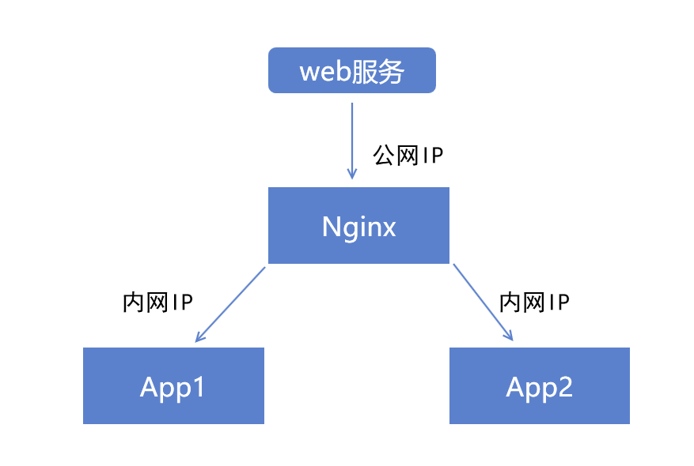
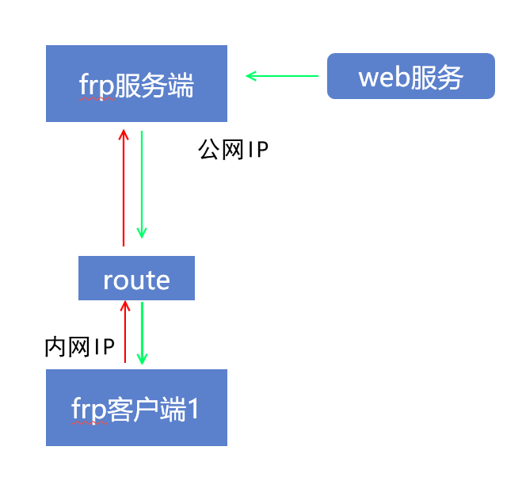
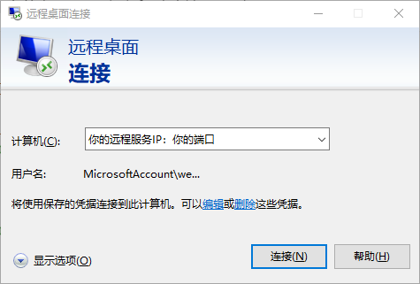

同学们是否经常遇到这个问题，我期望在家里访问公司的电脑。但是公司的电脑是部署在内网，ip经过NAT的转换，根本无法知道哪一个是自己的设备。这个问题的解决方案之一就是使用内网穿透工具。今天就要介绍我们在[2020-1-7-如何使用mac电脑连接你的windows设备 - huangtengxiao](https://xinyuehtx.github.io/post/%E5%A6%82%E4%BD%95%E4%BD%BF%E7%94%A8mac%E7%94%B5%E8%84%91%E8%BF%9E%E6%8E%A5%E4%BD%A0%E7%9A%84windows%E8%AE%BE%E5%A4%87.html)里最后提到的工具——frp。

-----

[fatedier/frp](https://github.com/fatedier/frp) 是一个可用于内网穿透的高性能的反向代理程序。

其最突出的一个特点是支持内网穿透。

## Frp原理

为什么frp能够做到内网穿透呢？

### 传统方式

我们先看一下传统的反向代理工具，例如Nginx。

当用户从公网访问web服务时，经过反向代理服务，将请求转发给实际运行后台程序的服务器。

但是需要注意的是，这种反向代理方式的配置都集中在服务端。

也就是说，Nginx知道各个服务实际运行在哪里。



但是，考虑这种更据现实情况。你的app服务运行在公司内网，而你手上只有一个远在美国的vps。

你在vps上部署的Nginx，根本没有办法知道你在公司内网中的设备。

### Frp方式

那么有同学就会想，既然我vps有公网IP，那是不是可以让我，内网的设备主动到vps上面，**注册**一个服务呢？

没错，frp就是这样做的。

如下图，frp的服务端可以就是一个部署在公网的服务注册中心。

frp客户端，从内网连接frp服务端，然后注册自己的服务。

frp服务端将这个服务对外暴露，并将外部的请求转发至frp客户端。

这样，外网就可以访问内网设备部署的服务了。



## 使用Frp配置远程桌面（Tcp模式）

如上所述，有了frp，我们只需要将内网设备的远程桌面服务端口（3389）通过frp服务端向外暴露即可。

### 1. 配置frp服务端

从[Releases · fatedier/frp](https://github.com/fatedier/frp/releases)下载你所需要的release版本。

在你的服务器上直接按照默认配置运行下面的代码即可

```sh
./frps -c ./frps.ini
```

### 2.配置frp客户端

在你对外提供远程桌面服务的内网pc上，运行frp客户端，配置如下

```ini
# frpc.ini
[common]
# 你的frp服务器的公网ip
server_addr = x.x.x.x
# 你的frp服务器的默认端口
server_port = 7000

[rdp]
type = tcp
local_ip = 127.0.0.1
# 远程桌面的端口号
local_port = 3389
# 远程桌面服务暴露在服务端的端口号
remote_port = 6000
```

然后调用启动命令

```sh
./frpc -c ./frpc.ini
```

### 3.远程桌面连接

此时你就可以通过微软的远程桌面客户端进行连接了

在另一台设备上使用`你的frp服务器的公网ip`+`远程桌面服务暴露在服务端的端口号`进行连接




---

参考文档：

-  [2020-1-7-如何使用mac电脑连接你的windows设备 - huangtengxiao](https://xinyuehtx.github.io/post/%E5%A6%82%E4%BD%95%E4%BD%BF%E7%94%A8mac%E7%94%B5%E8%84%91%E8%BF%9E%E6%8E%A5%E4%BD%A0%E7%9A%84windows%E8%AE%BE%E5%A4%87.html)
-  [frp/README_zh.md at master · fatedier/frp](https://github.com/fatedier/frp/blob/master/README_zh.md#%E5%AE%89%E5%85%A8%E5%9C%B0%E6%9A%B4%E9%9C%B2%E5%86%85%E7%BD%91%E6%9C%8D%E5%8A%A1)
-  [是否可以提供 mac os 的编译版本？ · Issue #318 · fatedier/frp](https://github.com/fatedier/frp/issues/318)
-  [fatedier/frp: A fast reverse proxy to help you expose a local server behind a NAT or firewall to the internet.](https://github.com/fatedier/frp)


