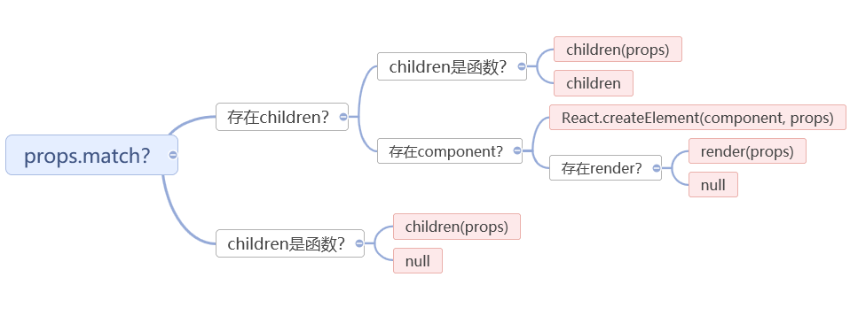
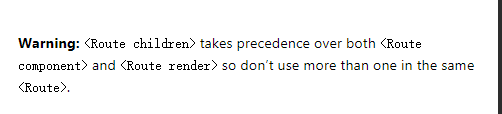

今天来和大家解析下React-Router的源码。

-----

React-Router是React生态中最重要的组件之一。

他提供了动态的前端路由功能，能让我们在前端应用实现，高效的SPA应用。

那么这个东西是怎么实现的呢？

我们来一起看下它的源码

## Router.js

```javascript
constructor(props) {
    super(props);

    this.state = {
      location: props.history.location
    };

    // This is a bit of a hack. We have to start listening for location
    // changes here in the constructor in case there are any <Redirect>s
    // on the initial render. If there are, they will replace/push when
    // they mount and since cDM fires in children before parents, we may
    // get a new location before the <Router> is mounted.
    this._isMounted = false;
    this._pendingLocation = null;

    if (!props.staticContext) {
      this.unlisten = props.history.listen(location => {
        if (this._isMounted) {
          this.setState({ location });
        } else {
          this._pendingLocation = location;
        }
      });
    }
  }

render() {
    return (
      <RouterContext.Provider
        value={{
          history: this.props.history,
          location: this.state.location,
          match: Router.computeRootMatch(this.state.location.pathname),
          staticContext: this.props.staticContext
        }}
      >
        <HistoryContext.Provider
          children={this.props.children || null}
          value={this.props.history}
        />
      </RouterContext.Provider>
    );
  }
```

在Router中我们主要看它的构造函数和render函数。

这里构造函数中将location作为自己的state，并且监听了location的变化。


在render中利用了React的Context提供了RouterContext，HistoryContext两个Context信息，供子元素使用。

值得注意的是`match: Router.computeRootMatch(this.state.location.pathname),`

这里Router利用了当前location的pathname计算，指向了根地址

## Route.js

```javascript
class Route extends React.Component {
  render() {
    return (
      <RouterContext.Consumer>//获取RouterContext共享的state
        {context => {
          invariant(context, "You should not use <Route> outside a <Router>");
			//计算location，match，并组装至props
          const location = this.props.location || context.location;
          const match = this.props.computedMatch
            ? this.props.computedMatch // <Switch> already computed the match for us
            : this.props.path
              ? matchPath(location.pathname, this.props)
              : context.match;
			
          const props = { ...context, location, match };
			//从this.props解析children，component，render
          let { children, component, render } = this.props;

          // Preact uses an empty array as children by
          // default, so use null if that's the case.
          if (Array.isArray(children) && children.length === 0) {
            children = null;
          }
			//渲染逻辑
          return (
            <RouterContext.Provider value={props}>
              {props.match
                ? children
                  ? typeof children === "function"
                    ? __DEV__
                      ? evalChildrenDev(children, props, this.props.path)
                      : children(props)
                    : children
                  : component
                    ? React.createElement(component, props)
                    : render
                      ? render(props)
                      : null
                : typeof children === "function"
                  ? __DEV__
                    ? evalChildrenDev(children, props, this.props.path)
                    : children(props)
                  : null}
            </RouterContext.Provider>
          );
        }}
      </RouterContext.Consumer>
    );
  }
}
```

Route.js的源码如上，比较长，我在关键处做了注释，我们一步步解析。

首先最外层是RouterContext.Consumer，用于获取父组件定义的RouterContext的状态。

用于辅助计算location，和match，并且封装仅props，在下面的渲染中，又作为RouterContext.Provider 的参数向下传递。

这样的好处主要是实现，嵌套路由，父元素Route处理部分路由，子元素继续处理。

### 核心渲染

```javascript
{props.match
  ? children
    ? typeof children === "function"
      ? children(props)
      : children
    : component
      ? React.createElement(component, props)
      : render
        ? render(props)
        : null
  : typeof children === "function"
    ? children(props)
    : null}
```

上面一段是Route的核心渲染方法，利用了嵌套的三元函数，决定了如何进行组件渲染（已删减调试方法）。

思维导图如下



当props匹配了路由时，先判断是否匹配，如果不匹配就将props向下传递。

如果匹配了，先判断是否存在children，如果存在优先选择children。

否则再判断是否存在component，如果是，就调用React的createElement，创建React组件

否则，如果有render，则调用render方法。

### 源码解析

我们可以从上述的源码中看到：

- Route的component，render，children三个属性是互斥的
- 优先级children>component>render
- children在无论路由匹配与否，都会渲染

这一点也可以在React-Router的官网中得到相应的信息


## 小结

通过分析源码我们了解到了

- React-Router通过监听location变化触发刷新，实现路由更新
- 利用React的Context机制，实现嵌套路由分析，和状态传递
- Route组件中component，render，children三个属性的渲染机制
- 所有的机制都在render中，所以能够在渲染时进行动态路由


---

参考文档：

-  [react-router/packages/react-router at master · ReactTraining/react-router](https://github.com/ReactTraining/react-router/tree/master/packages/react-router)
-  [React Router: Declarative Routing for React.js](https://reacttraining.com/react-router/)
