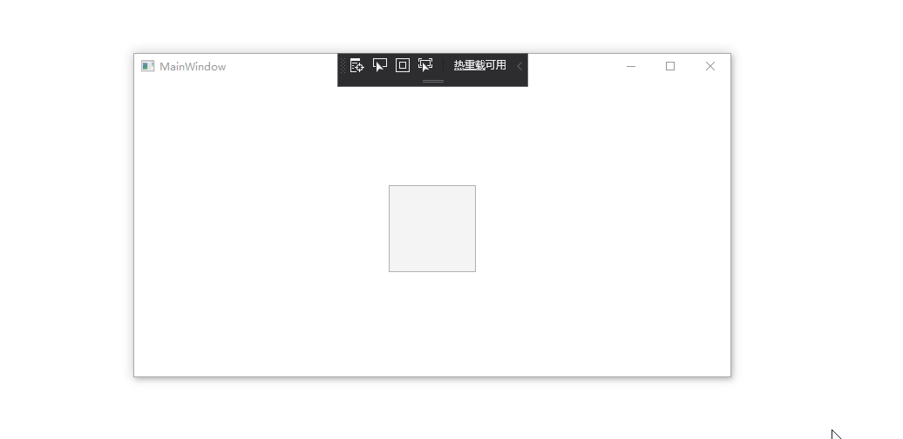
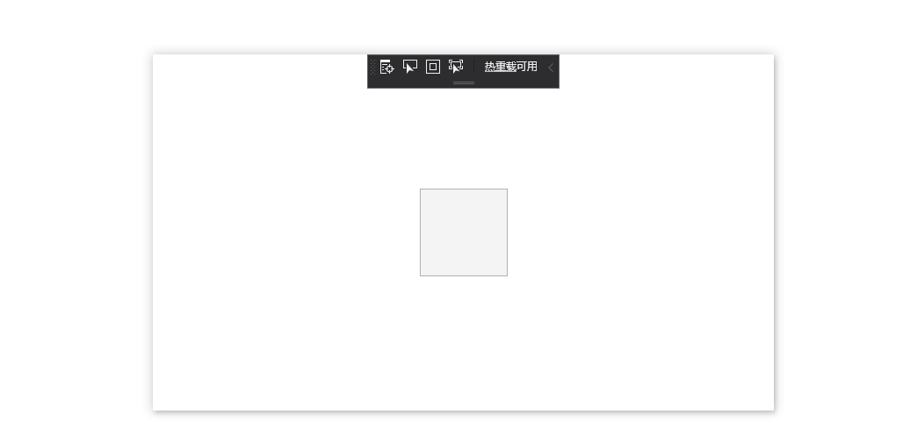
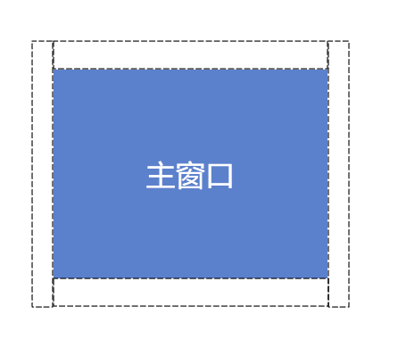
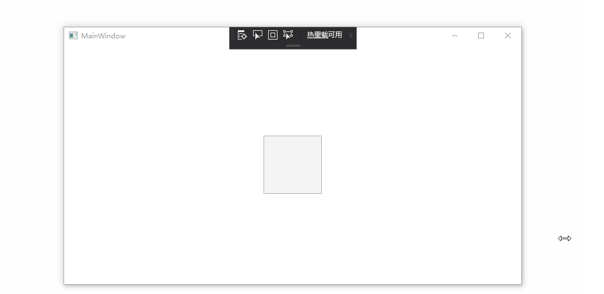

今天来和大家聊如何使WPF在窗口外部区域可拖动缩放。

-----

## 问题来源

对于WPF窗口来说，默认的可拖动缩放区域较小。

在某些应用场景下我们期望能够设置一个较大的可拖动的缩放区域。



## 自定义WindowChrome

有同学马上想到了，通过`WindowChrome`的`ResizeBorderThickness`属性进行设置

比如下面的方式

```xml
<Window x:Class="WpfApp2.MainWindow"
        xmlns="http://schemas.microsoft.com/winfx/2006/xaml/presentation"
        xmlns:x="http://schemas.microsoft.com/winfx/2006/xaml"
        xmlns:d="http://schemas.microsoft.com/expression/blend/2008"
        xmlns:mc="http://schemas.openxmlformats.org/markup-compatibility/2006"
        mc:Ignorable="d"
        Title="MainWindow" Height="450" Width="800">
    <WindowChrome.WindowChrome>
        <WindowChrome ResizeBorderThickness="100"></WindowChrome>
    </WindowChrome.WindowChrome>
    <Grid Background="Transparent" MouseDown="UIElement_OnMouseDown">
        <Grid Margin="100" Background="White" />
        <Button Width="100" Height="100" Command="Undo" />
    </Grid>
</Window>
```

但是`ResizeBorderThickness`只能向窗口内部扩展，而在外部依然不可以进行拖动缩放



## 添加外部窗口

想要在WPF窗口外部能够拖动缩放，问题的关键就在于如何能在外部收到鼠标点击拖动等消息。

那么实际上我们只需要在主窗口周围添加四个alpha值为1窗口。

这些窗口用于接受消息，并传递给主窗口进行拖动变化即可实现。

（注：visual studio就是这样做的，可以通过工具抓到他周围包含了4个宽度为9像素的窗口）



### 监听主窗口状态变化

现在我们一共有了5个窗口。

要想这5个窗口能像一个窗口一样工作，必须要让周围的辅助窗口跟随主窗口的状态变化。

这里我主要关注主窗口的下面5个事件：

- LocationChanged 
- SizeChanged 
- StateChanged 
- IsVisibleChanged
- Closed 

LocationChanged 和SizeChanged主要是通知辅助窗口调整位置和大小，确定包裹在主窗口周围

StateChanged和IsVisibleChanged用于通知窗口的显示隐藏，避免主窗口隐藏时，辅助窗口还能被拖动

Closed用于在主窗口关闭后，关闭辅助窗口以及释放资源。


有了这些事件，辅助窗口就能够跟随主窗口进行变换了。

### 通知主窗口

接下来一个重要的事情就是辅助窗口被点击拖动时，通知主窗口进行拖动缩放。

这个行为有很多实现方法，最简单的一种是，让辅助窗口假装自己是主窗口的非客户区。

听着很复杂，实际做起来很简单，就是在辅助窗口被点击时，给主窗口发一个非客户区被点击的win消息。

例如下面的代码加入到辅助左侧的辅助窗口中，就能让它在接收到windows的鼠标左键点击时，向主窗口发出一个左侧非客户区的border被点击的消息。

于是主窗口就傻傻的以为自己左侧非客户区的border被点中了，就进入了拖拽缩放的行为。

```C#
private IntPtr WndProc(IntPtr hwnd, int msg, IntPtr wParam, IntPtr lParam, ref bool handled)
        {
            if (msg == (int)WM.LBUTTONDOWN)
            {
                Win32.PostMessage(new WindowInteropHelper(Owner).Handle,
                    (int) WM.NCLBUTTONDOWN, (int) HitTestValues.HTLEFT,
                    0);
            }

            return IntPtr.Zero;
        }
```

### 辅助窗口隐藏

有了双向的通知机制后，需要接下来需要将辅助窗口设置为透明。

这里参考了毅仔同学的高性能透明窗口做法。

具体内容不做详细讲解，有兴趣的同学可以参考毅仔同学的博客。

[WPF 制作高性能的透明背景异形窗口（使用 WindowChrome 而不要使用 AllowsTransparency=True） - walterlv](https://blog.walterlv.com/post/wpf-transparent-window-without-allows-transparency.html)

关键代码如下

```csharp
//设置窗口非客户区大小为0
ResizeMode = ResizeMode.NoResize;
WindowStyle = WindowStyle.None;
WindowChrome.SetWindowChrome(this, new WindowChrome()
{
    GlassFrameThickness = new Thickness(-1),
    CaptionHeight = 0
});
//设置窗口alpha值为0x01
Opacity = 1.0 / 255;
```

### 效果呈现

最后就可以得到如下的效果，我们可以在窗口的外部进行拖动，让主窗口进行缩放了。



另外，这里对整个代码做了封装，所以在使用时可以非常简单。

只需要在xaml中配置一个附加属性即可。

```xml
<Window x:Class="WpfApp2.MainWindow"
        xmlns="http://schemas.microsoft.com/winfx/2006/xaml/presentation"
        xmlns:x="http://schemas.microsoft.com/winfx/2006/xaml"
        xmlns:d="http://schemas.microsoft.com/expression/blend/2008"
        xmlns:mc="http://schemas.openxmlformats.org/markup-compatibility/2006"
        xmlns:extendedResizeBorder="clr-namespace:ExtendedResizeBorder;assembly=ExtendedResizeBorder"
        mc:Ignorable="d"
        Title="MainWindow" Height="450" Width="800">
    <extendedResizeBorder:ExtendedResizeBorder.ExtendedResizeBorder>
        <extendedResizeBorder:ExtendedResizeBorder Radius="100" />
    </extendedResizeBorder:ExtendedResizeBorder.ExtendedResizeBorder>
    <Grid Background="Transparent" MouseDown="UIElement_OnMouseDown">
        <Grid Margin="100" Background="White" />
        <Button Width="100" Height="100" Command="Undo" />
    </Grid>
</Window>
```


## 代码

文中对应的代码已经推送到github的dotnet-campus组织下。

欢迎大家issue和star

[dotnet-campus/ExtendedResizeBorder: Enable WPF window has an outside resizable border](https://github.com/dotnet-campus/ExtendedResizeBorder)

---

参考文档：

-  [dotnet-campus/ExtendedResizeBorder: Enable WPF window has an outside resizable border](https://github.com/dotnet-campus/ExtendedResizeBorder)
-  [WPF 制作高性能的透明背景异形窗口（使用 WindowChrome 而不要使用 AllowsTransparency=True） - walterlv](https://blog.walterlv.com/post/wpf-transparent-window-without-allows-transparency.html)

