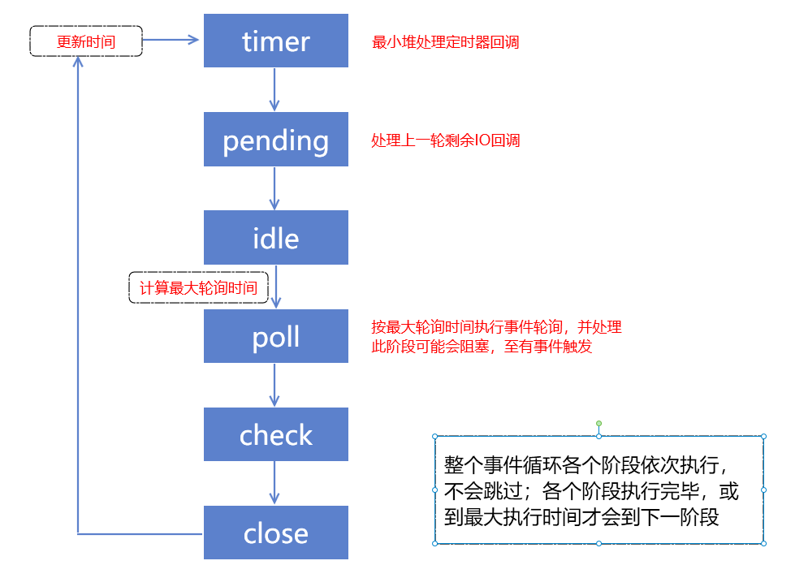

最近看到Nodejs的事件循环，发现网上的一些文档和描述都不够清晰。

所以今天来和大家一起从源码出发了解下Nodejs的事件循环机制。

-----

## 官网描述

我们先看下nodejs的官网对事件循环的描述。

```javascript
   ┌───────────────────────────┐
┌─>│           timers          │
│  └─────────────┬─────────────┘
│  ┌─────────────┴─────────────┐
│  │     pending callbacks     │
│  └─────────────┬─────────────┘
│  ┌─────────────┴─────────────┐
│  │       idle, prepare       │
│  └─────────────┬─────────────┘      ┌───────────────┐
│  ┌─────────────┴─────────────┐      │   incoming:   │
│  │           poll            │<─────┤  connections, │
│  └─────────────┬─────────────┘      │   data, etc.  │
│  ┌─────────────┴─────────────┐      └───────────────┘
│  │           check           │
│  └─────────────┬─────────────┘
│  ┌─────────────┴─────────────┐
└──┤      close callbacks      │
   └───────────────────────────┘
```

如上图所示整个事件循环被分为六个阶段，每个阶段有一个先入先出的队列来执行回调。

接着我们直接看最重要的poll阶段的描述

> When the event loop enters the **poll** phase *and there are no timers scheduled*, one of two things will happen:
>
> - *If the **poll** queue **is not empty***, the event loop will iterate through its queue of callbacks executing them synchronously until either the queue has been exhausted, or the system-dependent hard limit is reached.
> - *If the **poll** queue **is empty***, one of two more things will happen:
>   - If scripts have been scheduled by `setImmediate()`, the event loop will end the **poll** phase and continue to the **check** phase to execute those scheduled scripts.
>   - If scripts **have not** been scheduled by `setImmediate()`, the event loop will wait for callbacks to be added to the queue, then execute them immediately.
>
> Once the **poll** queue is empty the event loop will check for timers *whose time thresholds have been reached*. If one or more timers are ready, the event loop will wrap back to the **timers** phase to execute those timers' callbacks.

这段话的中文文档翻译是这样的

> 当事件循环进入 **轮询** 阶段且 *没有被调度的计时器时* ，将发生以下两种情况之一：
>
> - *如果 **轮询** 队列 **不是空的*** ，事件循环将循环访问回调队列并同步执行它们，直到队列已用尽，或者达到了与系统相关的硬性限制。
> - *如果 **轮询** 队列 **是空的*** ，还有两件事发生：
>   - 如果脚本被 `setImmediate()` 调度，则事件循环将结束 **轮询** 阶段，并继续 **检查** 阶段以执行那些被调度的脚本。
>   - 如果脚本 **未被** `setImmediate()`调度，则事件循环将等待回调被添加到队列中，然后立即执行。
>
> 一旦 **轮询** 队列为空，事件循环将检查 _已达到时间阈值的计时器_。如果一个或多个计时器已准备就绪，则事件循环将绕回计时器阶段以执行这些计时器的回调。

我自己在读到这段话时，觉得非常难理解。主要有以下几点：

- 文档说了没有timer被调度时的情况，那么如果有timer被调度，会怎么样呢？
- poll queue状态为非空的情况下，回调执行完毕后，还会执行check阶段么？
- 当检查发现有timer到达阈值，是直接进入timer阶段么？还会执行check阶段么？

不知道大家是否有同样的困惑。

那么我们就带着困惑去看一看源码

## 先看结论

为了照顾一些对源码不感兴趣的同学，这里先上源码阅读的结论



## Nodejs源码分析

nodejs的时间循环依赖于libuv，通过调用`uv_run(env->event_loop(), UV_RUN_DEFAULT)`这个方法启动。

我们可以在`deps\uv\src\unix`下面找到对应的代码，这里就是事件循环的核心。

```c
int uv_run(uv_loop_t* loop, uv_run_mode mode) {
	//...
  int r;
  while (r != 0 && loop->stop_flag == 0) {
      //更新时间
    uv__update_time(loop);
      //timer阶段
    uv__run_timers(loop);
      //pending 阶段
    ran_pending = uv__run_pending(loop);
      //idle prepare阶段
    uv__run_idle(loop);
    uv__run_prepare(loop);
		//计算timeout
    timeout = 0;
    if ((mode == UV_RUN_ONCE && !ran_pending) || mode == UV_RUN_DEFAULT)
      timeout = uv_backend_timeout(loop);
	//poll阶段
    uv__io_poll(loop, timeout);
      //check阶段
    uv__run_check(loop);
      //close阶段
    uv__run_closing_handles(loop);
	//...
    r = uv__loop_alive(loop);
  }
```

我们可以看到这边就是一个循环，每次循环会判断这个loop对象是否还"存活"，如果是就会不断执行这个循环。

接下来我们分别看下这个循环里面各个函数的功能

### uv__update_time

这个函数看名称应该是更新时间的，我们探索下

```c
UV_UNUSED(static void uv__update_time(uv_loop_t* loop)) {
  /* Use a fast time source if available.  We only need millisecond precision.
   */
  loop->time = uv__hrtime(UV_CLOCK_FAST) / 1000000;
}

uint64_t uv__hrtime(uv_clocktype_t type) {
    //get high-resolution real time
  return gethrtime();
}
```


这里是调用了系统命令gethrtime，获取了系统时间，并赋值给loop->time。

所以的确是对事件循环的时间进行更新。

### uv__run_timers

```c
void uv__run_timers(uv_loop_t* loop) {
  struct heap_node* heap_node;
  uv_timer_t* handle;

  for (;;) {
      //获取timer的最小堆，堆顶
    heap_node = heap_min(timer_heap(loop));
    if (heap_node == NULL)
      break;
	//获取timer挂载的handle
    handle = container_of(heap_node, uv_timer_t, heap_node);
      //如果handle设定的timeout时间还没有到，则退出循环
    if (handle->timeout > loop->time)
      break;
	//停止计时器
    uv_timer_stop(handle);
      //重新启动计时器,处理循环计时器
    uv_timer_again(handle);
      //执行回调
    handle->timer_cb(handle);
  }
}


```

进入runtimers，这里又是一个循环。

这里我们发现这个阶段的处理器不是在一个队列里，而是一个`最小堆`中。

这个也很好理解，timer的执行依赖于最先到达指定时间的顺序，而不是依赖于代码中的添加顺序。

构建一个最小堆能够确保我们每次将最先到时的定时器触发回调。

接着有一个不是很好理解的地方是`uv_timer_again`。

为啥要重启timer呢？这里主要是为了处理setInterval的情况，实现循环计时。

这段源码我们发现：

- timer阶段并不是维护FIFO的队列，而是一个最小堆
- 回调在这个循环内同步执行，处理所有到时定时器。因此耗时回调函数可能会卡死事件循环。

### uv__run_pending

```c
static int uv__run_pending(uv_loop_t* loop) {
  QUEUE* q;
  QUEUE pq;
  uv__io_t* w;

  if (QUEUE_EMPTY(&loop->pending_queue))
    return 0;

  QUEUE_MOVE(&loop->pending_queue, &pq);

  while (!QUEUE_EMPTY(&pq)) {
    q = QUEUE_HEAD(&pq);
    QUEUE_REMOVE(q);
    QUEUE_INIT(q);
    w = QUEUE_DATA(q, uv__io_t, pending_queue);
    w->cb(loop, w, POLLOUT);
  }

  return 1;
}
```

uv__run_pending是将pending_queue中所有回调都进行执行完毕。

这阶段没什么好讲的，需要注意的点是w是`uv__io_t`类型的指针，因此这个阶段都是执行的io回调

### uv_backend_timeout

跳过idle和prepare阶段，他们是internal方法。我们直接看poll。

在poll之前我们还执行了一个`uv_backend_timeout`方法

```c
int uv_backend_timeout(const uv_loop_t* loop) {
  if (loop->stop_flag != 0)
    return 0;

  if (!uv__has_active_handles(loop) && !uv__has_active_reqs(loop))
    return 0;

  if (!QUEUE_EMPTY(&loop->idle_handles))
    return 0;

  if (!QUEUE_EMPTY(&loop->pending_queue))
    return 0;

  if (loop->closing_handles)
    return 0;

  return uv__next_timeout(loop);
}

int uv__next_timeout(const uv_loop_t* loop) {
  const struct heap_node* heap_node;
  const uv_timer_t* handle;
  uint64_t diff;
	//如果没有定时器，可以无限阻塞
  heap_node = heap_min(timer_heap(loop));
  if (heap_node == NULL)
    return -1; /* block indefinitely */
	//根据定时器下次时间确定最大等待时间
  handle = container_of(heap_node, uv_timer_t, heap_node);
  if (handle->timeout <= loop->time)
    return 0;

  diff = handle->timeout - loop->time;
  if (diff > INT_MAX)
    diff = INT_MAX;

  return (int) diff;
}
```

这里我们看到`uv_backend_timeout`会检查是否有需要立刻执行的回调。

没有的话会计算poll阶段最大能够等待的时间。

如果此时的loop对象中没有挂载任何timer的handle，那么poll阶段可以无限阻塞下去。

这里我们发现：

- 文档中的`timers scheduled`是指通过setTimeout等方法开启了的定时器，而不是到达timeout时间的定时器
- 下一个定时器触发前的空闲时间，将都会用于poll阶段等待io事件

### uv__io_poll

```c
void uv__io_poll(uv_loop_t* loop, int timeout) {
//...
	//处理基础时间和最大循环次数
  base = loop->time;
  count = 48; /* Benchmarks suggest this gives the best throughput. */
  real_timeout = timeout;

  for (;;) {
	//...
      //获取监听的事件
      nfds = epoll_wait(loop->backend_fd,
                        events,
                        ARRAY_SIZE(events),
                        timeout);
	//..
    if (nfds == 0) {
      assert(timeout != -1);

      if (timeout == 0)
        return;
      goto update_timeout;
    }

   //...
	//处理监听的事件回调
    for (i = 0; i < nfds; i++) {
      pe = events + i;
      fd = pe->data.fd;
        //...
      w = loop->watchers[fd];
		//...
          w->cb(loop, w, pe->events);

        nevents++;
    }
	//...   
	
    if (nevents != 0) {
      if (nfds == ARRAY_SIZE(events) && --count != 0) {
        /* Poll for more events but don't block this time. */
          //进入下次轮询，但不要阻塞
        timeout = 0;
        continue;
      }
      return;
    }
	//耗时结束，直接返回
    if (timeout == 0)
      return;
	//若是允许阻塞轮询，则继续查询
    if (timeout == -1)
      continue;

      	//更新运行时间
update_timeout:
    assert(timeout > 0);

    real_timeout -= (loop->time - base);
    if (real_timeout <= 0)
      return;

    timeout = real_timeout;
  }
}
```

这个方法代码很长，做了删减和注释。

实际上我们可以看到poll阶段，调用`epoll`函数查询系统事件，并执行。

并且设置了最多执行次数，避免阻塞其他阶段。

## 结论

因此我们可以得到如下结论


我们再看下之前的问题

- 文档中未提及的，在有timer调度的情况下， 下一次timer到时的时刻，会作为poll阶段的最大执行时间
- check阶段总是会执行，不会跳过


---

参考文档：

-  [The Node.js Event Loop, Timers, and process.nextTick() - Node.js](https://nodejs.org/en/docs/guides/event-loop-timers-and-nexttick/)

