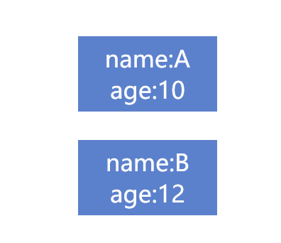
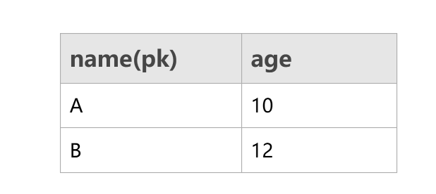

Restful已经是目前我们耳熟能详的概念了，但是找了下网上的文章，大部分都是介绍restful API范式。很少介绍resetful架构的。今天同大家介绍下对restful的理解。此外，阮一峰的文章也很不错，感兴趣的同学也可以参考。[理解RESTful架构 - 阮一峰的网络日志](http://www.ruanyifeng.com/blog/2011/09/restful.html) 

-----

## 什么是RESTful

[Representational state transfer - Wikipedia](https://en.wikipedia.org/wiki/Representational_state_transfer)中的解释是**表现层状态转换**（[英语](https://zh.wikipedia.org/wiki/英语)：**Representational State Transfer**）。

它代表了一种架构风格，统一了webAPI的格式，允许客户端以uri访问和操作互联网的资源。

这么说比较抽象，我们换一种角度来看它。


## 从0开始设计网络接口

正如我在[2020-3-8-MVC、MVP、MVVM模式演变简析 - huangtengxiao](https://xinyuehtx.github.io/post/MVC-MVP-MVVM%E6%A8%A1%E5%BC%8F%E6%BC%94%E5%8F%98%E7%AE%80%E6%9E%90.html)中说的，一切gui软件本质目的都是将模型进行恰当的呈现（model->view）。web应用当然也不例外。

假设我们现在有如下的模型，两个同学，A和B。他有name和age两个属性，其中name字段全局唯一。



那么对于这个模型，如果我们在数据库创建一张表，该如何表示呢？



很简单是吧。那我们试着使用编程语言进行表示。

```javascript
//获取所有对象
let people=getPeople();
//根据索引找到对象
let A=people['A'];
let B=people['B'];
//进行操作
console.log(A.age);
```

OK，那我们使用RESTfulAPI进行这个模型的表示会是怎么样呢？

```javascript
GET /people

[{
        "name": "A",
        "age": 10
    },
    {
        "name": "B",
        "age": 12
    }
]
```

```javascript
GET /people/A

{
    "name": "A",
    "age": 10
}
```

我们可以看到这写模型的表示方法是一致的，都是使用一个唯一标识获取到模型对象。

而RESTful的一个重要观点就是，互联网上一切对象都是资源，而uri就是定位这一个资源的标识符。

如果有同学了解领域驱动开发（DDD），那么就可以这样理解：每个网站提供了一个领域模型，我们通uri获取，这个领域模型中的实体对象，这个uri就是实体的标识符。

所以现在可以理解为什么大家在设计RESTfulAPI时，总是在说要找'名词'。因为RESTfulAPI的目标就是对特定场景建模，用uri定位领域模型中的实体（名词来源），而不是在网络提供一系列数据操作服务（动词来源）。

## RESTful的优势——关注点分离

那么RESTful有什么好处呢？

很多文章里面提到了无状态，可缓存等等。这些的确是RESTful的好处，但是我认为最大的优势还是模型和表示的关注点分离。即uri只负责模型，Content Negotiation负责表示。

### Content Negotiation

举个例子，我们互联网应用常见的用户有人类和软件（爬虫等），xml对人类更友好，json对软件更友好。

因此我们往往需要针对同一个模型，提供xml和json的不同表示方法。

如果没有使用RESTful，我们可能会有以下的API设计

```javascript
/people/A/xml
/people/A?type=xml
/people/A.xml
```

明明是同一个对象，为什么要设计这么多不同的路由规则？而且如果这些在同一个项目组中进行扩散，后果更不堪设想。

如果使用RESTful，我们只要在不同的客户端的http头中申明`Accept: application/xml`，而不需要更改uri。

### Versioning

另一个主要优势点是版本管理。

例如我们经常能见到`http://api.example.com/v1`这样的uri。

这种情况的大部分成因是，后续版本增加了模型字段，查询参数或者是重命名名称等等，造成了和现有API的不兼容。（注意：这里大部分情况下，不同版本API对应的后端数据库的模型还是一致的，否则启用新的API，而不是更新版本）

所以这还是同一个模型，不同表现形式的问题。而使用RESTful，只要设置`Accept-version: v1`即可保证uri的一致性。


综上所述，RESTfulAPI可以使得API风格和模型更加贴近，实现了uri对实体的映射，减轻了路由规则的复杂度。

## RESTful的缺陷

RESTful的缺陷也是很明显的，从数据操作获取服务变成了ORM，意味着API的爆炸，每一个实体都有一个API。

为了减少网络传输量，许多网站不得不针对RESTfulAPI的GET请求提供诸如`?limit=3`等服务端的filter等操作。

为了解决这一问题，GraphQL作为新一代的API风格也受到越来越多的关注。

大家有兴趣可以参考[GraphQL | A query language for your API](https://graphql.org/)


---

参考文档：

-  [Understanding And Using REST APIs — Smashing Magazine](https://www.smashingmagazine.com/2018/01/understanding-using-rest-API/)
-  [What is a RESTful API (REST API) and How Does it Work?](https://searchapparchitecture.techtarget.com/definition/RESTful-API)
-  [REST Principles and Architectural Constraints – REST API Tutorial](https://restfulAPI.net/rest-architectural-constraints/)
-  [What is REST (REpresentational State Transfer)? - Definition from WhatIs.com](https://searchapparchitecture.techtarget.com/definition/REST-REpresentational-State-Transfer)
-  [REST API Tutorial](https://www.restAPItutorial.com/)
-  [理解RESTful架构 - 阮一峰的网络日志](http://www.ruanyifeng.com/blog/2011/09/restful.html)
-  [Representational state transfer - Wikipedia](https://en.wikipedia.org/wiki/Representational_state_transfer)
-  [GraphQL | A query language for your API](https://graphql.org/)


