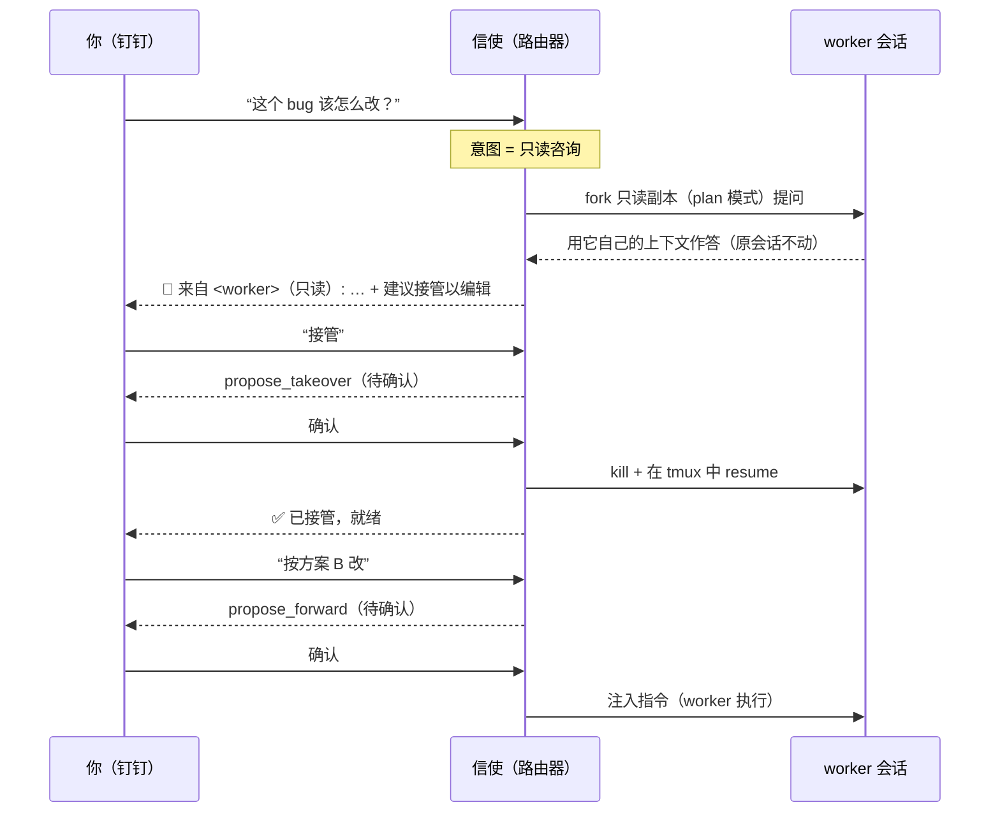

<div class="project-page-header">
  <p class="project-meta"><span class="proj-lang"><i class="proj-dot" style="--dot:#f1e05a"></i>JavaScript</span> · <span>⭐ 0</span> · <span>🕒 更新于 2026-07-31</span></p>
  <p class="project-actions"><a class="proj-btn proj-btn-primary" href="https://github.com/xinyuehtx/agent-connect" target="_blank" rel="noreferrer">GitHub 仓库</a> <a class="proj-btn" href="https://xinyuehtx.github.io/agent-connect/" target="_blank" rel="noreferrer">在线 Demo ↗</a></p>
</div>

[English (README.md)](https://github.com/xinyuehtx/agent-connect/blob/main/README.md) | **简体中文**

> 从手机（钉钉）监控并控制本机上运行的**多个** coding agent 会话（Claude Code / qodercli）：**读写分离 · 一对多 · 信使 Agent 做意图分派 · 写操作人工确认。**

📖 **使用介绍网站：** https://xinyuehtx.github.io/agent-connect/

在钉钉里发一句话，就能查看本机所有 agent 任务的状态、只读拉取结果、并把后续指令注入到指定的那个任务。一个轻量的**信使 Agent**（Vercel AI SDK，可配置任意 OpenAI 兼容模型）理解你的意图、决定读还是写、定位到哪个会话；任何变更 worker 会话的操作都要你**确认**后才执行。基于 [cc-connect](https://github.com/chenhg5/cc-connect) 做钉钉 ↔ 本地的消息传输，配套 `agent-connect serve` 提供 Web 控制台。

---

## 🏗️ 架构

三层，各司其职：

- **信使 Agent（寻址分派，非重路由）**：用 AI SDK 实现、与 Claude Code 解耦。它只判断「读还是写 / 哪个会话 / 哪个动词」，用工具调用控制面；**任务本身仍由 worker agent 执行**。信使自己一个独立会话上下文（Web 与钉钉共享），**永不进入 worker 会话的上下文**——这正是读写分离在自然语言输入下的守门人。
- **读写双平面**：读（list/read）只读 Claude Code 落盘的 sessions 注册表与 transcript，零副作用、不碰 worker 进程；写（send/takeover/run）经 tmux，且必须经**「提议 → 人工确认 → 执行」**安全闸。
- **通信**：继续用 cc-connect。因 cc-connect 只能通过 `acp` agent 类型接入自定义程序，信使以一个 **ACP 薄桥**（`agent-connect acp`）作为它的 agent，把消息转发给 `agent-connect serve` 守护。

```
钉钉 ─Stream─► cc-connect ─exec─► agent-connect acp（薄桥）─HTTP─► agent-connect serve（守护）
                                                                  │
   ┌──────────────────────────────────────────────────────────┐ │
   │  Web 控制台 + SSE + 配置页        闸门(白名单/前缀/确认词)   │◄┘
   │        │  共享 conductor / pending / 信使会话上下文         │
   │  AgentConductor（提议→确认→执行 安全闸）                    │
   │  Messenger Agent（AI SDK，OpenAI-compatible）              │
   │        │ 只读工具 / 提议工具                                │
   │  ControlPlane: listSessions·getMessages·sendMessage·takeover·run │
   └──┬───────────────┬──────────────┬────────────────────────┘
   registry.js     transcript.js    tmux.js
```

> **演进说明**：早期版本主张「无路由 Agent」（普通消息直连 worker，由其自行理解）。但那样从聊天做跨会话控制会**污染 worker 上下文**，且缺少安全闸。现改为独立信使做**寻址分派**（不重新理解/执行任务）+ 读写分离 + 人工确认，兼顾「发一句话就行」的体验与安全。

---

## 🆚 与 OpenClaw 的区别（why not OpenClaw）

两者**不是同一类东西**：[OpenClaw](https://github.com/openclaw/openclaw) 是一个**自己干活的通用 AI Agent 本体**（有自己的 agent loop、工具、模型调用、记忆，直接拿着 shell / 浏览器 / 邮件的钥匙替你做事）；agent-connect 是套在你**已有 coding agent** 之上的**遥控 / 分派层**——它自己不干活，只做「读还是写 / 哪个会话 / 哪个动词」的意图分派，真正的活仍由那个 worker（Claude Code / qoder…）用它自己的完整上下文去做。

| 维度 | agent-connect | OpenClaw |
|---|---|---|
| 本质 | 已有 agent 的**控制 / 信使层** | **Agent 本体**（Gateway 就是整个系统） |
| 谁执行任务 | 你原来的 Claude Code / qoder 等 worker，**保留其完整项目上下文与工具** | OpenClaw 自己（另起一个上下文较弱的 agent） |
| 一对多 | 核心能力：监控 / 寻址**多个**并发会话 | 单一网关助手 |
| 安全模型 | **读写分离** + 写操作**逐条人工确认**；仅监听本机；显式白名单 | 自主为默认 → 攻击面更大 |
| 上下文 | 信使独立上下文，**永不进入 worker 上下文** | 它本身就是那个上下文 |
| 定位 | 窄而专：从手机遥控你的 dev 会话 | 通用个人助理（日程 / 消息 / 代码都做） |
| 体量 | 轻：一层 + ACP 薄桥，传输复用 cc-connect | 一整套长驻运行时 |

**为什么用它而不是 OpenClaw**
- **不重造轮子、保住强上下文**：真正的编码能力在你原来的 Claude Code 会话里（完整项目上下文、权限、工具链），这里让它**继续干**，只是变得可从聊天里寻址 / 观察 / 注入；OpenClaw 则是另起一个它自己的 agent 去理解你的项目，上下文更弱。
- **安全是设计前提，不是补丁**：每个会改动 worker 的操作都要你回「确认」，读操作零副作用（只读盘上的 transcript 或只读 fork），Web 只听 `127.0.0.1`。
- **天生一对多**：「切到哪个会话」在这里是一等概念，适合本机同时跑多个任务时从手机分派。
- **轻量、可组合**：只是一层，传输直接复用 cc-connect（钉钉 / 飞书 / Telegram / Slack… 都能用）。

**什么时候反而该选 OpenClaw**：你要的是一个**通用自主助理**（处理日程、跨平台联络、后台盯 GitHub issue 等非编码杂务），且愿意接受「给它钥匙让它自己跑」的取舍——那 OpenClaw 更合适。agent-connect 是**刻意收窄**的：只解决「从手机安全地遥控本机多个 coding agent」这一件事。

> 一句话：**OpenClaw = 给 LLM 钥匙让它替你做；agent-connect = 人留在环里，真正的 coding agent 继续做，只是让它从聊天里可控可看。**

---

## 📦 安装

**一键安装（推荐）** —— 安装 CLI + cc-connect，检查 Node/tmux，并执行 `agent-connect init`：

```bash
curl -fsSL https://raw.githubusercontent.com/xinyuehtx/agent-connect/main/scripts/install.sh | bash
```

<sub>设 `AC_SKIP_CC=1` 跳过网关；设 `AC_SKIP_INIT=1` 跳过初始化。</sub>

**或用 npm：**

```bash
npm install -g @tengxiaohtx/agent-connect
```

**或从 GitHub Release 安装**（离线 / 固定版本）—— 到 [Releases](https://github.com/xinyuehtx/agent-connect/releases) 下载 `.tgz`：

```bash
npm install -g https://github.com/xinyuehtx/agent-connect/releases/download/v1.3.10/agent-connect-1.3.10.tgz
```

## 🚀 快速开始

```bash
# 1. 初始化配置（生成 ~/.agent-connect/config.toml）
agent-connect init

# 2. 启动 Web 控制台守护（仅本机，无需登录）
agent-connect serve
#   浏览器打开 http://127.0.0.1:8787
#   设置 → LLM Provider：填 base_url / api_key / model（任意 OpenAI 兼容端点）
#   设置 → IM 连接器：填钉钉 client_id / client_secret + 闸门（前缀 / 白名单）

# 3. 另开一个终端，拉起 cc-connect（钉钉 ↔ 本地）
agent-connect start
```

也可以全用 CLI 配置（等价于 Web 配置页）：

```bash
agent-connect config set messenger.base_url "https://your-gateway/v1"
agent-connect config set messenger.api_key  "sk-..."
agent-connect config set messenger.model    "gpt-4o-mini"
agent-connect config set projects.0.platforms.0.options.client_id     "your-dingtalk-client-id"
agent-connect config set projects.0.platforms.0.options.client_secret "your-dingtalk-client-secret"
```

钉钉凭证 `client_id` / `client_secret` 需在[钉钉开放平台](https://open.dingtalk.com)创建**企业内部应用**（或机器人应用），并启用 **Stream 模式**。默认配置已把信使接成 cc-connect 的 `acp` agent（`cmd = "agent-connect"`, `args = ["acp"]`），无需手改。

> 钉钉里默认要带前缀 `/ai` 才会路由给信使（如 `/ai 列出会话`）；待确认时直接回「确认 / 取消」。前缀可改或留空（留空 = 处理所有消息）。

---

## 🧠 信使 Agent（manager 路由器）

信使是**管理路由器**，不是干活的 worker，只做「意图识别 + 路由」；真正任务交给目标 worker 会话。它维护一个**「当前会话」指针（像 shell 的 cwd）**，后续指令无需再点名会话。

**意图 / 工具**
- `switch_current` 切换当前会话；`list_sessions` 列出全部（项目/Agent/状态/最近输入）。
- `consult_session` **只读咨询**：问 worker **它本身**、**绝不改动原会话**。按体量两种模式：
  - *小会话* → **full-fork**（`--resume --fork-session` + 只读参数）——全量上下文，最准。
  - *大会话* → **bounded-excerpt**——给一个**全新** agent 喂上下文节选，**从最近一次压缩摘要开始**（`isCompactSummary` / `compact_boundary`）+ 其后消息（从未压缩则回退最近若干条）。避免重放超大历史（14MB 会话从 90s+ 超时 → 约 12s）；回复标注**有损**。
  - 只读按 agent 保证：Claude 用 `--permission-mode plan`；**qoder 用 `--tools ""`**（禁用所有工具——比权限模式更强；`--yolo` 是其反面，只用于*控制*、绝不用于咨询）。桌面应用（qwen / qoderwork）无 CLI → 不支持咨询（用 `read_reply`）。
  - 用于「为什么/怎么改/总结/解释」。
- `read_reply` 看当前会话最新回复；`snapshot_session` 把终端画面渲染成图片。
- `propose_forward` / `propose_takeover` / `propose_exit` / `propose_run` —— **只暂存**，需你「确认」。

**保证**
- **读写分离**：咨询与读取都是只读（fork 或转录）；只有 `propose_*` 会改动，且必须确认后。
- **cwd 失效门禁**：写操作前校验当前会话仍在；失效则清空指针并提示重新 `switch_current`。
- **来源标注**：回复分清「谁在说」——信使（`🧭`）vs worker（`> 🔁 来自 <名称·agent>（只读）`）；绝不把 worker 的话冒充成信使自己的。
- **只读 → 接管**：只读咨询若得出「需要改动」的结论，信使建议**接管**（把该会话切到编辑模式），而不是在只读上下文里改。

LLM 用 Vercel AI SDK —— **openai-compatible / openai / anthropic**（anthropic 网关可 `auth_style: bearer`），Web 配置页或 config 文件切换，与 Claude Code 解耦。

### 一次请求怎么流动



### 会话交互示例

```
你 ▸ 列出会话
🧭 信使 ▸ | 状态 | 短ID | 名称 | 项目 | 最近输入 |
          | 🔄 | 5122982b | connect-console | connect | … |
          | ✅ | c233caaf | agentmon | agentmon | … |

你 ▸ 切到 c233caaf
🧭 信使 ▸ 📍 已切到 agentmon（c233caaf）

你 ▸ 它最近完成了什么？          # 咨询 → 只读 fork
🧭 信使 ▸ > 🔁 来自 agentmon·claude（只读）：发布了 v0.6.0，换成极光罗盘猫……

你 ▸ 帮我把版本号改成 0.6.1       # 需要改动 → 建议接管
🧭 信使 ▸ 这需要编辑，建议先接管进入编辑模式。要我提议接管吗？
你 ▸ 接管 → 确认                  # propose_takeover → 执行
🧭 信使 ▸ ✅ 已接管 c233caaf，已在 tmux 就绪
你 ▸ 改好后跑一下测试 → 确认       # propose_forward → 注入 worker 执行
```

---

## 🖥️ Web 控制台（`agent-connect serve`）

浏览器打开 `http://127.0.0.1:8787` —— 仅监听本机、无需登录。三个视图：

- **看板**：每个会话一张卡片（状态 · 项目 · Agent · 最近输入）+ 详情 / 接管 / 退出；**运行中/待输入置顶**；**时效过滤**（近 1/3/7 天）隐藏过旧的已完成任务——该设置对 IM `list_sessions` 同样生效；SSE 实时刷新（约 1.2 秒）。
- **单会话详情**：某 worker 的消息流（用户 / 助手 / 工具调用）实时更新，可在此发送 / 接管 / 退出。
- **信使**：与路由器对话，显示 **📍 当前会话** 徽标与**待确认**卡片（确认 / 取消），与钉钉共享同一队列。

**设置**（齿轮图标）：**LLM Provider**（provider / base_url / api_key / model / auth_style）与 **IM 连接器**（钉钉 client_id/secret + 闸门前缀/白名单），与配置文件同源，敏感字段遮掩；改动即时生效，无需重启。

```
┌ 看板 ─────────────────────────────┐   详情 / 信使
│ 🔄 connect-console  claude·connect │   → 点卡片进单会话实时流；
│ ⏳ agentmon         claude·agentmon│     切「信使」页与路由器对话
│ ✅ website-fe       claude·website │
└───────────────────────────────────┘
   [已完成任务范围: 近 3 天 ▾]  + 新建  刷新
```

---

## 🌐 支持任意 IM（不止钉钉）

cc-connect 本身桥接**多种平台**（钉钉、飞书、Telegram、Slack、Discord、企业微信、QQ、LINE…），而我们的信使以**平台无关**的 `acp` agent 接入，所以 agent-connect 对**任意平台**都适用。ACP 薄桥从 `CC_SESSION_KEY` 解析出平台名，套用对应闸门。

接入一个新 IM：
1. 在 `~/.agent-connect/config.toml` 的 cc-connect 部分配好该平台（它自己的 `[[projects.platforms]]` + 凭证，见 cc-connect 文档）。
2. （可选）给它加一段闸门：`[im.platforms.<平台名>]`，含 `enabled` / `command_prefix` / `allowed_sender_ids` / 确认词。不配则用默认（启用、空白名单=允许所有）。

信使、读写平面、确认闸在所有平台完全一致，只有传输层不同。

## 📇 访问控制与明确拒绝

当发送者不在 `allowed_sender_ids` 时，机器人会**明确回复「无权限」**（而不是静默），并提示该把哪个 ID 加进名单。名单留空 = 允许所有。发送者 ID 取平台上报值（如钉钉 `senderStaffId`）。

## 🧵 引用回复（线程一致性）

每条针对指令的回复都会在正文前**引用触发它的指令**（`> 🗨️ 你：列出会话`），这样即便多条指令同时在途、回复乱序返回，你也能一眼看出每条回复对应哪条指令。钉钉经 cc-connect **无原生引用回复**（`reply_to_trigger` 仅飞书支持），故在**回复内容层**实现，跨所有平台一致生效。同时**按会话串行**处理：同一会话的多条指令严格排队，杜绝共享信使上下文的并发竞态与乱序。用 `im.platforms.<平台>.quote_reply` 开关（默认 `true`）。

## 🌐 回复语言与自动翻译

信使的回复语言可配（默认**中文**；`messenger.reply_language`，或 **设置 → LLM Provider → 回复语言**）。当 **worker 的回复**是其他语种时，信使会翻译一次并**把译文附在原文之后**，让你同时看到两者 —— 例如英文 agent 的回答下方会跟一段 `🌐 信使译文（中文）`。同语种会被识别并跳过（不额外调用）；翻译失败则静默降级为仅原文。支持：zh / en / ja / ko / fr / es / de / ru / pt / it。

## ⏳ 时效过滤（Web 与 IM 共用）

为避免过多旧任务透出，已完成会话按时效过滤：`[filter] window_days`（1 / 3 / 7，或 `0` = 全部）。**运行中/待输入的会话始终显示**，只有空闲/已退出且超过时长的才隐藏。Web 看板有下拉可切换并持久化，**同一设置对 IM 的 `list_sessions` 同样生效**，信使也不会把陈旧任务列出来。

## 🔔 主动通知

守护进程只在两种转换时主动推 IM 消息 —— **需要确认/输入**（会话进入 `waiting`）与 **任务完成**（`busy → idle`），并按会话冷却去重。**纯监控型 GUI 应用（qwen / qoderwork）默认屏蔽**：这类会话你在其 App 内直接操作、也无法远程处理，推送只会是噪音；需要时设 `notify.monitor_only = true` 打开。配置：`[notify]` `enabled` / `on_needs_confirm` / `on_task_done` / `cooldown_ms` / `monitor_only` / `scope`。

## 🖌️ 流式 AI 卡片（钉钉，可选）

想要打字机式流式回复：在钉钉开放平台创建 **AI 卡片模板**，把它的 id 填到钉钉平台选项的 `card_template_id`（另可选 `card_template_key`、`card_throttle_ms`），或在 Web **设置 → IM 连接器 → 流式 AI 卡片** 里填。不填则回退为普通消息（功能不受影响，只是非流式）。

## 📸 富文本回复与截图

回复以 **Markdown** 发送（表格、加粗、代码块、emoji 状态），会话列表因此能一眼看到 项目 / Agent / 状态 / 最近输入。信使还能发**图片**：`snapshot_session` 把某会话的终端画面渲染成 PNG（用自动探测的无头 Chrome；可用 `messenger.chrome_path` 指定）并发到聊天里；`send_image` 发送本机任意图片文件。二者都经 `cc-connect send --image` 投递。若本机没有渲染器，截图会退回为 Markdown 代码块。

---

## 📖 CLI 命令参考

| 命令 | 说明 |
|------|------|
| `agent-connect init [--force]` | 初始化配置目录与默认配置（`--force` 覆盖） |
| `agent-connect serve [-H host] [-p port]` | 启动 Web 控制台 + 信使守护（读写平面 + 安全闸；仅本机、无需登录） |
| `agent-connect acp` | ACP 薄桥，供 cc-connect 拉起（勿手动运行） |
| `agent-connect start` | 启动 cc-connect（钉钉 ↔ 本地 消息传输） |
| `agent-connect config get/set/remove/list` | 读写配置（点号路径，敏感字段遮掩） |
| `agent-connect project add/remove/list` | 管理 cc-connect 项目 |
| `agent-connect agent list [-a] [--json]` | 列出运行中的 agent 会话 |
| `agent-connect agent read <id> [--full]` | 只读查看状态与最新回复（不污染上下文） |
| `agent-connect agent send <id> "<text>"` | 向 tmux 会话注入指令 |
| `agent-connect agent takeover <id> [--force]` | 接管非 tmux 会话（kill + resume 进 tmux） |
| `agent-connect agent run ["<prompt>"] [-w dir]` | 在 tmux 中新建可远控会话 |

---

## 📋 前置条件

| 依赖 | 说明 | 链接 |
|------|------|------|
| **Node.js ≥ 18** | 运行 `agent-connect` CLI 与 `serve` 守护 | https://nodejs.org |
| **cc-connect** | 消息网关，把钉钉消息经 `acp` 转发到信使 | https://github.com/chenhg5/cc-connect |
| **OpenAI 兼容 LLM 端点** | 信使 Agent 的模型（`base_url` + `api_key` + `model`） | 自建网关 / 代理 |
| **tmux** | 写平面所需；读平面不需要 | `brew install tmux` |
| **Claude Code / qodercli** | 被控制的 worker agent（至少装一个） | — |
| **钉钉开发者账号** | 创建机器人，获取 `client_id`/`client_secret`，启用 Stream 模式 | https://open.dingtalk.com |

## 🛠️ 开发

```bash
npm test            # node --test
node bin/cli.js --help
```

## 📂 目录结构

```
src/lib/control-plane.js   读写平面（复用 registry/transcript/tmux）
src/lib/messenger/         信使栈：agent(AI SDK)/conductor/provider/pending/history
src/lib/im/                gate（闸门路由）/ session-key（CC_SESSION_KEY 解析）
src/server/                Fastify：http/routes/sse/auth（Web + /im/handle）
web/                       控制台前端
docs/                      GitHub Pages 使用介绍网站
```

## 许可证

MIT · 基于 [cc-connect](https://github.com/chenhg5/cc-connect)，设计参考 [lifestream](https://github.com/nitonitori/lifestream)
